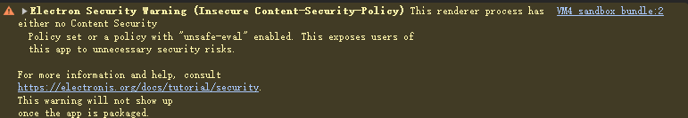

# Electron 入口函数 [文档](https://www.electronjs.org/zh/docs/latest/tutorial/tutorial-first-app#%E5%AF%BC%E5%85%A5%E6%A8%A1%E5%9D%97)

窗口配置 [全部配置](https://www.electronjs.org/zh/docs/latest/api/base-window#实例属性)

```javascript
const { app, BrowserWindow } = require("electron");

// 启动 Electron 窗口
app.on("ready", () => {
  new BrowserWindow({
    width: 800,
    height: 600,
    // 窗口位置
    x: 100,
    y: 100,
    // 窗口置顶
    alwaysOnTop: true,
    // 隐藏菜单栏
    webPreferences: {
      showMenuBar: false,
    },
  });
});
```

窗口操作 [全部方法](https://www.electronjs.org/zh/docs/latest/api/browser-window#%E7%94%A8%E6%B3%95)

```javascript
const { app, BrowserWindow } = require("electron");

app.on("ready", () => {
  const mainWindow = new BrowserWindow({
    width: 800,
    height: 600,
  });
  //跳转到指定网址
  mainWindow.loadURL("https://www.bing.com");
  // 打开web页面 可利用 ctrl+shift+i 打开开发者工具
  mainWindow.loadFile("index.html");
  // 打开开发者工具
  mainWindow.webContents.openDevTools();
  // 最小化窗口
  mainWindow.minimize();
  // 最大化窗口
  mainWindow.maximize();
  // 关闭窗口
  mainWindow.close();
});
```

[官方文档](https://www.electronjs.org/zh/docs/latest/tutorial/quick-start#%E7%AE%A1%E7%90%86%E7%AA%97%E5%8F%A3%E7%9A%84%E7%94%9F%E5%91%BD%E5%91%A8%E6%9C%9F)

> [!TIP]
> 打开开发者工具后，控制台里面会有一些 Electron 的日志信息，可以忽略
>
> > [!WARNING]
> > 注意：不要在渲染进程中使用 `console.log` 输出内容，因为它会导致渲染进程崩溃。
> > 
> >
> > > 此问题需在 HTML 添加 meta 标签
> > >
> > > ```html
> > > <meta
> > >   http-equiv="content-security-policy"
> > >   content="default-src 'self'; style-src 'self' 'unsafe-inline'; img-src 'self' data:;" />
> > > <!-- self 代表当前网站同源，unsafe-inline 代表内联样式，data: 允许 URL 引入代表支持任意数据 可添加多个内容安全策略 ; 表示结束  -->
> > > <!-- default-src 代表默认的安全策略，style-src 代表样式的安全策略，img-src 代表图片的安全策略 -->
> > > ```
>
> > > [!TIP]
> > > Windows 和 Mac 区别 所有窗口均关闭 win 会自动关闭，mac 会显示在任务栏 添加用户体验
>
> > [!NOTE]
> > electron 事件监听 `.ready`应用初始化完成 `.dom-ready` 应用页面渲染完成 `.did-finish-load` 页面 Js 加载完成 `.before-quit` 关闭窗口前触发 `.will-quit` 窗口关闭且应用退出时触发 `quit` 应用退出时触发 `activate` 应用激活时触发 `window-all-closed` 所有窗口关闭时触发 使用：`app.on('事件名', () => {})`
>
> ```javascript
> <!-- 监听所有窗口关闭 -->
> app.on("window-all-closed", () => {
>   if (process.platform !== "darwin") {
>     app.quit();
>   }
> });
> <!-- 监听应用激活 自动打开窗口 Mac 自动显示窗口 -->
> app.on("activate", () => {
>   if (BrowserWindow.getAllWindows().length === 0) {
>     createWindow();/* 把主窗口方法 写成函数 重新调用 */
>   }
> });
> ```

## 插件 [Nodemon](https://nodemon.io/) 自动重启 electron 进程 便于开发

> [!NOTE]
>
> > ```bash
> > npm install -g nodemon
> > ```
>
> > [!TIP]
> > package.json 配置
> >
> > ```json
> > scripts: {
> >  "start": "nodemon --exec electron ."
> > }
> > ```
>
> > [!NOTE]
> > nodemon.json 配置 更改任何文件都重启配置
> >
> > ```json
> > {
> >   "watch": ["src", "*.*"],
> >   "ext": "js,json,html",
> >   "ignore": ["node_modules/**", "dist/**"],
> >   "exec": "electron .",
> >   "env": {
> >     "NODE_ENV": "development"
> >   },
> >   "restartable": "rs"
> > }
> > ```
>
> `watch` 代表监听的文件夹，`ext` 代表监听的文件类型，`ignore` 代表忽略的文件夹，`exec` 代表执行的命令 `restartable` 配置终端重启代码，`rs` 为重启代码。 `env` 代表环境变量，`verbose` 代表是否显示详细日志。

[preload](Preload.md)

[render 进程](Render.md)
