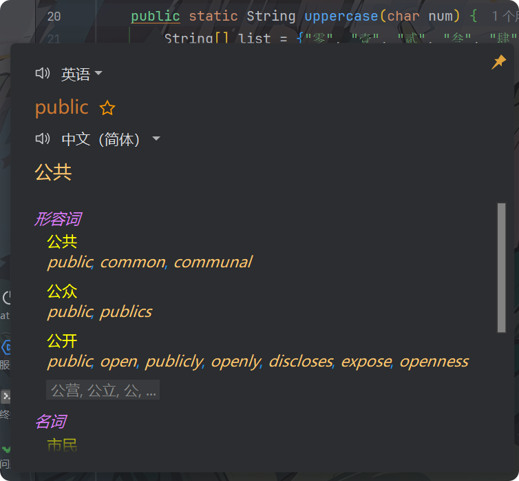
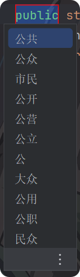
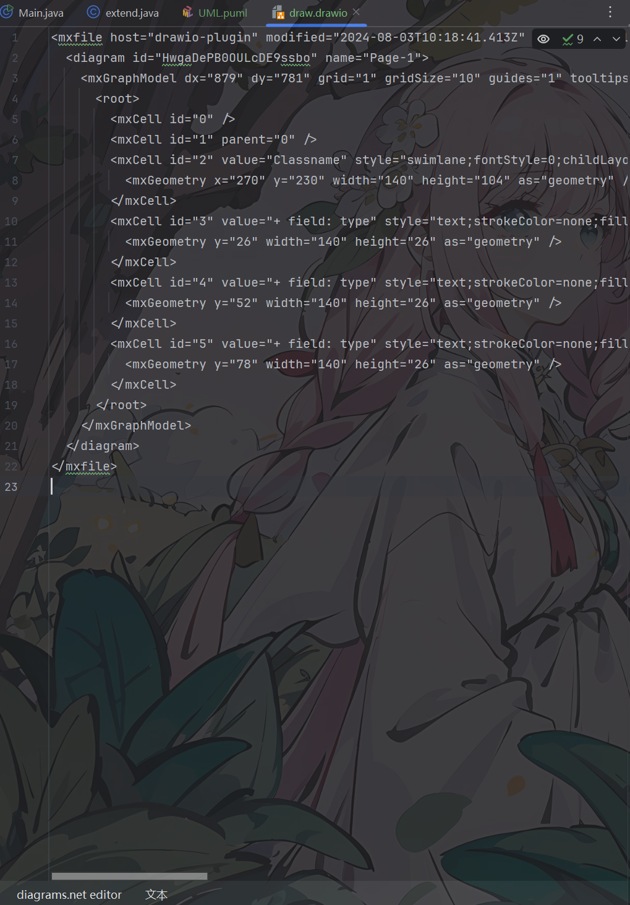
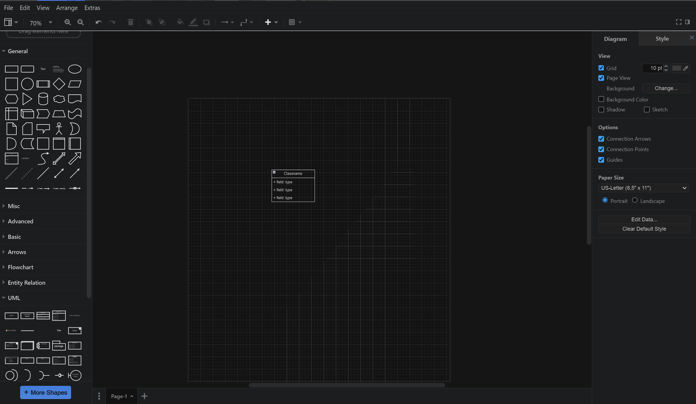
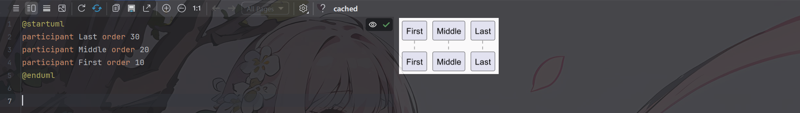

# Idea

## 1. 介绍

IntelliJ IDEA 是 JetBrains 公司推出的 Java 集成开发环境（IDE）。它是一款功能强大、界面简洁、支持多种语言的集成环境，可用于开发各种形式的应用软件。

## 2. 安装

IntelliJ IDEA 可以从官方网站下载安装，也可以从 JetBrains 官网下载安装。

## 3. 启动

启动 IntelliJ IDEA 后，会出现欢迎界面，选择 Create New Project 新建项目。

## 配置

菜单>文件>导入 IDE 设置

## Java 项目管理

菜单>文件>项目结构 「Ctrl+Alt+Shift+S」

> [!TIP]
> 项目模块: 就是项目依赖，添加依赖，
>
> 新建模块：项目所需：可以添加你所需要的，Java、Kotlin、Spring、^……^、模块。配置路径和类型
>
> 导入模块：导入其他项目的模块，可以是三分的，必须遵导入规则，Maven，Gradle 配置文件。

项目管理：顾名思义是项目重要的一环，类库引用，yaml 配置，依赖管理，运行配置等。

新建模块配置：

1. 源代码
   它是该模块根的目录，配置之后子级目录将会被识别为该模块的资源。
2. 测试
   测试代码的目录，配置之后该目录下的代码将会被识别为测试代码。
3. 资源
   该模块的资源目录，配置之后该目录下的资源文件将会被识别为该模块的资源。
4. 测试资源
   测试资源目录，配置之后该目录下的资源文件将会被识别为测试资源。
5. 排除
   排除目录，配置之后该目录下的资源文件将不会被编译。

## 运行「Alt+b」

配置运行参数：右上角运行下拉菜单>编辑配置

1. 添加配置

   点击左上角加号按钮，选择运行配置，配置运行对象。根据对象选择，Java：应用程序

   在去配置你的运行参数，入口类，java 版本，VM 参数，程序参数，环境变量等，工作目录。

2. 运行「Alt+b」

   点击运行按钮，运行你的程序。

## 调试「Alt+D」

配置调试参数：右上角运行下拉菜单>编辑配置

1. 添加配置

   点击左上角加号按钮，选择调试配置，配置调试对象。根据对象选择，Java：应用程序

   在去配置你的调试参数，入口类，java 版本，VM 参数，程序参数，环境变量等，工作目录。

2. 调试「Alt+D」

   点击调试按钮，调试你的程序。

## 我的快捷键

| 快捷键                                 | 功能        |
|-------------------------------------|-----------|
| <kbd> F2 </kdb>                     | 重命名       |
| <kbd> Alt + V </kdb>                | 方法声明变量    |
| <kbd> Alt + Left </kdb>             | 上一步       |
| <kbd> Alt + Right </kdb>            | 下一步       |
| <kbd> Ctrl + F12 </kdb>             | 类结构       |
| <kbd> Alt + M </kdb>                | 转到实现      |
| <kbd> Alt + b </kdb>                | 运行        |
| <kbd> Alt + D </kdb>                | 调试        |
| <kbd> Ctrl + Q </kdb>               | 切换行断点     |
| <kbd> Alt + G </kdb>                | SQL 语句运行  |
| <kbd> Alt + G </kdb>                | 类中提取为方法   |
| <kbd> Alt + Enter </kdb>            | Idea 生成   |
| <kbd> Ctrl + Enter </kdb>           | 智能换行      |
| <kbd> Ctrl + Shift + K </kdb>       | 删除整行      |
| <kbd> Ctrl + PgUp 『Num9』 </kdb>     | 标签下切换     |
| <kbd> Ctrl + PgDn 『Num3』 </kdb>     | 标签上切换     |
| <kbd> Alt + Num6 </kdb>             | 向右拆分      |
| <kbd> Alt + Num2 </kdb>             | 向下拆分      |
| <kbd> Alt + Num5 </kdb>             | 取消拆分      |
| <kbd> Alt + Shift +Num5 </kdb>      | 取消全部拆分    |
| <kbd> Alt + Shift +Space </kdb>     | 形参预览      |
| <kbd> Alt + A </kdb>                | 显示智能操作    |
| <kbd> Ctrl + I </kdb>               | 激活代码提示    |
| <kbd> Alt + T </kdb>                | 切换代码折叠    |
| <kbd> Ctrl + Alt + S </kdb>         | 代码格式化     |
| <kbd> Ctrl + Alt + T </kdb>         | 代码包围方法    |
| <kbd> Ctrl + Shift + Del </kdb>     | 代码移除包围    |
| <kbd> Ctrl + Shift + Alt + S </kdb> | 项目模块      |
| <kbd> Ctrl + Shift + v </kdb>       | MD 文件切换预览 |
| <kbd> Ctrl + Shift + E </kdb>       | MD 文件切换编辑 |


说明：

1. 方法说明变量：调用方法，有返回值需接受，它智能识别类型并声明变量
2. 重命名:支持文件重命名，也可以变量重命名，不再需要挨个替换
3. 提取为方法，Java 类选择代码，会出现小菜单栏，也可以选择提取，还有些提取功能
4. 智能换行:代码换行自动对齐
5. 智能操作:快速修复
6. 包裹方式:将代码外包裹一层，if、try、while、……
7. 项目模块:项目模块『文件夹』管理

## 拓展

1. Better HighLights「智能高光」

   ```java
   //TODO IDea 自带待做
   // ! 注意
   // ? 提示
   // Region 代码块 开始
   // End 代码库 结束
   ```

2. Rainbow Brackets「多彩括号」

   ```java
   public static void main(String[] args) {
       try {
           System.out.println(test());
       } catch (Exception e) {
           System.out.println(e);
       }
   }

   public static String test() {
       return "cg";
   }
   ```

   快捷键:

   | 快捷键                   | 功能     |
   | ------------------------ | -------- |
   | <kbd>Ctrl + MRight</kdb> | 局部高亮 |
   | <kbd>Alt + MRight</kdb>  | 专注模式 |
   | <kbd>ESC</kdb>           | 普通模式 |

   局部高亮:<br>
   

   专注模式：<br>
   

3. Translation「翻译工具」

   | 快捷键                      | 功能     |
   | --------------------------- | -------- |
   | <kdb>Ctrl + Shift + Y</kdb> | 选中翻译 |
   | <kdb>Ctrl + Shift + X</kdb> | 翻译替换 |

   效果图: <br>
   
   

4. Draw、UML 流程图绘制工具

   1. `drawio` 文件再底部切换图片绘制 或者 代码编写模式 后缀 `drawio`
      1. 代码：<br>
         
      2. 绘制：<br>
         
      3. Idea 卡顿 [解决](https://app.diagrams.net/)
   2. `UML` 纯代码编写，心智负担 不建议使用 后缀 `puml`
      1. 效果图: <br>
         
      2. [官网](https://plantuml.com/zh/running) [文献](https://plantuml.com/zh/guide)

[//]: # "5. Lombok 「隐藏Get、set」"
