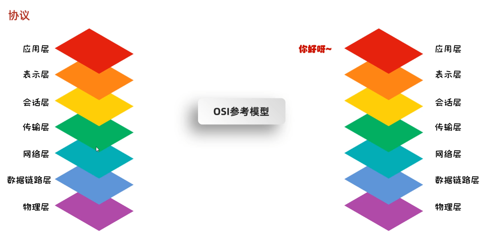
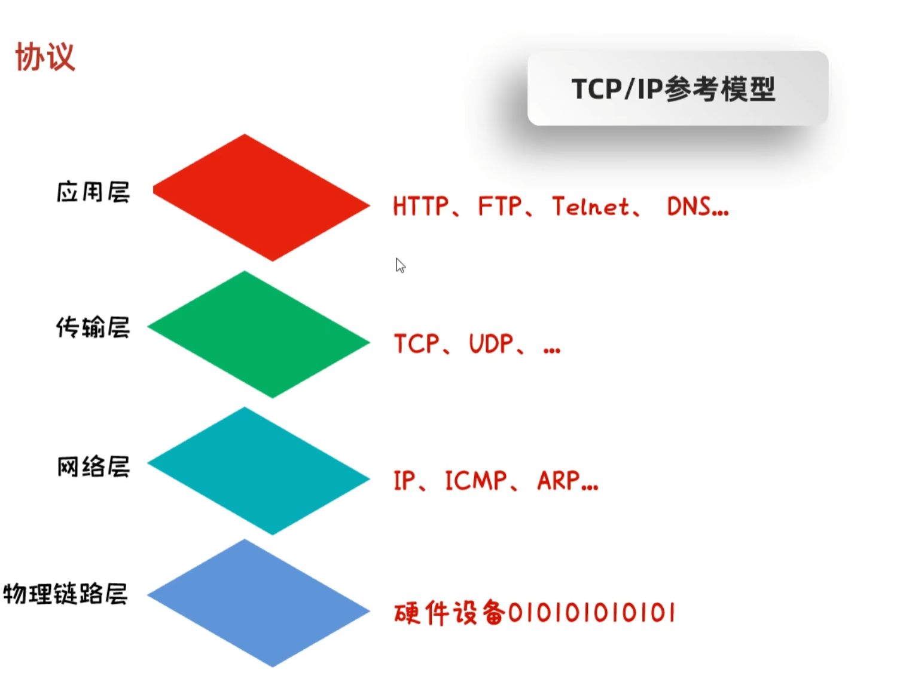

# 网络编程

> [!TIP]
> 网络编程：基于网络通讯协议下，不同计算机上运行程序，进行的传输数据。

常见架构
1. C/S Client/Server
2. B/S Browser/Server

C/S 优点：资源本地存储，节省云资源，缺点：下载体积大，更新不方便。客户端需要开发
B/S 优点 只需要开发服务端，按需下载资源。缺点：资源文件大小注意。

网络三要素：

1. IP 网络设备在网路上的地址 有 IPV4 与 IPV6 
2. 端口 0 ~ 65535 0 ~ 1023 常用网络服务或软件占用
3. 协议 TCP UDP HTTP FTP ...

IPV4 地址已经分配完毕，不够使用为了节省，192.168 开头都是私有地址，局域网连接

## 网路协议



## 获取ip

InetAddress：

| 方法                                | 功能         |
|-----------------------------------|------------|
| 静态方法                              | ---        |
| getByName(string name)            | 通过设备名称获取地址 |
| getByAddress(string ip)           | 通过地址获取对象   |
| getByAddress(string ip, int host) | 通过地址和端口获取  |
| 成员方法                              | ---        |
| getHostAddress()                  | 获取对象IP地址   |
| getAddress()                      | IP . 分割未数组 |
| getHostName()                     | 获取设备名称     |


## UDP 协议

1. 用户数据报协议(User Datagram Protocol)
2. UDP是面向无连接通信协议。不管是是否相应都发送数据。
3. 速度快，有大小限制一次最多发送64K，数据不安全，易丢失数据

网络视频、语音通话、在线视频

UDP 发送端

| 方法                                     | 说明     |
|----------------------------------------|--------|
| 构造函数                                   | ---    |
| DatagramSocket(/* 可选端口 */)             | UDP管理器 |
| 成员方法                                   | ---    |
| send(/* 数据包 */)                        | 发送数据   |
| close()                                | 关闭管理器  |

UDP 数据包

| 方法                                     | 说明     |
|----------------------------------------|--------|
| 构造函数                                   | ---    |
| DatagramPacket(/* 字节数组、长度 可选：地址、端口 */) | 数据包    |
| 成员方法                                   | ---    |
| getLength()                            | 获取数组长度 |
| getOffset()                            | 获取起始位置 |
| getAddress()                           | 获取地址   |
| getPort()                              | 获取端口   |
| getSocketAddress()                     | 获取地址对象 |

UDP 服务器组合端：多个服务器同时监听信息

| 方法                          | 说明                                   |
|-----------------------------|--------------------------------------|
| 构造函数                        | ---                                  |
| MulticastSocket(/* 可选端口 */) | 组合工具                                 |
| 成员方法                        | ---                                  |
| joinGroup(InetAddress)      | 加入组 要求区间 224.0.0.0 ~ 239.255.255.255 |
| send(/* 数据包 */)             | 发送到组                                 |

### 发送数据

```java
public static void main(String[] args) {
    /*
     * DatagramSocket对象：发送管理器
     * 构造函数可指定占用端口，无则随机获取
     * */
    DatagramSocket socket = new DatagramSocket();

    /*
     * DatagramPacket：数据包
     * 构造函数传入 字节数组 长度 可指定范围 起始位置与长度，可指定发送地址与端口
     * */
    
    byte[] data = "hellow 我是UDP数据".getBytes();

    DatagramPacket packet = new DatagramPacket(data, data.length,
            InetAddress.getByName("127.0.0.1"), 25505);

    //?让管理仓库发送数据,不会询问状态，UDP只负责发送。
    socket.send(packet);

    socket.close();
}
```

### 接受数据

```java
public static void main(String[] args) throws IOException {

    /*
     * DatagramSocket对象：发送管理器
     * 构造函数可指定占用端口，无则随机获取
     * */
    DatagramSocket socket = new DatagramSocket(25505);

    /*
     * DatagramPacket：数据包
     * 接受数据包，指定最大接受字节。
     * */
    DatagramPacket packet = new DatagramPacket(new byte[1024], 1024);
    //这里开启一直等待，直到收到数据。
    socket.receive(packet);

    //解析数据
    byte[] data = packet.getData();

    System.out.println("数据内容 \n"+new String(data,0,packet.getLength()));

    InetAddress address = packet.getAddress();
    int port = packet.getPort();

    System.out.println("数据来自"+address+":"+port);

    socket.close();
}
```

### 通讯室

Server

```java
public static void main(String[] args) throws IOException {

    DatagramSocket socket = new DatagramSocket(25505);

    DatagramPacket packet = new DatagramPacket(new byte[1024], 1024);

    while (true) {
        //重复监听，不然内容解析会一直之前的消息
        socket.receive(packet);

        //解析数据
        byte[] data = packet.getData();

        String body = new String(data,0,packet.getLength());

        System.out.println("数据内容 \n"+body);

        InetAddress address = packet.getAddress();
        int port = packet.getPort();

        System.out.println("数据来自"+address+":"+port);
        //退出密钥
        if ("关闭服务器".equals(body)) {
            break;
        }
    }
    socket.close();
}
```

Client

```java
public static void main(String[] args) throws IOException {

    DatagramSocket socket = new DatagramSocket();

    Scanner scanner = new Scanner(System.in);

    while (true) {
        String s = scanner.nextLine();

        byte[] data = s.getBytes();

        DatagramPacket packet = new DatagramPacket(data, data.length,
                InetAddress.getByName("127.0.0.1"), 25505);

        if("退出聊天".equals(s)){
            break;
        }
        
        socket.send(packet);
    }

    socket.close();
}
```

### 组合端

Server

```java
public static void main(String[] args) throws IOException {
    //指定端口
    MulticastSocket socket = new MulticastSocket(25505);
    //?区间 224.0.0.0～224.0.0.255 为预留的组播地址 出问题换地址
    InetAddress group = InetAddress.getByName("224.0.0.2");

    //?加入组
    socket.joinGroup(group);

    DatagramPacket packet = new DatagramPacket(new byte[1024], 1024);
    
    //正常解析部分
    while (true) {
        socket.receive(packet);

        byte[] data = packet.getData();
        String body = new String(data, 0, packet.getLength());

        System.out.println("数据内容 \n" + body);

        InetAddress address = packet.getAddress();
        int port = packet.getPort();

        System.out.println("数据来自" + address + ":" + port);

        if ("关闭服务器".equals(body)) {
            break;
        }
    }

    socket.leaveGroup(group);
    socket.close();
}
```

client

```java
public static void main(String[] args) throws IOException {
    //发送者不需要占用端口
    DatagramSocket socket = new DatagramSocket();

    Scanner scanner = new Scanner(System.in);

    while (true) {
        String s = scanner.nextLine();

        byte[] data = s.getBytes();

        DatagramPacket packet = new DatagramPacket(data, data.length,
                InetAddress.getByName("224.0.0.2"), 25505);

        if("退出聊天".equals(s)){
            break;
        }

        //发送到组，必须要组类的发送方法。
        socket.send(packet);
    }

    socket.close();
}
```

## TCP



1. 传输控制协议TCP(Transmission Control Protocol)
2. TCP协议是面向连接的通信协议
3. 速度慢，没有大小限制，数据安全。

安装包下载、文字聊天、发送邮件

