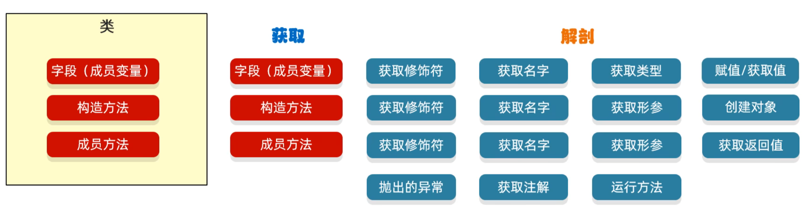

# Java 反射

> [!TIP]
> 反射允许对封装类的字段，方法和构造函数的信息进行编程访问,Idea的智能提示通过反射实现



## 获取class对象

1. class.forName("全类名") '静态方式'
2. 类名.class '静态方式'
3. 对象.getClass(); '实例化后获取方式'

Java 获取 Modifiers 修饰符的时候，返回数字，在Java文档中去查看

文档中搜索，并选择你获取对象的多态关系「`Constant Field Values`」

## 获取构造方法

Class 对象成员方法,全是静态方法

| 方法                                                 | 说明              |
|----------------------------------------------------|-----------------|
| getConstructors()                                  | 返回所有公共构造方法对象的数组 |
| getDeclaredConstructors()                          | 返回所有构造方法对象的数组   |
| getConstructor(Class<?>... parameterTypes)         | 返回单个公共构造方法对象    |
| getDeclaredConstructor(Class<?>... parameterTypes) | 返回单个构造方法对象      |

Constructor 构造函数对象

| 方法                        | 说明                |
|---------------------------|-------------------|
| getParameterAnnotations() | 返回参数声明顺序的数组       |
| getParameterCount()       | 返回方法参数数量          |
| getParameterTypes()       | 返回参数类型            |
| getName()                 | 以字符串形式返回此构造函数的名称  |
| getModifiers()            | 获取访问修饰符，常量字段值     |
| newInstance(/* 参数 */)     | 构造方法参数，与普通一样使用方式  |
| setAccessible()           | 暴力反射 私有的构造，强制转换公共 |

Constructor类中用于创建对象的方法

1. T newInstance(Object...initArgs)：根据指定的构造方法创建对象
2. setAccessible(boolean flag)：设置为true,表示取消访问检查

```java
public static void main(String[] args) {
    /*
     * Declared是能返回私有属性的
     * 最后有s是返回所有的对象
     * 单个无参数就顺序返回第一个
     * 单个的需要保证参数的数量
     * 参数的类型,都能与方法对应
     * 这样如果对的上就返回方法
     * 参数类型Int就int.class
     * 不要Integer.class对不上
     * */
    Class c1 = Class.forName("src.Server");
    //?获取参数类型是Int的公开构造方法。String 同理传入class对象，多参逗号隔开。
    System.out.println(c1.getConstructor(int.class));

    //! 强制调用私有化构造函数，并调用构造方法拿取对象
    Class cs = Class.forName("src.Server");

    //一定要使用 Declared 才能访问并拿取到私有方法
    Constructor constructor = cs.getDeclaredConstructor(int.class, String.class);

    //!强制转换为公开
    constructor.setAccessible(true);

    //?调用构造方法
    Server s1 = (Server) constructor.newInstance(16, "张三");
    Server s2 = (Server) constructor.newInstance(19, "李四");
}
```

## 获取成员属性

Constructor 构造函数对象

Class 对象静态方法

| 方法                            | 说明              |
|-------------------------------|-----------------|
| getFields()                   | 返回所有公共成员变量对象的数组 |
| getDeclaredFields()           | 返回所有成员变量对象的数组   |
| getField(String name)         | 返回单个公共成员变量对象    |
| getDeclaredField(String name) | 返回单个成员变量对象      |

Field类中用于创建对象的方法

1. void set(Object obj, Object value)： 赋值
2. Object get(Object obj) 获取值。

Filed 属性静态方法

| 方法                 | 说明                |
|--------------------|-------------------|
| get(/* 实例化后对象！ */) | 获取实例化后对象内的值       |
| getType()          | 获取属性类型            |
| set()              | 设置对象上的初始值值        |
| getName()          | 以字符串形式返回此构造函数的名称  |
| setAccessible()    | 暴力反射 私有的属性，强制转换公共 |
| getModifiers()     | 获取访问修饰符，常量字段值     |
| getBoolean()       | 获取静态或实例的值 boolean |
| getInt()           | 获取静态或实例的值 Int     |

```java
public static void main(String[] args) {
    Class cs = Class.forName("src.Server");
    //获取所有公开
    System.out.println(Arrays.toString(cs.getFields()));
    //获取单个
    System.out.println(cs.getDeclaredField("anInt"));
}
```

## 获取成员方法

Class 对象静态方法

| 方法                                                         | 说明                    |
|------------------------------------------------------------|-----------------------|
| getMethods()                                               | 返回所有公共成员方法对象的数组，包括继承的 |
| getDeclaredMethods()                                       | 返回所有成员方法对象的数组，不包括继承的  |
| getMethod(String name, Class<?>... parameterTypes)         | 返回单个公共成员方法对象          |
| getDeclaredMethod(String name, Class<?>... parameterTypes) | 返回单个成员方法对象            |

Filed 属性静态方法

| 方法                                 | 说明                |
|------------------------------------|-------------------|
| get()                              | 获取对象上的初始值，实例化中的值  |
| getName()                          | 获取方法名称            |
| getParameterAnnotations()          | 获取参数顺序数组          |
| getParameterCount()                | 获取方法参数数量          |
| getParameterTypes()                | 方法顺序参数类型数组        |
| getGenericExceptionTypes()         | Type类型的参数类型数组     |
| getReturnType()                    | 获取方法返回值类型         |
| getModifiers()                     | 获取访问修饰符,常量字段值     |
| getGenericExceptionTypes()         | 获取方法体抛出的可出现异常     |
| invoke(Object obj, Object... args) | 调用方法，第一个对象，后续方法参数 |
| setAccessible()                    | 暴力反射 私有的构造，强制转换公共 |
| toGenericString()                  | 描述方法字符串,包括类型参数    |

Method类中用于创建对象的方法

Object invoke(Object obj, Object... args)： 运行方法
参数一：自定义方法调用者,`apply`
参数二：调用方法的传递的参数（如果没有就不写）
返回值：方法的返回值(如果没有就不写)

```java
import java.lang.reflect.Method;

public static void main(String[] args) {
    Class cs = Class.forName("src.Server");

    System.out.println(Arrays.toString(cs.getMethods()));
    //?获取指定方法，第一个参数固定位方法名称，后续可变参数，类型需对应。
    Method setTest = cs.getMethod("setTest", String.class);

    Object o = new Object();

    //?相当于 apply 自定义方法调用者指针，让方法体认为是o调用的方法
    setTest.invoke(o, "1");
}
```

## 反射获取类属性

```java
public static void main(String[] args) {
    Server s1 = new Server(16, "张三");
    Server s2 = new Server(19, "李四");
    s2.setAddress("家庭地址");

    getFields(s1);
}

private static void getFields(Object o) throws IllegalAccessException {
    Class<?> cs = o.getClass();
    Field[] fields = cs.getDeclaredFields();
    for (Field field : fields) {
        field.setAccessible(true);
        String name = field.getName();
        //?注意Get方法传入的是类，而不是 class 对象。
        Object val = field.get(o);
        System.out.println(name + ": " + val);
    }
}
```
