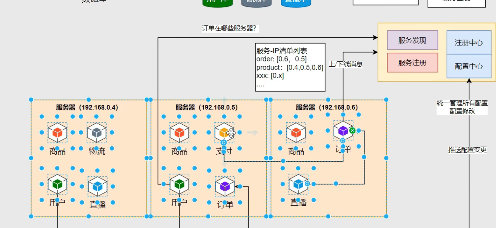

# Spring Cloud 微服务架构

> [!TIP]
> Spring Cloud 是一个基于 Spring Boot 的微服务架构开发框架
>
> 它解决了传统单体架构中服务独立部署困难、无法有效处理高并发等问题

## 分布式架构面临的挑战

### 1. 服务治理与网关处理

**Nginx 网关处理相关问题：**

- 服务副本 → 服务集群管理
- 服务路由 → 动态服务发现与路由
- 机器负载 → 负载均衡策略
- 扩缩容器 → 弹性伸缩与高可维护性

### 2. 分布式数据库

**数据库集群管理：**

- **主从复制**：一主多从，读写分离提升性能
- **分库分表**：水平拆分和垂直拆分
  - 水平拆分：按数据量拆分（如按用户ID取模）
  - 垂直拆分：按业务模块拆分（用户库、订单库、商品库）
- **数据一致性**：
  - 强一致性：ACID 事务保证
  - 最终一致性：BASE 理论，允许短暂不一致
  - 分布式事务：2PC、3PC、TCC、Saga 模式

**唯一性保证：**

- **分布式ID生成**：
  - UUID：简单但性能较差
  - 雪花算法（Snowflake）：高性能，时间戳+机器ID+序列号
  - 数据库自增ID：简单但存在单点故障
  - Redis 原子递增：高性能分布式ID
- **数据去重策略**：
  - 唯一索引约束
  - 分布式锁机制
  - 幂等性设计

**分布式数据库中间件：**

- **ShardingSphere**：数据分片、读写分离
- **MyCat**：数据库代理，透明分库分表
- **TiDB**：分布式 NewSQL 数据库

## 微服务架构特点

- **多语言支持**：不同服务可使用不同技术栈
- **模块化设计**：业务功能独立开发和部署
- **服务交互性**：通过 API 进行服务间通信
- **多语言适配**：不同语言交互没有影响

## 服务拆分实践

**从单体到微服务：**



- 将 Spring Boot 单体应用按业务域拆分
- 例如：电商系统拆分为
  - 用户服务（User Service）
  - 商品服务（Product Service）
  - 订单服务（Order Service）
  - 支付服务（Payment Service）

**服务间通信：**

- **同步通信**：HTTP REST API、RPC（Dubbo、gRPC）
- **异步通信**：消息队列（RabbitMQ、Kafka、RocketMQ）
- **服务发现**：Eureka、Consul、Nacos
- **配置管理**：Spring Cloud Config、Apollo、Nacos

> [!IMPORTANT]
> 服务之间的数据获取不再通过直接访问数据库，而是通过服务调用的方式实现，确保数据的封装性和服务的独立性

## 服务 RPC 远程调用

> [!NOTE]
> RPC（Remote Procedure Call）远程过程调用是微服务架构中服务间通信的核心技术，让分布式系统中的服务能够像调用本地方法一样调用远程服务

### 远程调用方式对比

| 调用方式 | 协议 | 性能 | 易用性 | 跨语言 | 适用场景 |
|---------|------|------|--------|--------|----------|
| **HTTP REST** | HTTP/HTTPS | 中等 | 高 | 是 | 外部API、跨语言调用 |
| **RPC (Dubbo)** | TCP | 高 | 中等 | 有限 | 内部服务调用 |
| **gRPC** | HTTP/2 | 高 | 中等 | 是 | 高性能、跨语言场景 |
| **消息队列** | AMQP/TCP | 中等 | 中等 | 是 | 异步处理、解耦 |

### Spring Cloud 中的远程调用技术

#### 1. RestTemplate（传统方式）

**特点：**

- Spring 框架提供的同步 HTTP 客户端
- 支持 `@LoadBalanced` 注解实现客户端负载均衡
- 需要手动处理服务发现和异常
- 适合简单的 HTTP 调用场景

**架构模式：**

```text
服务A → RestTemplate → 负载均衡器 → 服务B实例
```

#### 2. OpenFeign（声明式调用）

**核心优势：**

- **声明式编程**：通过接口和注解定义远程调用
- **集成度高**：内置负载均衡、熔断器、重试机制
- **易于维护**：接口定义清晰，支持服务降级
- **Spring 生态**：与 Spring Cloud 无缝集成

**架构组件：**

- `@FeignClient`：定义远程服务接口
- `@EnableFeignClients`：启用 Feign 客户端扫描
- `Fallback`：服务降级处理机制
- `RequestInterceptor`：请求拦截和增强

**调用流程：**

```text
业务服务 → Feign接口 → 负载均衡 → 熔断器 → 目标服务
     ↓
  降级处理（Fallback）
```

#### 3. WebClient（响应式调用）

**技术特点：**

- **非阻塞 I/O**：基于 Reactor 的响应式编程模型
- **高并发支持**：适合高吞吐量场景
- **流式处理**：支持数据流的实时处理
- **Spring WebFlux 集成**：与响应式技术栈配套

**适用场景：**

- 高并发微服务调用
- 实时数据流处理
- 异步任务处理

### 远程调用架构设计

#### 服务发现集成

**传统问题：**

- 硬编码服务地址，缺乏灵活性
- 服务实例变化时需要手动更新配置
- 无法感知服务健康状态

**解决方案：**

- **服务注册中心**：`Eureka`、`Nacos`、`Consul`
- **客户端负载均衡**：`Ribbon`、`Spring Cloud LoadBalancer`
- **服务发现**：自动获取可用服务实例列表

#### 容错机制设计

**超时控制：**

- **连接超时**：`connectTimeout`
- **读取超时**：`readTimeout`
- **分服务配置**：不同服务设置不同超时时间

**重试策略：**

- **重试次数**：避免无限重试
- **重试间隔**：指数退避算法
- **重试条件**：仅对幂等操作重试

**熔断降级：**

- **熔断器模式**：快速失败，避免级联故障
- **降级策略**：返回默认值或缓存数据
- **恢复机制**：半开状态探测服务恢复

## 注册中心

> [!NOTE]
> 在微服务架构中，注册中心是服务发现和注册的核心组件，用于管理服务实例的信息，解决服务实例动态变化的问题

### 主要功能

- **服务注册**：服务启动时自动注册实例信息（IP、端口、服务名等）
- **服务发现**：允许服务消费者查询和获取可用的服务实例
- **健康监测**：定期检查服务实例是否可用，自动剔除故障实例
- **负载均衡**：提供多实例间的负载均衡策略

### 常用注册中心

- **Eureka**：Netflix开源的服务注册中心，可用性优先
- **Nacos**：阿里开源的动态服务发现、配置管理和服务管理平台
- **Consul**：HashiCorp开源的服务网格解决方案
- **Zookeeper**：Apache开源的分布式协调服务

### 配置中心

配置中心与注册中心协同工作，提供以下能力：

- 集中管理各环境的配置文件
- 配置文件修改实时生效
- 版本管理及回滚
- 配置更新审计

常用的配置中心有：Spring Cloud Config、Apollo、Nacos等

### 分布式事务

> [!NOTE]
> 分布式事务是指跨多个服务或数据源的事务处理，需要保证所有操作要么全部成功，要么全部失败回滚

1. CAP 理论

   - **一致性(Consistency)**：所有节点数据保持一致
   - **可用性(Availability)**：服务一直可用，但不保证获取的是最新数据
   - **分区容错性(Partition tolerance)**：分布式系统中，节点之间通信可能失败

2. 分布式事务解决方案

   - **2PC (两阶段提交)**：准备阶段和提交阶段，强一致性但性能较差
   - **TCC (Try-Confirm-Cancel)**：预留资源、确认/撤销操作，适合金融场景
   - **Saga 模式**：将分布式事务拆分为多个本地事务，通过补偿机制保证最终一致性

3. 实现框架

   - **Seata**：阿里开源的分布式事务框架，支持多种事务模式
   - **LCN**：国产分布式事务框架，基于代理的事务控制
   - **ByteTCC**：支持 TCC 模式的分布式事务框架

4. 推荐工具：spring-Cloud Alibaba Seata

### 网关

> [!NOTE]
> 网关是微服务架构中的统一入口，负责路由转发、负载均衡、认证授权等功能

#### 主要功能

- **路由转发**：根据请求路径将请求转发到对应的微服务
- **负载均衡**：在多个服务实例间分发请求
- **认证授权**：统一处理用户身份验证和权限控制
- **限流熔断**：保护后端服务免受过载影响
- **监控日志**：统一收集请求日志和监控数据

#### 注册中心与 Nginx 的协同架构

**传统架构问题：**

- Nginx 配置静态，无法动态感知服务实例变化
- 服务扩缩容时需要手动修改 Nginx 配置
- 缺乏服务健康检查机制

解决方案：**注册中心 + Nginx 动态配置**

```text
客户端请求 → Nginx (负载均衡) → 注册中心 (服务发现) → 微服务实例
```

**实现方式：**

1. **Nginx + Consul Template**

   ```bash
   # Consul Template 监听注册中心变化，动态生成 Nginx 配置
   consul-template -template="nginx.conf.tpl:nginx.conf:nginx -s reload"
   ```

2. **Nginx + lua-resty-consul**

   ```lua
   -- 在 Nginx 中使用 Lua 脚本动态获取服务列表
   local consul = require "resty.consul"
   local services = consul:get_service("user-service")
   ```

3. **Spring Cloud Gateway + Eureka**

   ```yaml
   # 应用网关自动从注册中心发现服务
   spring:
     cloud:
       gateway:
         discovery:
           locator:
             enabled: true
   ```

**架构优势：**

- **动态路由**：服务实例变化时自动更新路由规则
- **健康检查**：自动剔除不健康的服务实例
- **零停机部署**：新实例注册后自动接收流量
- **故障隔离**：单个实例故障不影响整体服务

**最佳实践：**

- 使用多层负载均衡：Nginx (L7) + 注册中心 (服务发现)
- 配置合理的健康检查间隔和超时时间
- 实现优雅的服务上下线机制
- 监控服务注册状态和网关性能指标

## 常见问题

> [!NOTE]
> 由分布式架构带来的问题

### 服务雪崩

> [!IMPORTANT]
> 服务雪崩是指在微服务架构中，一个服务的故障导致级联故障，最终影响到整个系统的稳定性

问题：

- 当某个服务的请求时间过长 在高并发的情况下 导致其服务线程资源消耗 原性能预估出错

- 负载均衡调度会去调用其他服务 其他服务也会由于压力增大 单服务故障导致服务雪崩

解决：

  快速失败：当某个服务多次失败且响应时间较长 触发服务熔断 后续快速失败 节省资源

  工具 `Spring Cloud Alibaba Sentinel`
