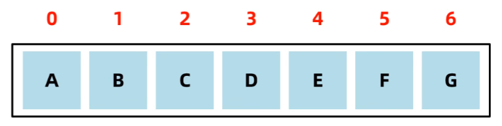
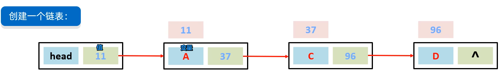

# 数据结构

1. 每种数据结构是什么
2. 任何添加数据
3. 如何删除数据

## 栈

先进先出，后进后出，栈顶出入，进入叫压，出去叫弹。

ABCD依次进入，完成之后A在站地，D在栈顶，只有等D完成后等CB，才能轮到A出栈，

## 队列

数据从后端进入队列叫：入队列 、从前端离开队列叫：出队列。先进先出，后进后出

## 组数

ArrayList 用的组数，并带有自动扩容。

查询速度快：查询可通过索引定位，查询速度容易数据耗时相同

删除效率低：移除原始数据，同时将后面数据前移

添加效率低：添加数据，同时后面数据后移

## 链表

数链接起来存储的方式 `LinkedLIst` 用的双向链表

非连续数据导致查询慢，它需要从head挨个去看记录的地址，直到地址找到对应数据。

增删改会非常快，它不需要每次往后推移，在链表中间修改为新的地址值，增加删除则修改新地址的左右俩边的地址为他即可。

双向链表具备优化性，可判断数据距离头和尾谁近，就用谁来进行查询

## 二叉树

## 二叉查找树

## 平衡二叉树

## 红黑树

