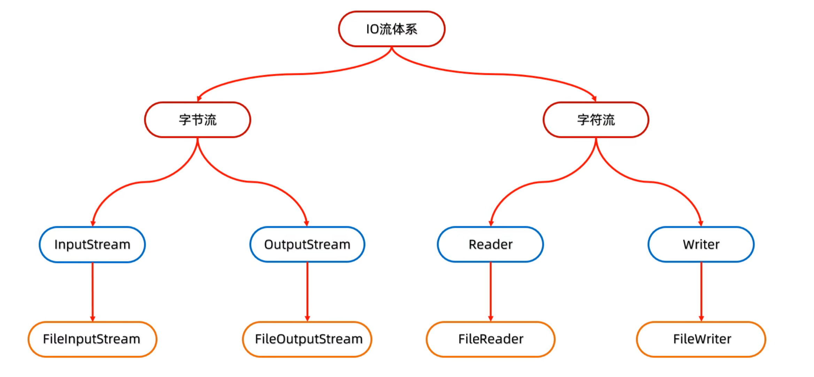
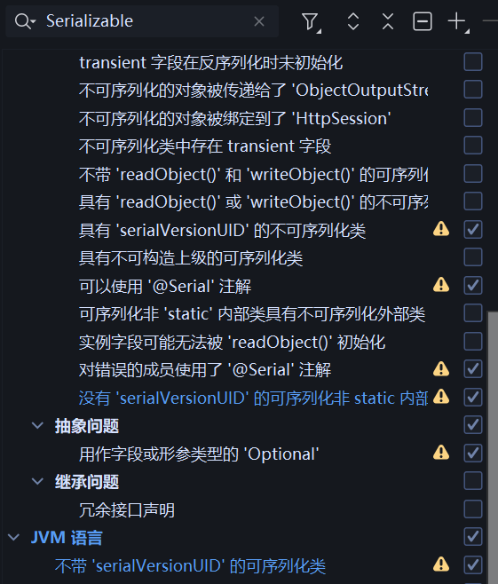

# Java IO（Input/Output）



## 输入输出流

Java IO 包括输入流和输出流。输入流用于从源（如文件、网络、控制台）**读取数据**

输出流用于向目标（如文件、网络、控制台）**写入数据**。

读取也分为：`字节流`和`字符流`。字节流用于处理`二进制`数据<sup>图片...</sup>，字符流用于处理 `文本数据`。

快速使用

<details>
<summary>详细语法</summary>

```java
public static void main(String[] args) {

    //?写入方法首次会将文件中所有字符 全部删除再进行写入,append参数为true时追加写入,就不会删除原有内容
    FileOutputStream fos = new FileOutputStream("test.txt");

    fos.write('6');

    fos.close();
}
```

</details>

## 字节流(二进制)

### FileOutputStream :: 写入文件

> [!TIP]
> FileOutputStream 用于将字节数据写入文件。

| 方法                                                        | 参数            | 描述                               |
|-----------------------------------------------------------|---------------|----------------------------------|
| FileOutputStream(String name)                             | name:文件路径     | 实例化对象                            |
| FileOutputStream(File file)                               | file:文件对象     | 实例化对象                            |
| FileOutputStream([File file, boolean append],append:是否追加) | file:文件对象     | 实例化对象                            |
| write(int b)                                              | b:写入的字节       | 将单个字节写入文件,写入不能超出一字节！             |
| write(byte[] b)                                           | b:写入的字节数组     | 将字节数组写入文件                        |
| write(byte[] b , int off, int len)                        | b:写入的字节数组自选范围 | 将字节数组范围写入 `len` 是个数不是结束位置        |
| flush()                                                   | 无             | 刷新缓冲区，将缓冲区中的数据立即写入文件             |
| close()                                                   | 无             | 关闭 FileOutputStream，释放系统资源       |
| Str.getBytes()                                            | 将字符串转换为字节数组   | 返回值是字节数组,write 可用                |
| Str.getBytes()                                            | charsetName   | 使用特点格式编码器，返回格式对应字符码 \[数组\] 查看需解码 |

> [!NOTE]
> 换行符：**windows** 换行符是 `\r\n`, **Unix** 换行符是 `\n` **Mac** 换行符是 `\r`。

<details>
<summary>详细语法</summary>

```java
FileOutputStream fos = new FileOutputStream("test.txt");
```

</details>

### FileInputStream :: 读取文件

> [!TIP]
> FileInputStream 用于从文件中读取字节数据，它是指针读取，读一次移动一个字节。
>
> 弊端一次只能读取一个字节，文件过大会循环次数太多导致低效率。
>
> 不要用字节流读取文本文件，它会导致乱码的问题，它的字节需要解码，拷贝不影响。
>
> 拷贝文件的通解，用其他拷贝可能出现问题，字节就不会出现。内部数组 是字节类型。

| 方法                                   | 参数                       | 描述                             |
|--------------------------------------|--------------------------|--------------------------------|
| FileInputStream(String name)         | name:文件路径                | 实例化对象,指针读取形势                   |
| FileInputStream(File file)           | file:文件对象                | 实例化对象                          |
| int read()                           | 无                        | 从文件中读取单个字节，返回值是字节值,无数据返回 -1    |
| int read(byte[] b)                   | b:字节数组                   | 从文件中读取字节数组，返回值是读取的字节数          |
| int read(byte[] b, int off, int len) | b:字节数组,off:偏移量,len:读取字节数 | 从文件中读取字节数组范围，返回值是读取的字节数        |
| byte[] readAllBytes                  | void                     | 一次性返回数据字节数组，大文件内存 和 long字节上线   |
| close()                              | 无                        | 关闭 FileInputStream，释放系统资源,先开后关 |

<details>
<summary>示例代码</summary>

适用于小文件拷贝

<details>
<summary>详细语法</summary>

```java
//?拷贝文件,写入文件时候 找不到文件就异常 需要自己创建文件
public static void main(String[] args) {

    File file = new File("test2.txt");
    System.out.println(file.createNewFile());

    FileInputStream fus = new FileInputStream("test.txt");
    FileOutputStream fos = new FileOutputStream("test2.txt");

    while (true) {
        int i = fus.read();
        if(i == -1) {
            fus.close();
            break;
        }else {
            fos.write(i);
        }
    }
}
```

</details>

大文件拷贝

<details>
<summary>详细语法</summary>

```java
public static void main(String[] args) throws RuntimeException {
    /*
     * ?由于一次只能读取一个字节导致慢，我们可以自定义一次读取大小，
     * 方法是传递一个byte[]根据长度来定义一次读取大小。
     * 注意重复读取的时候，数组第一次读取的数据并不会删除而是重新覆盖第二次字节位置的
     * 比如第一次 50 字节 ，第二次只读取到 10 字节 数组0~10 是第二次数据 后面还是首次数据。
     */
        File file = new File("test2.txt");
        System.out.println(file.createNewFile());

        FileInputStream fus = new FileInputStream("test.txt");
        FileOutputStream fos = new FileOutputStream("test2.txt");

        while (true) {
            byte[] bytes = new byte[1024 * 1024/* 1Mb */];
            //读取的数据会全部存入传递的数组里面，没有读取到就是 null
            int i = fus.read(bytes);//?read 传递数组 返回值就是读取字节数
            if(i == -1) {
                //? 指针一开始就没读取到数据就是 -1，有数据才会返回读取到的字节数
                fus.close();
                break;
            }else {
                //? 写入也支持传入数组，但是数组长度是写实的，里面会包含null数据
                //! 我们可以根据读取到的字节数来限制它写入范围，不会写入null 和 前一次的数据
                fos.write(bytes,0,i);
            }
        }
}
```

</details>

编译异常,解决方法

<details>
<summary>详细语法</summary>

```java
public static void main(String[] args) {
    //JDK 7
    try(FileInputStream fus = new FileInputStream("test.txt");
        FileOutputStream fos = new FileOutputStream("test2.txt")) {}
    catch(Exception e) {
        /*
         * 注意 只有实现了AutoCloseable按口的类，才能在小括号中创建对象。
         * 这是简写版，如果在try大括号里面写创建对象，我们无法获取到fos
         * 无法获取到 无法确保 资源被释放
         */
        e.printStackTrace();
    }
    //JDK 9
    //?JDK9就是实例化的过程不需要写在括号里面，可以在外面写完 括号写变量名称就行了，需要 throws 过编译异常
}
```

</details>

</details>

## 字符流(文本)

> [!NOTE]
> 字节流只能一字节的解析，再遇到文字编码后 会多字节存储 时候无法处理
>
> 码表中 Ascii 系列只有 1 字节，因为英语的码表中编码最大就 999 内，不需要多字节存储
>
> 而国家语言增加后 一字节 8 的长度不够使用 所以引入的字符编码器 utf 8 (Unicode Transformation Format)
>
> 中文数量很多在 utf8 中为中文划分的区间是 3 个字节 左边第一字节 10 就表示 一字节 110 两字节 0 是断开符
>
> 由于上面的编码问题所以通过字节读取文件，一字节可能会出现文字解码错误，字符流就是 utf 解码器
>
> 字符刘 = 字节流 + 字符集 。**字符流内部数组是 字符类型，而不是字节类型**

### FileReader :: 读取文本

快速使用

<details>
<summary>详细语法</summary>

```java
public static void main(String[] args) {
  //没有指定编码格式，默认使用系统默认编码格式
  FileReader f1 = new FileReader(new File("test.txt"));
  while (f1.ready()) {
      //?读取之后它会 自动解码并转换成 10 进制，它返回的是编码值，编码值可以转换字符。
      int text =f1.read();
      if(text > 0) {
          System.out.println((char) text);
      }else {
          break;
      }
  }
  f1.close();
}
```

</details>

| 方法                                       | 参数     | 说明                 |
|------------------------------------------|--------|--------------------|
| public FileReader(File file)             | File   | 传入文件对象             |
| public FileReader(String path)           | String | 传入文件路径             |
| --------分割符-------                       | 分割符    | 分割符                |
| public int read ()                       | void   | 读取数据,结束返回-1        |
| public int read (char[])                 | 数组长度   | 指定读取数,返回读取文字数 -1   |
| public int read (char[],int off,int len) | int    | 指定读取数,并指定起始位置,往后长度 |
| public void close ()                     | void   | 结束资源占用             |

指定长度 Demo

<details>
<summary>详细语法</summary>

```java
public static void main(String[] args) {
    try (FileReader f1 = new FileReader("test.txt")) {
        int i;
        char[] chars = new char[100];
        //?数组里面装的已经是chars的数组了，编码已经转换成字符了，只需要拿取对应位置的使用即可。
        while ((i = f1.read(chars)) != -1) {
            //! read 数组方法返回的是 读取到的 **文字数量** 使用的时候注意位置避免使用错误位置 否则出现 null
            System.out.println((new String(chars, 0, i)));//换行符也算在文字数量里面 \r 算一个文字 \n 同样如此
        }
    }
}
```

</details>

### FileWriter :: 写入文本

快速入手

<details>
<summary>详细语法</summary>

```java
public static void main(String[] args) {
    try (FileWriter fw = new FileWriter("test.txt")) {
        //也可以用char[]数组,可以指定范围,注意范围是 起始位置和起始位置长度
        fw.write("Hello World");
    } catch (IOException e) {
        e.printStackTrace();
    }
}
```

</details>

| 方法                 | 参数                          | 说明    | 额外           |
|--------------------|-----------------------------|-------|--------------|
| -----              | 构造方法                        | ----- |              |
| FileWriter         | File                        | 文件对象  |              |
| InputStreamReader  | InputStream                 | 互相转换  |              |
| OutputStreamWriter | OutputStream                | 互相转换  |              |
| FileWriter         | (Str Path)                  | 文件路径  |              |
| FileWriter         | (File,boolean)              | 续写开关  | 关续写，清空数据     |
| FileWriter         | (Path,boolean)              | 续写开关  | 关续写，清空数据     |
| -----              | 成员方法                        | ----- |              |
| Write              | Int、str                     | 写入字符  | Int 需对应 字符编码 |
| Write              | \[Int、str\],int off,int len | 写入部分  | 写入可以超出一字节    |
| Write              | char[]                      | 写入字组  |              |
| Write              | char[],int off,int len      | 指定范围  | 起始位置 往后长度    |
| flush              | void                        | 刷新资源  | 同步数据，然无更新    |
| close              | void                        | 释放资源  | 关闭占用         |

## 原理

### 字符输入流

字符输入流是字节输入流的封装，它会自动解码字节为字符，并返回。

> [!CAUTION]
> 字节流没有缓存区，操作比较细化没必要。

在实例化的时候，它会先创建 8192 长度的数组，然后创建内存与硬盘的通道

等你首次使用了 read 后，再贪婪填充数组，这样就实现了\[`缓存`、`缓冲区`\]，通道开启休眠。

在读取的时候，它会依次将二进制转换十进制，再返回给你，在内存操作因此速度很快。

在读取指针到数组末尾的时候，它就重写激活通道，从上次结束的位置重写填充，覆盖数组并还原指针

如果遇到了文件字节不注意填满数组，它就会将读取的字节数记录下来，读取全部完成后就返回 -1

传入的是数组也是同理，会根据你的数组长度依次对照修改，不足以填充完成不重要 返回值是修改的数量

逻辑上你读取使用起始位置和填充数量就能正确拿取使用。

特殊情况：

最后一字节是中文多字节编码，它每次从硬盘加载都会判断最后一字节是不是多字节编码，是就通过变量记录

等到我们使用到最后一字节的时候，它会判断是不是多字节，是的话就重新走硬盘缓存覆盖数组。

前一次我们保存了最后一字节的位置，读取完成会看多字节变量存在，有就把多字节和数组前面的字节拼接成字符再返回。

### 字符输出流

字符输出流是字节输出流的封装，它会自动编码字符为字节，并写入。

> [!CAUTION]
> 字符写入流同样有 缓冲区，对数据进行写入操作是在内存中进行，没有同步和关闭资源，会导致数据丢失。

它与字符读取一样 拥有 8192 长度的数组，然后创建内存与硬盘的通道。

自动更新会触发逻辑 等写入的数据已经把数组全部写完，它就执行同步操作，将数据写入硬盘。

然后清空数组，正确移动指针到写入后，手动执行刷新也是同样的操作。

特殊情况：

数组最后是多字符,它会先将字符的前部分写入数组，等待同步完成后，自动续写入上一次多字节的后续部分

## 缓冲流 「操作文件用」

> [!TIP]
> 缓冲流 是基本流 <sup>字节|字符</sup> 的高级封装流，用于提高性能和自动同步。

### 字节缓冲流

快速入手

<details>
<summary>详细语法</summary>

```java
public static void main(String[] args) {
    //!只有两个特有方法，构造和关闭,其余字符流方法。
    BufferedInputStream bis = new BufferedInputStream(new FileInputStream("test.txt"));
    BufferedOutputStream bos = new BufferedOutputStream(new FileOutputStream("test2.txt"));
    int c;
    //?多字节同理 传入数组 写入用返回的范围。
    while ((c = bis.read()) != -1) {
        bos.write(c);
    }
    bis.close();
    bos.close();
}
```

</details>

> [!NOTE]
>
> 提高性能原理：缓冲区内部也有一有 8192 的数组
>
> 在我们写入流的时候它会，先将传入的基本流内部的 缓存数组 给拷贝到自己数组中
>
> 等到我们执行write数量到达数组上线再去执行硬盘同步，关闭缓冲流占用也会执行手动同步。
>
> 以前的写入是每次都一字节的写入，内存等待硬盘时间较长，它加了个中间数组从而提高性能。

### 字符缓冲流

快速入手

<details>
<summary>详细语法</summary>

```java
/*
 * 同样只有两个特有方法
 * 构造需传入基本流。
 * 读取流：readLine()  读一行返回 string  \r\n 换行符不会存储在里面
 * 写入流：newLine() 写入换行符 自动根据平台切换换行符。
 * */
public static void main(String[] args) {
    //?续写功能是 基本流控制的，缓冲流只负责提高性能，原来怎么写就怎么写。多给个参数 true
    BufferedReader br = new BufferedReader(new FileReader("test.txt"));
    BufferedWriter bw = new BufferedWriter(new FileWriter("test2.txt"));

    String line;

    while ((line = br.readLine()) != null) {
        bw.write(line);
        bw.newLine();
    }

    br.close();
    bw.close();
}
```

</details>

## 转换流 「编码处理」

> [!TIP]
> 转换流是字符流和字节流的桥梁,并且指定编码解读字节。
> 
> 当字节流中突然想使用字符流的方法，就可以使用它来桥接。
> 
> 转换流构造函数，只需要你传入的是 InputStream 对象就行了
> 
> 反正只要是输入流，你需要解析文字，就直接实例化出来，把输入流扔给他，无论你是什么方式获得的输入流。网络或文件

<details>
<summary>详细语法</summary>

```java
public static void main(String[] args) {
    //?Java 7
    InputStreamReader isr = new InputStreamReader(new FileInputStream("test.txt"),"utf-8"); /*输出流 把input 改 Output */
    int c;
    while ((c = isr.read()) != -1) {
        System.out.print((char) c);
    }
    //!Java 11
    FileReader isr = new FileReader("test.txt", Charset.forName("utf-8"));
    int c;
    while ((c = isr.read()) != -1) {
        System.out.print((char) c);
    }
}
```

</details>

## 序列化流

> [!TIP]
> 用处是将对象存储到本地文件中
> 
> 多对象的情况 一定要序列化数组，否则后续使用很麻烦，一个数组就是一个对象，用起来不会有问题。

| 方法                 | 参数                 | 说明                          |
|--------------------|--------------------|-----------------------------|
| -----              | 构造方法               | -----                       |
| ObjectOutputStream | ObjectOutputStream | 参数都需要new两个类，源码参数嵌套 Obj>file |
| ObjectInputStream  | ObjectOutputStream | 参数都需要new两个类，源码参数嵌套 Obj>file |
| -----              | 成员方法               | -----                       |
| WriteObjects       | Object             | 写入类对象,Write 还有其他方法 一次写一个    |
| readObject         | void、char[]        | 读取写入类,完全还原！类型强转。一次读一个       |
| flush              | void               | 同步硬盘                        |
| close              | void               | 关闭占用                        |

快速上手

### 序列化

<details>
<summary>详细语法</summary>

```java
public static void main(String[] args) {
    ObjectOutputStream os = new ObjectOutputStream(new FileOutputStream("test2.txt"));

    os.writeObject(new student("张三",8));

    os.flush();
    os.close();
}

//? 需实现标记性接口,它本身没有任何方法，只是确保你所写的类是可被序列化。
static class  student implements Serializable {
    private String name;
    private int age;

    public student(String name, int age) {
        this.name = name;
        this.age = age;
    }

    @Override
    public boolean equals(Object o) {
        if (!(o instanceof student student)) return false;
        return age == student.age && Objects.equals(name, student.name);
    }

    @Override
    public int hashCode() {
        return Objects.hash(name, age);
    }
    
}
```

</details>

### 反序列化

<details>
<summary>详细语法</summary>

```java
public static void main(String[] args) {
    ObjectInputStream os = new ObjectInputStream(new FileInputStream("test2.txt"));
    //! 方法完全还原！ toString 很明显字节输入res 打印内存地址，有则调用方法。
    student res = (student) os.readObject();

    System.out.println(res);

    System.out.println(res.age);

    os.close();
}
```

</details>

### 版本异常

<details>

<summary> 详细语法 </summary>

> [!TIP]
> 注意: 序列化的时候，Java会自动根据类结构去生成 id，
> 
> 后续进行反虚拟化的时候会自动去项目找同名类，再次根据结构生成id，再进行比对同则正常，而不同就会出现版本异常
> 
> Java 提供了解决方式，类属性自行定义版本号，它就不会根据id去拦截，留给你进行判断处理，版本号需遵守规定。
> 
> 反序列化，不知道数量，推荐是在序列化的时候序列化数组，就能确保不会出现异常 `EOFException`
> 
> 没办法的情况使用 try-catch 死循环并添加进数组，catch里面去 break 就行了。



```java
import java.io.Serial;
import java.io.Serializable;

static class student implements Serializable, Serializable {
    //?idea 自动修复 配置好了 类名会警告
    
    @Serial
    private static final long serialVersionUID = 1806412263878124732L;

    private String name;
    private int age;
    private transient String Test;/*! transient 修饰符，可以让属性不再本地存储 */
//    private int id; 制造差异并尝试运行

    public student(String name, int age) {
        this.name = name;
        this.age = age;
    }

    @Override
    public String toString() {
        return "student{" +
                "name='" + name + '\'' +
                ", age=" + age +
                '}';
    }
}
```

</details>

## 打印流

> [!TIP]
> 打印流一般是指：PrintStream，PrintWriter两个类
 
1. 打印流只操作文件目的地，不操作数据源
2. 特有的写出方法可以实现，数据原样写出 | 打印：97 文件中：97
3. 特有的写出方法可以实现自动刷新，自动换行 | 打印一次数据=写出+换行+刷新

| 方法                 | 参数                                                   | 说明                |
|--------------------|------------------------------------------------------|-------------------|
| -----              | 构造方法                                                 | -----             |
| public PrintStream | OutputStream/File/String                             | 关联字节输出流/文件/文件路径   |
| public PrintStream | String fileName, Charset charset                     | 指定字符编码            |
| public PrintStream | OutputStream out，boolean autoFlush                   | 自动刷新 底层没有缓冲流 实际无效 |
| public PrintStream | OutputStream out, boolean autoFlush, String encoding | 指定字符编码且自动刷新       |
| -----              | 成员方法                                                 | -----             |
| write              | int                                                  | 与普通的写入一样          |
| println            | any                                                  | 特有 打印任意数据,自动换行,刷新 |
| print              | any                                                  | 特有 打印任意数据,不换行     |
| printf             | String format, Object... args                        | 特有 带有占位符的打印语句，不换行 |
| flush              | void                                                 | 同步资源              |
| close              | void                                                 | 关闭占用,控制台权限丢失      |

### 字节打印流

> 不需要同步之类的，它每次写入都走硬盘通道

<details>
<summary>详细语法</summary>

```java
public static void main(String[] args) {
    PrintStream ps = new PrintStream(new FileOutputStream("test3.txt",false), true, StandardCharsets.UTF_8);
    ps.println("A");
    ps.printf("%s dadx %s","张三","李四");//占位符 关键字 %s 后续参数会自动根据位置替换
    /*
     * %n 换行
     * %c 转换大写
     * %b boolean 类型
     * %d 小数类型
     * C语言 占位符 自行搜索
     * */
    ps.close();
}
```

</details>

### 字符打印流

> 方法表格中的 file 转换一下 Writer 就能使用了
> 
> 字符流底层有缓冲层，同步需要执行方法，否则丢失数据。flush() close()

<details>
<summary>详细语法</summary>

```java
public static void main(String[] args) {
    PrintWriter pw = new PrintWriter(new FileOutputStream("test3.txt",false));

    pw.print("hello-from-java");

    pw.close();
}
```

</details>

## 压缩

> [!TIP]
> 压缩文件是指指将文件夹转换为一个单文件，使用时候方便传输和备份操作。

| 方法                    | 参数                                                   | 说明                |
|-----------------------|------------------------------------------------------|-------------------|
| -----                 | 构造方法                                                 | -----             |
| public ZipInputStream | OutputStream/File/String                             | 压缩包保存路径           |
| public ZipInputStream | String fileName, Charset charset                     | 指定字符编码            |
| public ZipInputStream | OutputStream out，boolean autoFlush                   | 自动刷新 底层没有缓冲流 实际无效 |
| public ZipInputStream | OutputStream out, boolean autoFlush, String encoding | 指定字符编码且自动刷新       |
| public ZipEntry       | string path (aaa/b 解析会出现创建aaa文件夹里面有b文件)              | 压缩文件,根据路径自动生成结构   |
| -----                 | 成员方法                                                 | -----             |
| getNextEntry          | void                                                 | 获得压缩对象 null 则读取完成 |
| putNextEntry          | ZipEntry                                             | 创建新的压缩资源          |
| close                 | void                                                 | 关闭压缩流             |
| -----                 | entry 成员方法                                           | -----             |
| isDirectory           | void                                                 | 当前对象是不是文件夹        |
| getName               | void                                                 | 获取当前对象名称          |
| read                  | void                                                 | 文件对象读取解析字节 -1完成   |
| closeEntry            | void                                                 | 结束资源写入，同步数据       |
| write                 | byte[]、int、Byte[] int off int len                    | 写入字节,zipEntry对象特有 |
| close                 | void                                                 | 关闭占用,控制台权限丢失      |

### 解压缩

<details>
<summary>详细语法</summary>

```java
//自行调用方法,传入zip路径和输出路径

public static void unzip(String zipFile, String destDir) throws IOException {
    ZipInputStream zis = new ZipInputStream(new FileInputStream(zipFile));

    ZipEntry entry;

    while ((entry = zis.getNextEntry()) != null) {
        if (entry.isDirectory()) {
            System.out.println("文件夹");
            File dir = new File(destDir, entry.getName());
            System.out.println(dir.mkdirs());
        } else {
            System.out.println("文件");
            int b;
            FileOutputStream fos  = new FileOutputStream(new File(destDir, entry.getName()));
            while ((b = zis.read()) != -1) {
                fos.write(b);
            }

            fos.close();
            zis.closeEntry();
        }
    }
    zis.close();
}
```

</details>

### 压缩流

<details>
<summary>详细语法</summary>

```java
public static void zip(String srcDir, String destDir) throws IOException {
    File file = new File(srcDir);
    File dir = new File(destDir,"test.zip");

    dir.mkdirs();

    //?构造函数传入存储路径，必须是写入流
    ZipOutputStream zip = new ZipOutputStream(new FileOutputStream(dir));
    //需要文件夹就直接在路径里面写 `\\` 区分，ZipEntry是记录的路径，压缩软件解析也是只看路径字符，并不是真的有文件夹对象。
    ZipEntry entry = new ZipEntry(file.getName());
    zip.putNextEntry(entry);

    FileInputStream fis = new FileInputStream(file);

    zip.write(fis.readAllBytes());

    zip.closeEntry();

    zip.close();
    
    //文件夹压缩就不写了，自行通过 File获取文件夹目录，区分文件，然后转换为文件相对路径，填入 ZipEntry 里面就能实现了
}
```

</details>

## properties 「配置文件」

> [前往查看](./List.md#properties)
