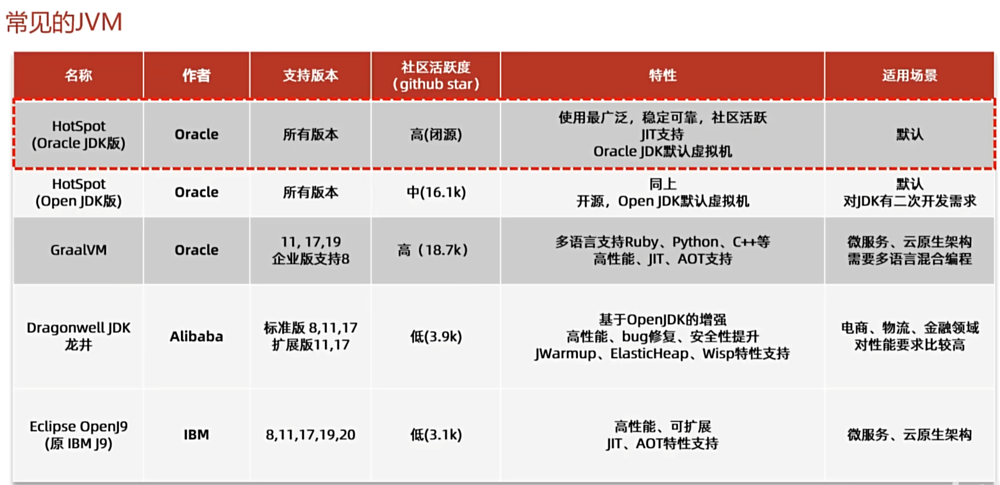
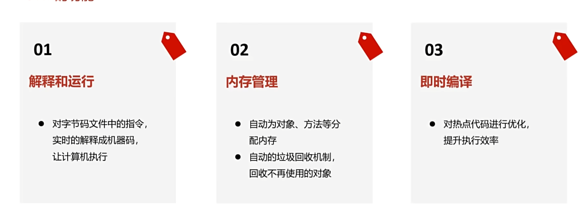

# JVM

> JVM 是Java文件的解释、编译器，负责转换字节码文件，让系统能正确运行代码

JVM有很多种，任何人都可以开发，但是具有一定的规范

《Java虚拟机规范》由Oracle制定，内容主要包含了Java虚拟机在设计和实现时需要遵守的规范，主
要包含class字节码文件的定义、类和接口的加载和初始化、指令集等内容。

《Java虚拟机规范》是对虚拟机设计的要求，而不是对Java设计的要求，也就是说虚拟机可以运行在
其他的语言比如Groovy、Scala生成的class字节码文件之上。

我们学习的是HotSpot的虚拟机，因为其出色的性能表现。
