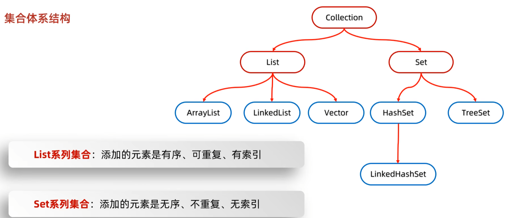

# Java 高阶集合方法 [返回上级](./AboutAPI.md#More)



## 单列集合

1. ArrayList 动态数组，方法名很易懂，自动扩容组数
2. HashMap 哈希表，键值对存储，键唯一，值可重复，无索引，无序。
3. LinkedList 用法跟动态数组一样，方法名同样易懂，用的双向链表
4. TreeSet 红黑树，可排序，无重复，无索引。
5. Collections 集合工具类，排序，查找，转换等。

> [!NOTE]
> ArrList 就是普通数组加强版，自动扩容方法与普通数组一致，不用举例方法了。

### HashSet 集合

1. 如果没有重写 hashCode 方法，不同对象计算出的哈希值是不同的
2. 如果已经重写 hashcode 方法，不同的对象只要属性值相同，计算出的哈希值就是一样的
3. 在小部分情况下，不同的属性值或者不同的地址值计算出来的哈希值也有可能一样。（哈希碰撞）
4. JDK8:数组+链表+红黑数 JDK7:数组+链表

```java
public static void main(String[] args) {
    //!set系列内容不能重复。
   Set<String> S = new HashSet<>();
   System.out.println(S.add("张三"));
   System.out.println(S.add("李四"));
   System.out.println(S.add("王五"));
   //?结果是无序,无索引。
   System.out.println(S);
   // Region 三种遍历方式
   Iterator<String> iterator = S.iterator();
   while (iterator.hasNext()) {
      System.out.println(iterator.next());
   }

   for (String s : S) {
      System.out.println(s);
   }

   S.forEach(s -> System.out.println(s));
   // End
}
```

哈希值获取

```java
 public String name;
 public static void main(String[] args){
   Object one = new Object();
   one.hashCode();
   //?想要通过成员变量值生成对象哈希请重写方法
   this.hashCode();
   System.out.println("ddd".hashCode());//String类有单独的哈希方法。
 }
@Override
 public int hashCode() {
     //Idea自动生成的。
     return Objects.hashCode(Name);
 }
```

### LinkedHashSet

1. 有序：存储取出元素一致、不重复、无索引
2. 底层数据结构是依然哈希表，只是每个元素又额外的多了一个双链表的机制记录存储的顺序。

   ```java
   import java.util.LinkedHashSet;
   public static void main(String[] args){
     LinkedHashSet<int> lhs = new LinkedHashSet<>();
     lhs.add("1");
     lhs.add("2");
     lhs.add("3");
     lhs.add("4");
     System.out.println(lhs);//按照添加顺序输出。
   }
   ```

### TreeSet

1. 不重复、无索引、可排序：升序
2. 红黑树数据结构，增删改查性能较好。
3. 类排序请实现接口，不然使用匿名内部类。
4. 排序特点，O 是当前需要排序的对象.
5. 按照红黑树顺序来排序的，根节点，到下层节点

```java
import java.util.TreeSet;
public static void main(String[] args){
  TreeSet<Integer> ts = new TreeSet<>();
  ts.add(9);
  ts.add(5);
  ts.add(3);
  ts.add(7);
  ts.add(4);
  System.out.println(ts);
}
```

对象排序：必须实现接口，重写方法，底层用的红黑数，不需要重写 equals 和 HashCode

```java
import java.util.TreeSet;
public String name;
public static void main(String[] args){
     TreeSet<student> ts = new TreeSet<>();
     ts.add(new student("张三",12));
     ts.add(new student("李四",16));
}
public class student implements Comparable<student>{
    public String name;
    public int age;

     public student(String name,int age) {
         this.name = name;
         this.age = age;
     }

     @Override
      public int compareTo(student o) {
         //按照年龄排序,数字越小越靠前。o是即将进行排序的下个对象。 0就舍弃不存储。
         //o 是根据红黑数的插入来进行计算的，>0 存右边，< 左边 。0就代表重复了。
          return this.age - o.age;
      }
}
```

方式二 自定义排序

```java
import java.util.Comparator;
import java.util.TreeSet;
public static void main(String[] args){
 //可以用lambda简写;
 TreeSet<String> treeSet = new TreeSet<>(new Comparator<String>() {
         @Override
         public int compare(String o1, String o2) {
             //使用长度排序
             int i = o1.length() - o2.length();
             //一样则使用默认
             i = i == 0 ? o1.compareTo(o2) : i;
             return i;
         }
     });
 treeSet.add("d");
 treeSet.add("a");
 treeSet.add("b");
 System.out.println(treeSet);
}
```

总结

1. 如果想要集合中的**元素可重复**
   - 用 ArrayList 集合，基于数组的。（用的最多）
2. 如果想要集合中的元素可重复，而且当前的**增删**操作明显多于查询
   - 用 LinkedList 集合，基于链表的。
3. 如果想对集合中的**元素去重**
   - 用 HashSet 集合，基于哈希表的。（用的最多，效率也最高）
4. 如果想对集合中的元素去重，而且保证**存取顺序**
   - 用 LinkedHashSet 集合，基于哈希表和双链表，效率低于 HashSet。
5. 更多高阶集合 [双列集合](./List.md#双列集合)

## Collections 集合工具类

> [!TIP]
> Collections 是用于专门处理集合的,使用时候不需要实例化,全是静态方法,仅支持单列集合

双列集合想使用通过 entrySet 获取键值对 Key 和 Value 的集合，转换成单列集合了。

`Comparator<T>` 用了很多次了，匿名内部内实现，或者 Lambda 表达式

接受两个参数 param1 新增|当前 对象 param2 过去|已存在 对象

返回 正数为大，负数为小，0 表示已经存在，根据它进行排序

| 方法         | 功能                   | 参数               | 说明                       |
| ------------ | ---------------------- | ------------------ | -------------------------- |
| addAll       | 批量添加元素           | List 、`argument`  | 参二：可变参数，可一直传递 |
| shuffle      | 打乱原数组             | List               |                            |
| sort         | 数组排序               | List               |                            |
| sort         | 数组排序               | List Comparator<T> | 自定义排序规则             |
| binarySearch | 二分查找               | List key           | 返回数组位置               |
| fill         | 使用指定元素填充       | List Object        | 数组全内容替换为参数       |
| max/min      | 默认排序获取大小值     | List               | 返回元素                   |
| max/min      | 自定义排序获取大小值   | List Collections   | 建议：匿名内部类           |
| swap         | 指定集合位置的元素交换 | List int int       |                            |
| copy         | 拷贝数组               | List list          | 接受数组会被覆盖           |
| toMap        | 转换 Map 集合          | K V                | 需要俩个参数               |

## 双列集合

> [!NOTE]
> Java 中集合有 `set` `get` `map` 系列，实现有 `Hash`、`Linked` 标准库

### [set 系列](./AboutAPI.md#More)

### map 系列-Entry

> [!TIP]
> 对象必须为键值对类型，在实例化的时候由泛型定义，键与值都需要填写泛型
> Map 只是一个接口，通常直接使用 标准类库中数据结构系列。
> 有时候需要对象存储，也不想要写类，可以直接用 entry 键值对。

```java
public static void main(String[] args) {
    Map<String, String> map = new HashMap<>();

    map.put("1", "1");
}
```

| 方法        | 说明     | 参数     | 解释                       |
| ----------- | -------- | -------- | -------------------------- |
| put         | 添加数据 | 泛型键值 | 已有键会覆盖原值           |
| putAll      | 合并数据 | Map      | 合并集合数据               |
| get         | 获取键值 | 对应键名 | key 为键 value 为值        |
| remove      | 移除键值 | 移除键值 |                            |
| containsKey | 判断存在 | 对应键名 |                            |
| size        | 获取长度 | void     |                            |
| clear       | 清空数据 | void     |                            |
| KeySet      | 键名集合 | void     | 返回键的集合，set 系列拿取 |
| entrySet    | 键值集合 | void     | 返回内部 entry 集合        |
| -------     | entry    | 接口方法 | entry 为键值对的存储对象   |
| getKey      | 获取键名 | void     | 返回当前 entry 对象中的键  |
| getKey      | 获取键值 | void     | 返回当前 entry 对象中的值  |

#### HashMap 高效率

<details>
    <summary>小练习</summary>

需求：创建一个 HashMap 集合，键是学生对象（Student），值是籍贯（String)。
存储三个键值对元素，并遍历
要求：同姓名，同年龄认为是同一个学生

```java
public class App {

   public static void main(String[] args) {
      student st1 = new student("张三",15);
      student st2 = new student("张三",15);
      student st3 = new student("李四",15);
      System.out.println(st1.equals(st2));

      Map<student,String> map = new HashMap();
      map.put(st1,"中国");
      map.put(st2,"韩国");
      map.put(st3,"中国");

      map.forEach((k,v)->System.out.println(k+":"+v));
   }
}

class student {
   private String name;
   private int age;

   public student(String name, int age) {
      this.name = name;
      this.age = age;
   }

   @Override
   public boolean equals(Object o) {
      if (this == o) {
         return true;
      }
      if (!(o instanceof student student)) {
         return false;
      }
      return age == student.age && Objects.equals(name, student.name);
   }

   @Override
   public String toString() {
      return "student{" +
              "name='" + name + '\'' +
              ", age=" + age +
              '}';
   }

   @Override
   public int hashCode() {
      return Objects.hash(name, age);
   }

   /**
    * get field
    *
    * @return name
    */
   public String getName() {
      return this.name;
   }

   /**
    * set field
    *
    * @param name
    */
   public void setName(String name) {
      this.name = name;
   }

   /**
    * get field
    *
    * @return age
    */
   public int getAge() {
      return this.age;
   }

   /**
    * set field
    *
    * @param age
    */
   public void setAge(int age) {
      this.age = age;
   }
}
```

</details>

总结:

1.  HashMap 底层是哈希表结构的
2.  依赖 hashCode 方法和 equals 方法保证键的唯一
3.  如果键存储的是自定义对象，需要重写 hashcode 和 equals 方法
    如果值存储自定义对象，不需要重写 hashCode 和 equals 方法

#### TreeMap 推荐排序使用

> [!TIP]
> TreeMap 跟 TreeSet 底层原理一样，都是红黑树结构的。
>
> 由键决定特性：不重复、无索引、可排序
>
> 可排序：对键进行排序，会自动根据键来进行排序。
> 注意：默认按照键的从小到大进行排序，也可以自己规定键的排序规则

排序的底层实现是对象中实现了`compare`方法，用于比较大小

`TreeMap`底层红黑树就是根据比较结果插入相对位置进行排序

<details>
    <summary>小练习</summary>

```java
public static void main(String[] args) {
    //自行实现倒序功能排序
   TreeMap<Integer,String> map = new TreeMap<>(new Comparator<Integer>() {
      @Override
      public int compare(Integer o1, Integer o2) {
          //o1是当前添加的元素，因为排序只会在添加新节点的时候进行比较确定位置
          //o2就是以前的节点，以前有5个数据，就会把o1进行5次与之前的比较。
          //compareTO 方法是Inter内部的比较大小方法
         return o2.compareTo(o1);
      }
   });
   map.put(0, "1");
   map.put(1, "2");
   map.put(2, "3");
   map.put(3, "4");
   map.put(4, "5");

   System.out.println(map);
}
```

```java
/*
   TreeMap集合：基本应用
   需求2：
   键：学生对象
   值：籍贯
   要求：按照学生年龄的升序排列，年龄一样按照姓名的字母排列，同姓名年龄视为同一个人。
*/
public class App {

   public static void main(String[] args) {
      student st1 = new student("张三",15);
      student st2 = new student("张三",15);
      student st3 = new student("李四",15);
      System.out.println(st1.equals(st2));

      //方式一：在使用的时候自定义 比较|排序 规则
      TreeMap<student,String> map = new TreeMap<>(new Comparator<student>() {
         @Override
         public int compare(student o1, student o2) {
            int age = o1.getAge() - o2.getAge();
            return age != 0 ? age : o1.getName().compareTo(o2.getName());
         }
      });

      map.put(st1,"中国");
      map.put(st2,"中国");
      map.put(st3,"中国");


      System.out.println(map);
   }
}

//方式二：对象里面定义自己的 比较|排序 规则
class student implements Comparable<student>{
   private String name;
   private int age;

   public student(String name, int age) {
      this.name = name;
      this.age = age;
   }

   @Override
   public int compareTo(student o) {
      //this 表示当前的对象
      //O 表示进行比较的对象

      //返回值
      //正数：表示大数，存树右边
      //负数：表示小数,存树左边
      //0：表示已经存在，舍弃
      int age = this.getAge() - o.getAge();
      return age != 0 ? age : this.getName().compareTo(o.getName());
   }

   @Override
   public boolean equals(Object o) {
      if (this == o) {
         return true;
      }
      if (!(o instanceof student student)) {
         return false;
      }
      return age == student.age && Objects.equals(name, student.name);
   }

   @Override
   public String toString() {
      return "student{" +
              "name='" + name + '\'' +
              ", age=" + age +
              '}';
   }

   @Override
   public int hashCode() {
      return Objects.hash(name, age);
   }

   /**
    * get field
    *
    * @return name
    */
   public String getName() {
      return this.name;
   }

   /**
    * set field
    *
    * @param name
    */
   public void setName(String name) {
      this.name = name;
   }

   /**
    * get field
    *
    * @return age
    */
   public int getAge() {
      return this.age;
   }

   /**
    * set field
    *
    * @param age
    */
   public void setAge(int age) {
      this.age = age;
   }
}
```

</details>

最终练习

```java
public static void main(String[] args) {
    /*
      需求：
      字符串“aababcabcdabcde”
      请统计字符串中每一个字符出现的次数，并按照以下格式输出
      输出结果：
      a（5)b（4)c(3）d（2)e（1)
      新的统计思想：利用map集合进行统计
      如果题目中没有要求对结果进行排序，默认使用HashMap
      如果题目中要求对结果进行排序，请使用TreeMap
      键：表示要统计的内容
      值：表示次数
   */


   /* 答案 */
   Map<Character,Integer> map = new HashMap(); //没有排序，排序就改为 TreeSet
   String str = "adxcsadwrcxgs";

   for (int i = 0; i < str.length(); i++) {
      if (map.containsKey(str.charAt(i))) {
         map.put(str.charAt(i), map.get(str.charAt(i)) + 1);
      }else{
         map.put(str.charAt(i), 1);
      }
   }

   System.out.println(map);
}
```

### 源码说明

HashMap 不需要实现 Compareable 接口，它是利用哈希值进行大小判断红黑树存放位置
判断重复的时候需要重写 HashCode 和 equals 来判断重复。
默认的数组长度是 16，当超出长度后，它会扩容并且将之前链表存储的数据，全部转换为红黑树。

Treemap 底层是用的红黑树，它需要实现 Compareable 来比较大小，不然它无法确认存放位置
它底层看到是相同的就覆盖原来的值，所以不需要重写 equals 和 hashCode。
它默认直接就是红黑树进行存储，在查找的时候默认就是有二分的优势。

### 排序技巧

> [!TIP]
> 利用 hashMap `entrySet` 的键值对实现简易快速排序

有固定规律的数据使用方式

```java
public static List<String> Demos = new ArrayList<>();

public static void main(String[] args) {
   //添加数据
   Collections.addAll(Demos,"#1","#2","#3","*1","*2","*3");

   Map<String, Integer> map = new HashMap<>();
   //!找寻数据规律，使用循环设置权重
   for (int i = 0; i < Demos.size(); i++) {
      //?自行分析规则，并用int值设置权重
      String s = Demos.get(i);
      map.put(s, map.getOrDefault(s, i));
   }
   //利用TreeSet Int 自动排序，数据必须是 HashMap 存在关系
   TreeMap<String, Integer> res = new TreeMap<>(map);

   System.out.println(res);
}
```

没有固定规律使用方式

```java
import java.util.Collections;

public static List<String> Demos = new ArrayList<>();

public static void main(String[] args) {
   //添加数据
   Collections.addAll(Demos, "#1", "#2", "#3", "*1", "*2", "*3", "Joker");

   Map<String, Integer> map = new HashMap<>();

   //自定义特殊权重
   map.put("Joker", 999);

   //!多开一个是为了不影响原数据，再原数据被使用时候使用排序。
   ArrayList<String> res = new ArrayList<>(Demos);

   //自定义排序规则，判断自定义权重是否存在。
   Collections.sort((o1, o2) -> {
      if (map.containsKey(o1)) {
         String i = map.get(o1).toString();
         return i.compareTo(o2);
      } else {
         return o1.compareTo(o2);
      }
   });

   System.out.println(res);
}
```

## 不可变集合

> 不可变集合是集合的常量版，只能在初始化的时候写内容。

| 方法    | 说明       | 参数       | 解释         |
| ------- | ---------- | ---------- | ------------ |
| list    | 集合类型   | method     | 常规集合     |
| set     | 集合类型   | method     | 不重复       |
| map     | 集合类型   | entry      | 上限 10 对   |
| of      | 不可变     | 任意类型   | null         |
| get     | 获取元素   | 下标位置   | null         |
| ofEntry | 不可变     | 多参同类型 | 不会上限     |
| toArray | 转换为数组 | list       | 数组长度就新 |
| copyOf  | 拷贝数据   | list       | 直接覆盖     |

```java
import java.util.List;

public static void main(String[] args) {
    //还可以用 `set`
   List<String> list = List.of("1", "2", "3", "4");

   //!调用添加、修改、删除等方法会无法通过编译阶段
    list.add("2");
    //?拿取不会有问题
    list.get(0).System.out.println();
}
```

## properties

> [!TIP] > `properties` 基本上算是 Java 自己的本地存储方式，类似 JS 跟 JSON。
>
> HashMap 集合为他单独开了集合，它同样拥有 Map 集合的所有特性。

| 方法              | 参数         | 说明                                             |
| ----------------- | ------------ | ------------------------------------------------ |
| -----             | 构造方法     | -----                                            |
| public properties |              | 实例化                                           |
| public properties | int          | 初始大小可容纳指定数量的元素，而无需动态调整大小 |
| public properties | properties   | 创建具有指定默认值的空属性列表，合并数据         |
| -----             | 成员方法     | -----                                            |
| store             | OutputStream | 自动序列化，本地存储                             |
| load              | InputStream  | 加载本地数据，存储在内部数组                     |

### 存储

```java
public static void main(String[] args) {
   Properties properties = new Properties();

   properties.put("a","Soles sunt inquisitor de clemens absolution.");
   properties.put("B","Lamas trace!");

   BufferedWriter bw = new BufferedWriter(new FileWriter("file.properties"));

   properties.store(bw, "test");
}
```

### 加载

```java
public static void main(String[] args) {
   Properties properties = new Properties();

   BufferedReader br = new BufferedReader(new FileReader("file.properties"));

   properties.load(br);

   System.out.println(properties);
}
```
