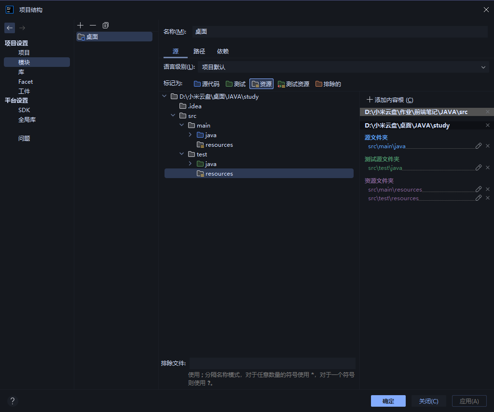

# Maven

> [!TIP]
> Maven 是Java的包管理器，复制构建jar包。
> 类似前端Node一样，让你的项目包封装成开源软件包。

## 仓库

仓库就是Node.js一样的官方库，与国内的镜像仓库性质一样，软件包可发布服务器。

差异：官方的包只允许开源软件包，第三方的可以是公司内部使用软件包，私有使用。

服务器没有CDN这么大，CDN是为了用户，而java是为了开发者，服务器基数少且差。

中心仓库：Center,第三方随便命名，URL填写正确就行了。

国内同样与NPM一样有镜像仓库阿里的：http://maven.aliyun.com/nexus/content/groups/public

## 坐标

坐标：用于区分包的，由于Java包可同名，用做标识符区分

有三个坐标：组织ID、项目ID、版本号

## 安装

1. [前往下载](https://maven.apache.org/download.cgi)
2. 解压到指定路径，win + x < 系统 < 系统环境 < 环境变量
3. 系统或用户变量处，新建 变量命：`MAVEN_HOME` 值就是你的解压根路径。
4. 系统或用户变量处 双击 path < 添加 < %MAVEN_HOME%\bin 完成

确保 `MAVEN_HOME` 解压出来的根路径，路径下还有个 bin 的文件夹。

## 自动生成

Idea 模块>添加>新建模块>Java>Maven>添加实例代码

这样生成的Java目录就是符合Maven规范的程序了，测试目录一致。

插件模板生成：模块 > 添加 > 新建模块 > Maven Archetype < Archetype 选择模板。

## 全局配置

配置文件与NPM一致，是固定在 Maven 本体内部修改 `conf < settings.xml`

仓库配置

默认仓库是在c盘下的，配置比较合适，系统盘比较占用内存等。

```xml
<!-- 配置文件第55行，上面有原版提示 -->
<localRepository>E:\Maven\repository</localRepository>
```

远程仓库

远程仓库是用于下载包使用的，默认是没有配置任何地址，连中央都不是是空地址

```xml
<!--161行处修改配置 -->
<mirror>
    <id>aliyunmaven</id> <!-- 远程仓库的唯一ID -->
    <mirrorOf>*</mirrorOf> <!-- 仓库名称 -->
    <name>阿里云公共仓库</name> <!-- 本地名称 -->
    <url>https://maven.aliyun.com/repository/public</url> <!-- 连接地址 -->
</mirror>
```

### 用户配置「少用」

用户配置需要在配置的仓库文件夹 `repository` 同级下有 setting.xml 就行了

它是在发现仓库有 setting 文件优先使用用户配置，再去使用全局。

## 项目结构

第一层固定 `src`

第二层

main 程序目录

test 测试程序

第三层 ：方便开发时管理 构建完成后并不存在 下面两个文件夹 会自动合并文件 在第二层对应目录

java : 程序目录

resources : 配置文件

### 程序

```java
//记得给个软件包，Com.xxx
package TestDemo;

public class Demo {
    public String testSay() {
        System.out.println("hello Maven");

        return "hello Maven";
    }
}
```

### 测试

```java
//记得给个软件包，Com.xxx
package TestDemo;

import org.junit.test;
import org.junit.Assert;

public class DemoTest {
    @Text
    public void testSay() {
        Demo d = new Demo();

        String ret = d.say();

        //?该方法必须是测试类才有的，参数一为应该的值，二为参数。对不上就停止程序运行。
        Assert.assertEquals("hello Maven", ret);
    }
}
```

## 工程目录结构

> 工程结构文件，src 同层 pom.xml

```xml
<?xml version="1.0" encoding="UTF-8"?>
<project xmlns="http://maven.apache.org/POM/4.0.0"
         xmlns:xsi="http://www.w3.org/2001/XMLSchema-instance"
         xsi:schemaLocation="http://maven.apache.org/POM/4.0.0 http://maven.apache.org/xsd/maven-4.0.0.xsd">
    <!--  Maven版本  -->
    <modelVersion>4.0.0</modelVersion>

    <groupId>org.Naer</groupId>
    <artifactId>项目名称</artifactId>
    <version>0.1</version>
    <packaging>jar</packaging>

    <properties>
        <maven.compiler.source>22</maven.compiler.source>
        <maven.compiler.target>22</maven.compiler.target>
        <project.build.sourceEncoding>UTF-8</project.build.sourceEncoding>
    </properties>

    <!-- 项目依赖项目 -->
    <dependencies>
        <!--   依赖复制到这里     -->
        <dependency>
            <!-- 刚才测试代码，需要的依赖 -->
            <groupId>junit</groupId>
            <artifactId>junit</artifactId>
            <version>4.12</version>
        </dependency>
    </dependencies>

</project>
```

## 构建指令

| 指令          | 功能   |
|-------------|------|
| mvn compile | 打包编译 |
| mvn clean   | 清理编译 |
| mvn test    | 编译测试 |
| mvn package | 构建发布 |
| mvn install | 发布仓库 |

Idea 右下角 Maven 添加目录位置，查看全部命令

可选 Idea 配置运行 < Maven < 命令 test 自选 < 保存运行

## Idea 配置

终端在 pom.xml 路径下打开，使用 mvn compile

它会先初始化仓库，下载全局的依赖，等待下载完成后，src 目录下会出现 target 目录

它是把项目打包编译后的字节文件，这一步成功就说明配置文件与项目配置完成。

再次进行 mvn test 这个命令就开始走程序测试流程了，如果出现异常就说明代码出现问题。

之前是用记事本写的代码，idea 项目结构 < 添加进来



这样设置就能确保Idea的路径设置正确了，规范也是这样如此安排路径的。

Idea 设置 < maven 主路径 < 选择安装的 Maven 路径

这样编辑器的配置就完成了，idea 编辑代码，查看问题，快速修复，缺失就按提示下载。

再次测试 mvn test，返回成功代表成功

## 配置文件

Project 必须为根标签，配置项目基本元素

基本配置

```xml
<?xml version="1.0" encoding="UTF-8"?>
<project xmlns="http://maven.apache.org/POM/4.0.0"
         xmlns:xsi="http://www.w3.org/2001/XMLSchema-instance"
         xsi:schemaLocation="http://maven.apache.org/POM/4.0.0 http://maven.apache.org/xsd/maven-4.0.0.xsd">

    <!--  Maven版本  -->
    <modelVersion>4.0.0</modelVersion>
    <!-- 项目说明 公开名称 -->
    <groupId>org.Naer</groupId>
    <!-- 项目本地名称 -->
    <artifactId>name</artifactId>
    <!-- 版本信息 -->
    <version>0.1</version>
    <!-- 生成格式 -->
    <packaging>jar</packaging>

    <!-- 项目配置 -->
    <properties>
        <maven.compiler.source>22</maven.compiler.source>
        <maven.compiler.target>22</maven.compiler.target>
        <project.build.sourceEncoding>UTF-8</project.build.sourceEncoding>
    </properties>

</project>
```

### 依赖相关

核心概念：你引入的依赖，它同样也有它自己的配置与依赖
安装自动扫描下载全部依赖，依赖内依赖，与你的配置依赖

直接依赖：当前项目的配置所需的依赖。
间接依赖：直接依赖配置所需的依赖

当出现同依赖重复出现，版本不同则优先选择靠近直接依赖

```xml
<!-- 项目依赖项目 -->
<dependencies>
    <!--   依赖复制到这里     -->
    <dependency>
        <groupId>junit</groupId>
        <artifactId>junit</artifactId>
        <version>4.13.1</version>
        <!-- 可选依赖 **对外** 不可见的依赖 -->
        <optional>true</optional>
        
        <!-- 指定依赖使用范围 -->
        <scope>
            <!-- 
                compile:全范围 
                test:测试范围
                provided:主程序、测试范围 开发环境。
                runtime:打包构建后范围 生成环境使用
                
                当被间接依赖时候，范围会产生变化。
                
                间接依赖：主人不是依赖你，而是主人依赖的人它依赖了你
                
                compile -> runtime 
                test -> test
                provided -> provided
                runtime -> runtime
            -->
            test
        </scope>
        
        <!-- 排除依赖 -->
        <exclusions>
            <!--
                主依赖你，你的依赖库会自动添加了主
                手动排除特定间接依赖，防止重名问题等。
            -->
            <exclusion>
                <groupId>org.Naer</groupId>
                <artifactId>name</artifactId>
            </exclusion>
        </exclusions>
    </dependency>
</dependencies>
```

### 构建插件

```xml
    <!-- 构建相关 -->
<build>
    <!-- 构建插件 -->
    <plugins>
        <!-- 插件命令 Idea < Maven < 插件 < 名称 < 选择运行 -->
        <plugin>
            <!-- 也可以命令 mvn 名称:指令 -->
            <groupId>org.opoo.maven</groupId>
            <artifactId>tomcat9-maven-plugin</artifactId>
            <version>3.0.0</version>
            <!-- 指定运行生命周期 -->
            <executions>
                <execution>
                    <goals>
                        <!-- 指定调用用法 -->
                        <goal>run</goal>
                    </goals>
                    <!-- 指定运行时 -->
                    <phase>generate-resources</phase>
                </execution>
            </executions>
        </plugin>
    </plugins>
<!--
    插件：在程序添加新的功能，程序需要为插件预留接口，
    接口会预留程序不同生命周期的接口，插件可在不同时候注入

    生命周期:
        clean : 
            pre-clean 预清理
            clean 清理时
            post-clean 完成时
    
        default: 
            validate（校验）
            initialize(初始化)
            generate-sources（生成源代码）
            process-sources（处理源代码）
            generate-resources（生成资源文件）
            process-resources（处理资源文件）
            compile（编译）
            process-classes（处理类文件）
            generate-test-sources（生成测试源代码）
            process-test-sources（处理测试源代码）
            test-compile（编译测试源码）
            process-test-classes（处理测试类文件）
            test（测试）
            prepare-package（准备打包）
            package（打包）
            pre-integration-test（集成测试前）
            integration-test（集成测试）
            post-integration-test（集成测试后）
            verify(验证）
            install（安装）
            deploy（部署）
        
        site:
            pre-site : 生成站点前
            site: 生成站点时
            post-site: 完成站点时
            site-deploy: 站点部署时
-->
</build>
```
