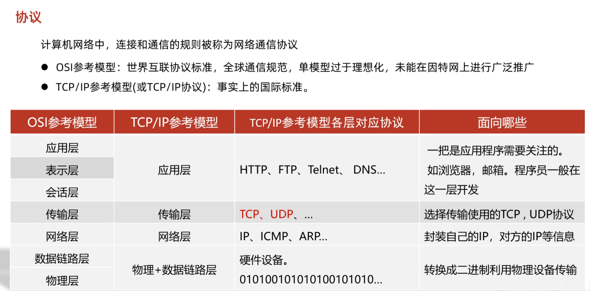
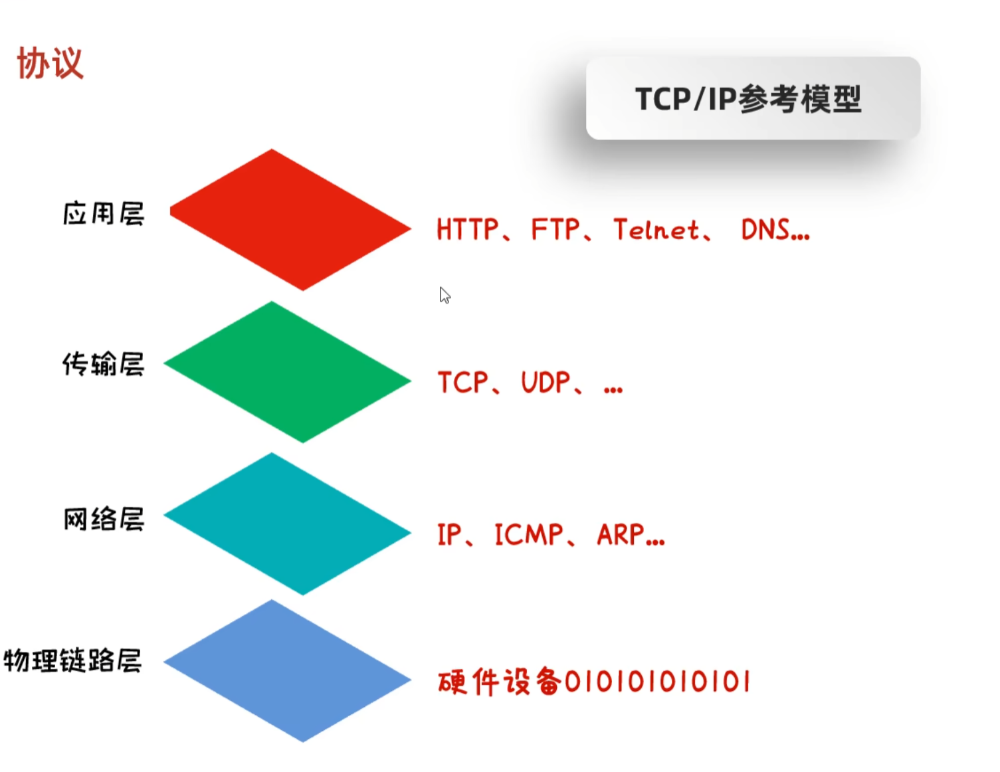
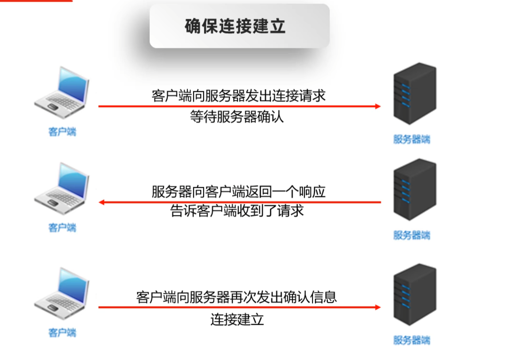
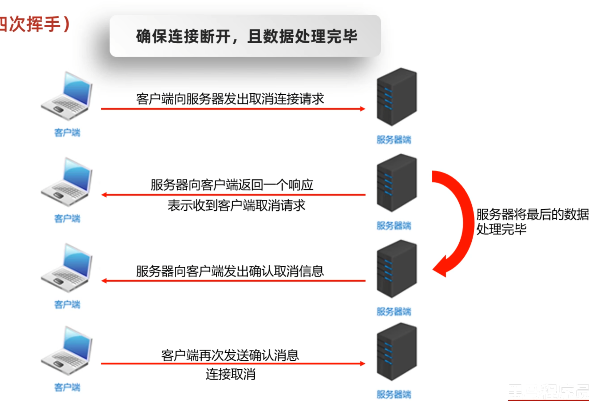

# 网络编程

> [!TIP]
> 网络编程：基于网络通讯协议下，不同计算机上运行程序，进行的传输数据。

常见架构
1. C/S Client/Server
2. B/S Browser/Server

C/S 优点：资源本地存储，节省云资源，缺点：下载体积大，更新不方便。客户端需要开发
B/S 优点 只需要开发服务端，按需下载资源。缺点：资源文件大小注意。

网络三要素：

1. IP 网络设备在网路上的地址 有 IPV4 与 IPV6 
2. 端口 0 ~ 65535 0 ~ 1023 常用网络服务或软件占用
3. 协议 TCP UDP HTTP FTP ...

IPV4 地址已经分配完毕，不够使用为了节省，192.168 开头都是私有地址，局域网连接

## 网路协议




## 获取ip

InetAddress：

| 方法                                | 功能         |
|-----------------------------------|------------|
| 静态方法                              | ---        |
| getByName(string name)            | 通过设备名称获取地址 |
| getByAddress(string ip)           | 通过地址获取对象   |
| getByAddress(string ip, int host) | 通过地址和端口获取  |
| 成员方法                              | ---        |
| getHostAddress()                  | 获取对象IP地址   |
| getAddress()                      | IP . 分割未数组 |
| getHostName()                     | 获取设备名称     |


## UDP 协议

1. 用户数据报协议(User Datagram Protocol)
2. UDP是面向无连接通信协议。不管是是否相应都发送数据。
3. 速度快，有大小限制一次最多发送64K，数据不安全，易丢失数据

网络视频、语音通话、在线视频

UDP 发送端

| 方法                                     | 说明     |
|----------------------------------------|--------|
| 构造函数                                   | ---    |
| DatagramSocket(/* 可选端口 */)             | UDP管理器 |
| 成员方法                                   | ---    |
| send(/* 数据包 */)                        | 发送数据   |
| close()                                | 关闭管理器  |

UDP 数据包

| 方法                                     | 说明     |
|----------------------------------------|--------|
| 构造函数                                   | ---    |
| DatagramPacket(/* 字节数组、长度 可选：地址、端口 */) | 数据包    |
| 成员方法                                   | ---    |
| getLength()                            | 获取数组长度 |
| getOffset()                            | 获取起始位置 |
| getAddress()                           | 获取地址   |
| getPort()                              | 获取端口   |
| getSocketAddress()                     | 获取地址对象 |

UDP 服务器组合端：多个服务器同时监听信息

| 方法                          | 说明                                   |
|-----------------------------|--------------------------------------|
| 构造函数                        | ---                                  |
| MulticastSocket(/* 可选端口 */) | 组合工具                                 |
| 成员方法                        | ---                                  |
| joinGroup(InetAddress)      | 加入组 要求区间 224.0.0.0 ~ 239.255.255.255 |
| send(/* 数据包 */)             | 发送到组                                 |

### 发送数据

```java
public static void main(String[] args) {
    /*
     * DatagramSocket对象：发送管理器
     * 构造函数可指定占用端口，无则随机获取
     * */
    DatagramSocket socket = new DatagramSocket();

    /*
     * DatagramPacket：数据包
     * 构造函数传入 字节数组 长度 可指定范围 起始位置与长度，可指定发送地址与端口
     * */
    
    byte[] data = "hellow 我是UDP数据".getBytes();

    DatagramPacket packet = new DatagramPacket(data, data.length,
            InetAddress.getByName("127.0.0.1"), 25505);

    //?让管理仓库发送数据,不会询问状态，UDP只负责发送。
    socket.send(packet);

    socket.close();
}
```

### 接受数据

```java
public static void main(String[] args) throws IOException {

    /*
     * DatagramSocket对象：发送管理器
     * 构造函数可指定占用端口，无则随机获取
     * */
    DatagramSocket socket = new DatagramSocket(25505);

    /*
     * DatagramPacket：数据包
     * 接受数据包，指定最大接受字节。
     * */
    DatagramPacket packet = new DatagramPacket(new byte[1024], 1024);
    //这里开启一直等待，直到收到数据。
    socket.receive(packet);

    //解析数据
    byte[] data = packet.getData();

    System.out.println("数据内容 \n"+new String(data,0,packet.getLength()));

    InetAddress address = packet.getAddress();
    int port = packet.getPort();

    System.out.println("数据来自"+address+":"+port);

    socket.close();
}
```

### 通讯室

Server

```java
public static void main(String[] args) throws IOException {

    DatagramSocket socket = new DatagramSocket(25505);

    DatagramPacket packet = new DatagramPacket(new byte[1024], 1024);

    while (true) {
        //重复监听，不然内容解析会一直之前的消息
        socket.receive(packet);

        //解析数据
        byte[] data = packet.getData();

        String body = new String(data,0,packet.getLength());

        System.out.println("数据内容 \n"+body);

        InetAddress address = packet.getAddress();
        int port = packet.getPort();

        System.out.println("数据来自"+address+":"+port);
        //退出密钥
        if ("关闭服务器".equals(body)) {
            break;
        }
    }
    socket.close();
}
```

Client

```java
public static void main(String[] args) throws IOException {

    DatagramSocket socket = new DatagramSocket();

    Scanner scanner = new Scanner(System.in);

    while (true) {
        String s = scanner.nextLine();

        byte[] data = s.getBytes();

        DatagramPacket packet = new DatagramPacket(data, data.length,
                InetAddress.getByName("127.0.0.1"), 25505);

        if("退出聊天".equals(s)){
            break;
        }
        
        socket.send(packet);
    }

    socket.close();
}
```

### 组合端

Server

```java
public static void main(String[] args) throws IOException {
    //指定端口
    MulticastSocket socket = new MulticastSocket(25505);
    //?区间 224.0.0.0～224.0.0.255 为预留的组播地址 出问题换地址
    InetAddress group = InetAddress.getByName("224.0.0.2");

    //?加入组
    socket.joinGroup(group);

    DatagramPacket packet = new DatagramPacket(new byte[1024], 1024);
    
    //正常解析部分
    while (true) {
        socket.receive(packet);

        byte[] data = packet.getData();
        String body = new String(data, 0, packet.getLength());

        System.out.println("数据内容 \n" + body);

        InetAddress address = packet.getAddress();
        int port = packet.getPort();

        System.out.println("数据来自" + address + ":" + port);

        if ("关闭服务器".equals(body)) {
            break;
        }
    }

    socket.leaveGroup(group);
    socket.close();
}
```

client

```java
public static void main(String[] args) throws IOException {
    //发送者不需要占用端口
    DatagramSocket socket = new DatagramSocket();

    Scanner scanner = new Scanner(System.in);

    while (true) {
        String s = scanner.nextLine();

        byte[] data = s.getBytes();

        DatagramPacket packet = new DatagramPacket(data, data.length,
                InetAddress.getByName("224.0.0.2"), 25505);

        if("退出聊天".equals(s)){
            break;
        }

        //发送到组，必须要组类的发送方法。
        socket.send(packet);
    }

    socket.close();
}
```

## TCP



1. 传输控制协议TCP(Transmission Control Protocol)
2. TCP协议是面向连接的通信协议
3. 速度慢，没有大小限制，数据安全。

安装包下载、文字聊天、发送邮件

1. TCP通信协议是一种可靠的网络协议，它在通信的两端各建立一个Socket对象
2. 通信之前要保证连接已经建立
3. 通过Socket产生IO流来进行网络通信

客户端步骤

1. 创建客户端的socket对象(Socket)与指定服务端连接
2. 获取输出流，写数据
3. 释放资源

服务器步骤

1. 创建服务器端的Socket对象(ServerSocket)
2. 监听客户端连接，返回一个Socket对象
3. 获取输入流，读数据，并并把数据显示在控制台
4. 释放资源

注意：TCP有确保连接安全性，客户端在连接时，会先向服务端发送3次握手协议，保证协议安全建立。

常用方法，更多参考api文档。

| 方法                     | 说明             |
|------------------------|----------------|
| 构造函数                   | ---            |
| Socket(/* 服务器地址,端口 */) | 客户端            |
| ServerSocket(/* 端口 */) | 服务端            |
| 成员方法                   | ---            |
| accept()               | 开启监听,获取 socket |
| getInputStream()       | 输入流，拿取数据       |
| getOutputStream()      | 输出流，写入数据       |
| shutdownOutput();      | 输入流关闭，防服务端等待   |
| close()                | 关闭连接           |

### 服务端

> [!CAUTION]
> 一定要防止双等待的情况，写入信息写完了一定要调用 shutdownOutput 完成写入流，逻辑顺序注意检查！否则程序卡解析等待。

```java
public static void main(String[] args) throws IOException {
    ServerSocket server = new ServerSocket(25505);
    while (true) {
        //?监听连接
        Socket socket = server.accept();
        //!转换为字符流，处理中文字符乱码
        InputStreamReader inputStream = new InputStreamReader(socket.getInputStream());

        OutputStreamWriter outputStream = new OutputStreamWriter(socket.getOutputStream()) ;

        //解析数据
        int i;
        //!Read 方法它不会有 -1的，没有数据它会等待客户端发送，客户端那边也在等待你写入数据，避免出现写入最后给一个标识符！
        while ((i = inputStream.read()) != -1) {
            System.out.println((char) i);
        }
        
        //!这里写入有验证是否无线等待，客户端那边必须给 shutdown 关闭写入通道，否则服务端无法确认是否写入完成。服务等客户，客户等服务。
        outputStream.write("服务器收到消息");
        
        //手动同步，不然无效写入。
        outputStream.flush();
        
        //?写入完成，否则一样无线等待
        socket.shutdownOutput();
        
        //!不要关流！第四次挥手，它需要确保结算前数据传输完毕。
        socket.close();
    }
}
```

### 客户端

```java
public static void main(String[] args) throws IOException {
    Socket socket = new Socket("127.0.0.1", 25505);

    InputStreamReader inputStream = new InputStreamReader(socket.getInputStream());

    OutputStreamWriter outputStream = new OutputStreamWriter(socket.getOutputStream());

    /*
     * 遵守顺序，客户端先发送信息，
     * 服务端解析信息，解析完成再返回信息
     * 客户端走解析信息，等待后续信息
     * */
    
    outputStream.write("客户端");

    outputStream.flush();

    //!给标识符，不然服务端解析过程无线等待。
    socket.shutdownOutput();
    
    //解析数据
    int i;

    while ((i = inputStream.read()) != -1) {
        System.out.println((char) i);
    }

    socket.close();
}
```

### 握手协议

三次握手

第一次: 客户端向服务端发送请求，等待服务端回应

第二次：服务器返回请求，告诉客户端我接受了请求

第三次：客户端在此向服务端发送确认请求，连接开启



四次挥手

确保连接断开，保证数据处理完毕

1. 客户端向服务端发送取消连接请求

2. 再返回表示收到了取消请求

3. 服务端将最后的数据处理完成

4. 最后再次发送确认信息

5. 客户端再次确认信息，关闭连接




## 多线程

> 使用多线程处理TCP连接请求
> 一个客户端对应一个线程。

### 服务端

> 线程池版，自己在main函数中实例化线程池，再传入线程对象到池子中就行了

```java
public class Server {
    public static void main(String[] args) throws IOException {
        ServerSocket server = new ServerSocket(25505);
        System.out.println("服务器已启动，等待连接...");
        while (true) {
            Socket socket = server.accept();
            System.out.println("客户端已连接：" + socket.getRemoteSocketAddress());
            new Thread(new Thread1(socket)).start();
        }
    }
}

class Thread1 extends Thread {
    private Socket socket;

    public Thread1(Socket socket) {
        this.socket = socket;
    }

    @Override
    public void run() {
        try (
                InputStreamReader inputStream = new InputStreamReader(socket.getInputStream());
                OutputStreamWriter outputStream = new OutputStreamWriter(socket.getOutputStream())
        ) {
            int i;
            StringBuilder message = new StringBuilder();

            // 读取数据
            while ((i = inputStream.read()) != -1) {
                message.append((char) i);
            }
            System.out.println("收到消息：" + message);

            // 发送响应
            outputStream.write("服务器收到消息\n");
            outputStream.flush();

        } catch (IOException e) {
            System.err.println("连接异常：" + e.getMessage());
        } finally {
            try {
                System.out.println("关闭客户端连接：" + socket.getRemoteSocketAddress());
                socket.close();
            } catch (IOException e) {
                System.err.println("关闭连接时出错：" + e.getMessage());
            }
        }
    }
}
```

### 客户端

```java
public static void main(String[] args) throws IOException {
    Socket socket = new Socket("127.0.0.1", 25505);

    InputStreamReader inputStream = new InputStreamReader(socket.getInputStream());

    OutputStreamWriter outputStream = new OutputStreamWriter(socket.getOutputStream());

    outputStream.write("客户端");

    outputStream.flush();

    socket.shutdownOutput();

    int i;

    while ((i = inputStream.read()) != -1) {
        System.out.println((char) i);
    }

    socket.close();
}
```
