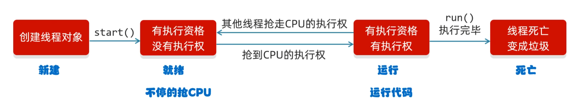

# Thread「线程」

> [!TIP]
> 简单理解：应用软件中互相独立，可以同时运行的功能
> 
> 线程是操作系统能够进行运算调度的最小单位。它被包含在进程之中，是进程中的实际运作单位,多线程提高效率。
> 
> 单线程就是cpu只能等待之前的代码运行完毕后才能继续执行，使用多线程就能使电脑性能充分发挥。
>
> 1．并发：在同一时刻，有多个指令在单个 CPU 交替执行
> 
> 2.并行：在同一时刻，有多个指令在多个 CPU 同时执行

## 创建线程

> Thread 常用方法

| 方法                                        | 说明                   |
|-------------------------------------------|----------------------|
| ----                                      | 构造函数                 |
| public Thread(Runnable task)              | 创建线程,默认别名            |
| public Thread(Runnable task, String name) | 创建线程,设置别名            |
| public void sleep(long time)              | 让主线程休眠               |
| ----                                      | 静态方法                 |
| static Thread currentThread()             | 获取当前线程的对象            |
| static void sleep(long time)              | 让线程休眠指定的时间，单位为毫秒     |
| static void join()                        | 插入线程/插队线程            |
| static void yield()                       | 出让线程/礼让线程            |
| ----                                      | 成员方法                 |
| String getName()                          | 返回此线程的名称             |
| void setName(String name)                 | 设置线程的名字(构造方法也可以设置名字) |
| setPriority(int newPriority)              | 设置线程的优先级 1~10        |
| final int getPriority()                   | 获取线程的优先级 默认 5        |
| final void setDaemon(boolean on)          | 设置为守护线程 (跟随绑定主进程死活)  |


### 方式一

> 快速创建线程，弊端拓展性差，无法再次继承

```java
//? 创建线程，需继承 Thread 或实现 Runnable
class test extends Thread {
    @Override
    public void run() {
        for (int i = 0; i < 10; i++) {
            System.out.println(getName()+"now is"+i);
        }
    }
}

public static void main(String[] args) {
    test t = new test();
    t.setName("我是第一个");
    test t2 = new test();
    t2.setName("我是第二个");
    t.start();
    t2.start();
}
```

### 方式二

> 使用接口创建，弥补了拓展性，降低简易性

```java
//方式二
class test implements Runnable {
    @Override
    public void run() {
        for (int i = 0; i < 10; i++) {
            //?方式二获取线程对象，接口并不存在方法，可通过Java保留的当前运行时线程，拿取并通过它使用方法。
            Thread t = Thread.currentThread();
            System.out.println(t.getName()+"now is"+i);
        }
    }
}

public static void main(String[] args) {
    Thread t = new Thread(new test());
    t.setName("我是第一个");
    Thread t2 = new Thread(new test());
    t2.setName("我是第二个");
    t.start();
    t2.start();
}
```

### 推荐方式：可管理线程

> 具备前者特点，并且方便重复调用、取消线程、定义超时 ...

| 方法                         | 参数                          | 说明              |
|----------------------------|-----------------------------|-----------------|
| ----                       | 构造函数                        | ----            |
| public class FutureTask<V> | Callable                    | 管理专用线程类         |
| public FutureTask          | Runnable runnable, V result | 通用接口适配,无返回需结束标识 |
| ----                       | 成员方法                        | ----            |
| public start               | void                        | 启动线程            |
| public isDone              | void                        | 是否完成            |
| public cancel              | boolean                     | 取消线程            |
| public get                 | void                        | 获取结果 通用式 返回传入标识 |
| public get                 | lone TimeUnit               | 获取结果 定义超时时间     |
| public run                 | void                        | 再次启动            |
| public state               | void                        | 线程状态            |
| public exceptionNow        | void                        | 根据状态产出异常        |


```java
//? Callable 也是线程主函数，返回值会返回到 管理类内部 使用泛型限制类型。
class test implements Callable<Integer> {
    @Override
    public Integer call() throws Exception {
        int sum = 0;
        for (int i = 0; i < 50; i++) {
            sum += i;
        }
        return sum;
    }
}

public static void main(String[] args) {
    // FutureTask就是负责管理多线程，内部拥有多方法，查看是否完成 isDone , get 获取结果。
    FutureTask<Integer> task = new FutureTask<>(new test());
    //? 它也是多线程实现类一种，使用start来启动,它启动之后才能传入的线程对象同时会执行。
    new Thread(task).start();

    System.out.println(task.get());
}
```

## 演示Demo

### 守护进程

> 用处：子窗口，比如浏览器与标签的关系，浏览器关闭了，标签就没有存在的必要了，自动销毁。
> 
> 自动结束逻辑：守护线程 不是跟随创建 线程者的生命周期，而是“跟随”所有 非守护线程 的生命周期。守护线程会在所有非守护线程结束后自动退出。
> 
> 这样的弊端：守护线程只适用于两层主与守的关系，如果主创建另一个主，而守护需要指定绑定第二个主，就不能通过守护来实现了，需独立控制线程了。

```java
public static void main(String[] args) {
    test t1 = new test();
    test t2 = new test();

    t2.setDaemon(true);
    //? 设置优先级，优先级只能提高先执行的概率，而不是直接先后区分的,范围 1 ~ 10 默认:5
    t1.setPriority(10);
    t1.start();

    t2.start();
}
//
class test extends Thread {
    @Override
    public void run() {
        for (int i = 0; i < 100; i++) {
            System.out.println(getName() +";" +i);
        }
    }
}
```

### 插入线程

```java
public static void main(String[] args) throws Exception {
    test test = new test();
    test.setPriority(10);
    test.start();
    
    //?插入线程，必须由非自己线程去调用插入，这样线程和调用者 会优先让线程执行
    test.join();//!Main 是调用者 ，因此 Main 会等到线程执行完成在执行

    for (int i = 0; i < 100; i++) {
        System.out.println("main" + i);
    }
}

class test extends Thread {
    @Override
    public void run() {
        for (int i = 0; i < 100; i++) {
            System.out.println(getName() + ";" + i);
        }
    }
}

```

### 出让线程

```java
public static void main(String[] args) {
    
}

class test extends Thread {
    @Override
    public void run() {
        for (int i = 0; i < 100; i++) {
            System.out.println(getName() +";" +i);
            //Thread出让线程，底层是根据内部记录的 currentThread 来获取当前线程
            Thread.yield();//?就算出让也无法确保自己是最后结束的线程,不如线权 很少使用。
        }
    }
}
```

## 生命周期



> 线程睡眠之后，会重新走准备状态，重新抢占CPU线权。

## 同步代码 「线程安全问题」

### 问题演示

```java
//DEMO
class test extends Thread {
    static int ticket = 0;
    
    @Override
    public void run(){
        while (true){
            if(ticket < 100){
                Thread.sleep(100);
                ticket++;
                System.out.println("当前票数:"+ ticket);
            }else{
                break;
            }
        }
    }
}

public static void main(String[] args) {
    new Thread(new test()).start();
    new Thread(new test()).start();
    new Thread(new test()).start();
}
```

> 产出问题，在执行到最后的时候会发现导致问题，判断是 < 100 可是最后增加到了102
> 
> 并不是判断是问题，而是线程在执行中途，比如上一会 ++ 执行完成了
> 
> 该去走打印的时候出现，线程又停止执行了，跑到别的线程去走++了，问题就是代码不是一次执行全部的
> 
> 任何时候都可能出现执行了上面下面没来得及，在后面来执行时数据已经发生了变化

### 线程锁 

> 使用 Java 同步锁绑定共享数据，锁定数据不让操作。
> 
> 锁默认打开，有一个线程进去了，锁自动关闭
> 
> 里面的代码全部执行完毕，线程出来，锁自动打开
> 
> 锁是根据内部的代码是否有线程还未执行完成，没执行完成其他的线程也不会执行。

```java
class test extends Thread {
    static int ticket = 0;

    //?锁对象，确保是唯一的，并且必须是对象，不能使用变量，它只是标识符。
    static Object obj = new Object();

    @Override
    public void run() {
        //Test.class 是类的字节码对象，Java编译后也是唯一的。
        synchronized (test.class) {
            while (true) {
                if (ticket < 100) {
                    try {
                        Thread.sleep(100);
                    } catch (InterruptedException e) {
                        throw new RuntimeException(e);
                    }

                    ticket++;
                    System.out.println("当前票数:" + ticket);
                } else {
                    break;
                }
            }
        }
    }
}
```

### 方法锁

> [!TIP]
> 方法锁就是给类中的方法同样添加锁，使多线程不会出现数据异常问题。
> 
> 方法锁的绑定对象是 this ,就是实例化的对象，而不是类字节码。
> 
> 如果线程你实例化两个线程对象在启动线程的时候，它们的锁是无法无法触发的，他们的this是不同的。

```java
public static void main(String[] args) {
    test test = new test();
    new Thread(test).start();
    new Thread(test).start();
    //!错误示范：new Thread(new test()).start(); 线程实现类同步方法不要 new 多余的
}

class test extends Thread {
    static int sum = 0;

    @Override
    public void run() {
        addSum();
    }

    private synchronized void addSum() {
        while (true) {
            if (sum < 100) {
                sum++;
                System.out.println(getName() + "当前数量:" + sum);
            } else {
                break;
            }
        }
    }
}
```

## Lock 「锁控制类」

> [!NOTE]
> 锁是自动管理的，当有线程在内部时候，其他线程无法使用，JDK5 开放了手动控制。
> 
> Reentrant 只是负责管理锁 锁是线程对象内部的属性 它获取并修改实现管理。
> 
> 线程内部有个 state 变量控制占用，它通过方法拿取并修改
> 
> 实例化的锁对象必须是静态，否则每次进来都会重新初始化锁，状态重置。

| 方法              | 说明   |
|-----------------|------|
| 构造函数            | ---  |
| ReentrantLock() | 实例化锁 |
| 成员方法            | ---  |
| lock()          | 锁住   |
| unlock()        | 解锁   |


DEMO

```java
public static void main(String[] args) {
    new Thread(new test());
}

class test extends Thread{
    static int sum = 0;
    
    public synchronized void run(){
        for (int i = 0; i < 30; i++) {
            addSum();
        }
    }
    
    private synchronized void addSum(){
        sum++;
    }
}
```

### 死锁

死锁是由双锁可能产生的逻辑错误。

```java
public static void main(String[] args) {
    test a = new test();
    a.setName("A");
    test b = new test();
    b.setName("B");
    //?由于同时开启了双锁，假设 A锁先启动占用了，B线程抢占成功了 B同时也占用了，而A需要去等待B，B也同样去等待A,导致线程无线等待。
    new Thread(a).start();
    new Thread(b).start();
}

class test extends Thread {
    static Object lock = new Object();
    static Object lock2 = new Object();

    @Override
    public void run() {
        if(getName().equals("A")){
            synchronized (lock) {
                System.out.println("A获取了权限，等待B执行");
                synchronized (lock2) {
                    System.out.println("A完成了事件");
                }
            }
        }if(getName().equals("B")){
            synchronized (lock2) {
                System.out.println("B获取了权限，等待A执行");
                synchronized (lock) {
                    System.out.println("B完成了事件");
                }
            }
        }
    }
}
```


## 线程订阅模式

> [!TIP]
> 线程订阅模式：线程中有生产者与消费者，生产者负责创建数据，而消费者使用数据。
> 
> 出现情况：消费者拿到线权时，没有产生数据，生产者线权数据已存在。
> 
> 这时候需要订阅模式，但生产者完成数据，通知消费者使用数据，自己睡眠等待
> 
> 消费者使用完成了数据，去通知生产者数据已完成，等待生产。

### 等待唤醒

```java
package src;

/**
 * @author Naer
 */
public class App {
    public static void main(String[] args) {
        test test = new test();
        test.setName("厨师");
        new Thread(test).start();
        new Thread(new user()).start();
    }
}

/*
 * 1．循环
 * 2.同步代码块
 * 3.判断共享数据是否到了末尾（到了末尾）
 * 4.判断共享数据是否到了末尾（没有到末尾，执行核心逻辑）
 * 
 * 通知消费者一定是在生产的时候，不管到没到上线都去通知，而不是完成了睡眠再去通知。
 * 消费者也是同理，可以引入一个中间桌子，确保不能同时操作，数据不会出现同时操作问题。
 * */
class test extends Thread {
    public static Object lock = new Object();  // 使用相同的锁对象
    public static int sum = 0;

    @Override
    public void run() {
        while (true) {
            synchronized (lock) {
                if (sum < 5) {
                    System.out.println(getName() + "生产完成");
                    sum++;
                    lock.notify();  // 生产后通知消费者
                } else {
                    try {
                        lock.wait();  // 如果生产数量已满，等待消费者消费
                    } catch (InterruptedException e) {
                        throw new RuntimeException(e);
                    }
                }
            }
        }
    }
}

class user extends Thread {
    public static Object lock = new Object();  // 锁对象保持一致

    @Override
    public void run() {
        for (int i = 0; i <= 10; i++) {
            synchronized (test.lock) {
                if (test.sum > 0) {
                    test.sum--;
                    System.out.println(getName() + "我还能吃:" + (10 - i));
                    test.lock.notifyAll();  // 消费后通知生产者 all是唤醒所有同绑定对象上的线程
                } else {
                    try {
                        test.lock.wait();  // 如果没有商品可消费，等待生产者生产
                    } catch (InterruptedException e) {
                        throw new RuntimeException(e);
                    }
                }
            }
        }
    }
}

```

### 阻塞队列 「推荐」

> [!TIP]
> ArrayBlockingQueue<T> 是用于处理队列的解决类，简化了繁琐的唤醒与休眠步骤。
> 
> 不需要我们自行去休眠和唤醒,只需要拿取和生产，需注意两者都需要同一个实例化的对象。

```java
package src;

import java.util.concurrent.ArrayBlockingQueue;

/**
 * @author Naer
 */
public class App {
    public static void main(String[] args) {
        //它的底层最重要的一点，每个方法都是根据方法队列已内容来的，未达标就无效循环休眠，有则返回给你。
        ArrayBlockingQueue<String> msg = new ArrayBlockingQueue<>(100);

        test test = new test(msg);
        test.setName("厨师");
        new Thread(test).start();
        new Thread(new user(msg)).start();
    }
}

class test extends Thread {
    public ArrayBlockingQueue<String> msg;

    public test(ArrayBlockingQueue<String> list) {
        this.msg = list;
    }

    @Override
    public void run() {
        //不要再给锁了，它内部有一个锁，再给容易出现死锁。
        for (int i = 0; i < 10; i++) {
            try {
                this.msg.put("信息:"+i);
            } catch (InterruptedException e) {
                throw new RuntimeException(e);
            }
        }
    }
}

class user extends Thread {
    public ArrayBlockingQueue<String> msg;

    public user(ArrayBlockingQueue<String> list) {
        this.msg = list;
    }

    @Override
    public void run() {
        while (true) {
            try {
                //!这个线程是无线循环，而生产只能13个，最后底层线程会在内部循环等待休眠。
                System.out.println(msg.take());
            } catch (InterruptedException e) {
                throw new RuntimeException(e);
            }
        }
    }
}

```

## 线程池

> [!TIP]
> 线程池是负责管理线程的，没有它之前，线程都是实例化启动结束。
>
> 而当它结束任务之后，线程还是在那边，只不过不执行了，这样就会导致线程资源浪费。
>

线程池是管理线程的工具类

1. 创建一个池子，池子中是空的
2. 提交任务时，池子会创建新的线程对象，任务执行完毕，线程归还给池子 
   下回再次提交任务时，不需要创建新的线程，直接复用已有的线程即可
3. 但是如果提交任务时，池子中没有空闲线程，也无法创建新的线程，任务就会排队等待
 
> `Executors`

| 方法                                                             | 说明           |
|----------------------------------------------------------------|--------------|
| 静态方法                                                           | ---          |
| public static ExecutorService newCachedThreadPool()            | 创建一个没有上限的线程池 |
| public static ExecutorService newFixedThreadPool(int nThreads) | 创建有上限的线程池    |
| 成员方法                                                           |              |
| submit(Runnable task) 、 Callable<T> 、 Runnable task result     | 提交任务         |
| shutdown()                                                     | 销毁线程池        |

## 自定义线程池

线程池中需要的参数

1. 正式员工数量 -> 核心线程数量（不能小于0）
2. 餐厅最大员工数 -> 线程池中最大线程的数量（最大数量>=核心线程数量）
3. 临时员工空闲多长时间被辞退(值) -> 空闲时间 (值)（不能小于0）
4. 临时员工空闲多长时间被辞退 (单位) -> 空闲时间 (单位)（用TimeUnit指定）
5. 排队的客户 -> 阻塞队列（不能为null）
6. 从哪里招人 -> 创建线程的方式（不能为null）
7. 当排队人数过多，超出顾客请下次再来(拒绝服务) -> 要执行的任务过多时的解决方案（不能为null）

<details>
<summary>实际作用演示</summary>

线程池

```html
核心线程3 临时3 5个任务

核心:任务123
队列:任务12

核心3 临时3 8个任务 队列长度3

核心:任务1~5
队列:任务456

如果任务数量>核心+临时+队列,会直接触发拒绝服务。

ThreadPoolExecutor.AbortPolicy -> 默认策略：丢弃任务并抛出RejectedExecutionException异常
ThreadPoolExecutor.DiscardPolicy -> 丢弃任务，但是不抛出异常这是不推荐的做法
ThreadPoolExecutor.DiscardOldestPolicy -> 抛弃队列中等待最久的任务 然后把当前任务加入队列中
ThreadPoolExecutor.CallerRunsPolicy -> 调用任务的run()方法绕过线程池直接执行

结论:

1. 临时线程是在等待队列长度满了之后,还有任务时,开启的线程。
2. 线程的不一定是根据顺序完成的,队列456 78临时线程在执行。
```
</details>

```java
/*
  ThreadPoolExecutor threadPoolExecutor = newThreadPoolExecutor
 （核心线程数量，最大线程数量，空闲线程最大存活时间，任务队列，创建线程工厂，任务的拒绝策略）；
 
    参数一:核心线程数量          不能小于0
    参数二:最大线程数           不能小于，最大数量>=核心线程数量
    参数三:空闲线程最大存活时间   不能小于θ
    参数四:时间单位            用TimeUnit指定
    参数五:任务队列            不能为nul1
    参数六:创建线程工厂         不能为nul1
    参数七:任务的拒绝策略        不能为nul1
 */

public static void main(String[] args) {
    //?查看当前可用最大并行数,可根据大小调整线程数量
   int cores = Runtime.getRuntime().availableProcessors();
   System.out.println(cores);
   ThreadPoolExecutor pool=new ThreadPoolExecutor(
           3,
           6,
           60,
           TimeUnit.SECONDS,
           new ArrayBlockingQueue<>(3),
           Executors.defaultThreadFactory(),
           new ThreadPoolExecutor.AbortPolicy()
   );
}
```

### 合适线程池大小「用处较少」

1. CPU密集型运算：程序读写内存中操作占多
   数据库IO操作少 推荐 最大并行数 +1 防线程卡死等。
2. I/0密集型运算:数据库和本地存储操作多 
   推荐 最大并行数 * 期望CPU利用率 * (总时间（CPU计算时间+等待时间）/ CPU 计算时间)

总时间：硬盘操作，测试读写速度，计算时间 

CPU时间：与上面同理测试。

通常程序员懒得计算，可根据感觉预估时间，填写百分比，硬盘100% cpu50%
