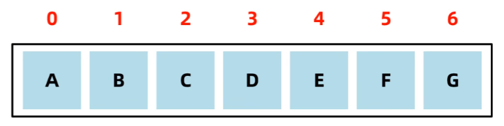
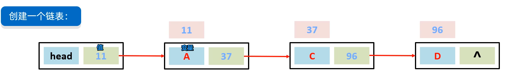

# 数据结构

1. 每种数据结构是什么
2. 任何添加数据
3. 如何删除数据

## 栈

先进先出，后进后出，栈顶出入，进入叫压，出去叫弹。

ABCD 依次进入，完成之后 A 在站地，D 在栈顶，只有等 D 完成后等 CB，才能轮到 A 出栈，

## 队列

数据从后端进入队列叫：入队列 、从前端离开队列叫：出队列。先进先出，后进后出

## 组数

ArrayList 用的组数，并带有自动扩容。

查询速度快：查询可通过索引定位，查询速度容易数据耗时相同

删除效率低：移除原始数据，同时将后面数据前移

添加效率低：添加数据，同时后面数据后移

## 链表

数链接起来存储的方式 `LinkedLIst` 用的双向链表

非连续数据导致查询慢，它需要从 head 挨个去看记录的地址，直到地址找到对应数据。

增删改会非常快，它不需要每次往后推移，在链表中间修改为新的地址值，增加删除则修改新地址的左右俩边的地址为他即可。

双向链表具备优化性，可判断数据距离头和尾谁近，就用谁来进行查询

## 二叉树

## 二叉查找树

遍历方式：

记忆技巧：

弊端：全是大于就会导致于链表相似。

## 平衡二叉树

实现方式：

左旋

右旋

出现情况

 

## 红黑树

数据结构（红黑树）红黑规则：

1. 每一个节点或是红色的，或者是黑色的
2. 根节点必须是黑色
3. 如果一个节点没有子节点或者父节点，则该节点相应的指针属性值为 Nil，这些 Nil 视为叶节点，每个叶节点(Nil)是黑色的
4. 如果某一个节点是红色，那么它的子节点必须是黑色(不能出现两个红色节点相连的情况)
5. 对每一个节点，从该节点到其所有后代叶节点的简单路径上，均包含相同数目的黑色节点;
6. 后代节点叶片：子级 Nil 叶片。简单路径：一条路走不回头。 **增删改查性能都强**

规则处理方式：

## 总结

1. 二叉树是基础的数据存储方式
2. 二叉查找数是为了解决二叉树数据混乱的问题
3. 平衡二叉树是解决二叉树数据偏斜
4. 红黑数测底解决了二叉树系列的所有问题，省去了频繁旋转的性能。
