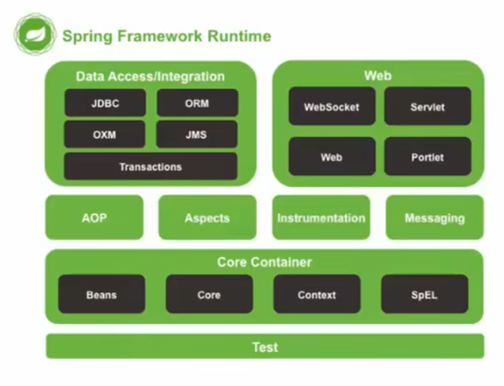

# Spring

预学习阶段，我们需掌握的配置与结构，开发理念。



我们先学习 Spring 容器部分

## Spring 三层结构

1. Dao「DAL」 : 数据程 负责进行数据相关操作
2. Service「BLL」 : 服务程 负责提供方法的层
3. View「UI」 : 视图程 为用户显示的视图
4. factory : 可选的工厂程，简化重复添加 Bean。

使用规范：

Service 获取Dao 通过 Bean 来加载

Dao 只能由 Server 来操作，不允许外部访问。

## GetStand

> Spring 快速入门

Spring 开发步骤

1. 导入 Spring 开发的依赖包坐标
2. 编写 Dao 接口与实现类
3. 创建 spring 核心配置文件
4. 在 Spring 配置文件中获得 UserDaoImpl
5. 使用 Spring 的 API 获得 Bean 实例{反射实现}

依赖资源

```xml

<dependency>
    <groupId>org.springframework</groupId>
    <artifactId>spring-context</artifactId>
    <version>6.2.1</version>
</dependency>
```

定义接口

```java
package com.Naer;

public interface UserDao {
    void run();
}
```

主程序 `resources` 配置路径下 右键新建 < xml < spring 配置文件

```xml
<?xml version="1.0" encoding="UTF-8"?>
<!-- 推荐约定俗成命名 applicationContext  -->

<beans xmlns="http://www.springframework.org/schema/beans"
       xmlns:xsi="http://www.w3.org/2001/XMLSchema-instance"
       xsi:schemaLocation="http://www.springframework.org/schema/beans http://www.springframework.org/schema/beans/spring-beans.xsd">
    <!-- 添加你的主程序所需 Bean -->
    <bean id="UserDao" class="com.Naer.Dao.Demo"/>
</beans>
```

主程序 | bean

```java
public class Demo implements UserDao {
    public static void main(String[] args) {
        //主程序调用 Spring 读取配置文件
        ApplicationContext app = new ClassPathXmlApplicationContext("applicationContext.xml");
        //根据配置文件，反射拿取到 Bean
        UserDao userDao = app.getBean(UserDao.class);
        //调用方法,入口函数是静态的，调用的是动态实例化的方法。
        userDao.run();
        //运行直接当前文件，或者Idea main 方法有个按钮点击
    }

    public String say(String name) {
        return "hello " + name;
    }

    @Override
    public void run() {
        System.out.println("Running");
    }
}
```

## Spring Config

### Bean

> 配置项目所需的 Java Bean 对象，可由 Spring 进行管理的形式
> 简化 Dao 层需要为 Service 方便使用的中间管理层，由 Spring 管理。

```xml

<beans xmlns="http://www.springframework.org/schema/beans"
       xmlns:xsi="http://www.w3.org/2001/XMLSchema-instance"
       xsi:schemaLocation="http://www.springframework.org/schema/beans http://www.springframework.org/schema/beans/spring-beans.xsd">

    <bean id="UserDao" class="com.Naer.Dao.Demo"/>
</beans>
``` 

spring 挂载 Bean 实现类不是接口
id是Bean的标识符, Get 根据字符串判断是否相同来判断。  
默认实例化 Class 方式调用 Instance 方法，只能通过无参构造。

init-method： 指定 Bean 初始化的调用的方法

destroy-method : 指定 Bean 被销毁时调用方法

测试直接关闭实例化出来的配置文件 close 方法。

#### 指定获取 Bean 方式

class: 反射方式获取Bean对象

指定对象字节码地址，通过此地址访问并反射调用 无参构造，返回此 Bean

factory-method : 静态工厂「静态工厂 获取对象」

拥有此属性，反射获取到指定对象后，再去调用对象中指定静态方法去获取Bean。

factory-bean : 动态工厂「动态工厂 获取对象」

自动实例化一个配置的工厂，返回这个工厂对象，使用时调用工厂方法获取 Bean

factory-method「动态工厂 获取对象」

绑定动态工厂，在动态工厂被实例化后，直接调用工厂内部的指定方法来获取 Bean

#### 范围限制

scope 可选范围：

1. singleton : 默认 单列模式
2. prototype : 多例的
3. request : WEB 项目中，Spring创建一个Bean 的对象，将对象存入到 request 域中
4. session : WEB项目中，Spring创建一个Bean的对象，将对象存入到 session 域中
5. global session : WEB项目中，应用在Portlet环境
   如果没有 Portlet 环境那么 globalSession 相当于session

#### 引用注入

> [!TIP]
> Bean 想直接挂载其他 Bean 在自己内部的属性上
> 利用引用Bean 从而省去了实例化配置，拿取属性赋值繁琐的步骤。

```java
import javax.naming.Name;

public class Service implements UserService {
    //内部所需挂载的 Bean ,可自定义名称，最后赋值对象在上面
    private t t;
    private String Name;

    @Override
    public void sayHello() {
        t.test();
    }

    //方式一：提供set方法，Spring调用赋值。
    public void setT1(t t) {
        this.t = t;
    }

    //方式二：通过构造方法注入
    public Service(t1 t) {
        this.t = t;
    }

    //普通属性注入
    public void setName(String name) {
        this.Name = name;
    }
}
```

```xml

<beans>
    <!-- 需要的 Bean -->
    <bean id="t" class="com.Naer.Dao.t"/>

    <!-- 挂载自己让 Spring 反射对象 -->
    <!-- p命名空间可简写，我感觉不方便管理，不写演示了 -->
    <bean id="Service" class="com.Naer.Service.Service">
        <!-- 方法注入 name:注入方法名称 ref : 引用的bean -->
        <property name="t" ref="t"/>
        <!-- 方式二 构造方法注入 name: 构造方法参数命名 -->
        <constructor-arg name="t" ref="t1"/>
        <!-- 方法注入基本类型 构造用构造标签名 ,Spring 会尝试转换类型 -->
        <property name="name" value="张三"/>
    </bean>
</beans>
```

启动测试

```java
public class Demo {
    public static void main(String[] args) {
        ApplicationContext context = new ClassPathXmlApplicationContext("applicationContext.xml");
        /* 必须通过 Context 获取 Bean,否则它的挂载不会自动执行 */
        UserService service = (UserService) context.getBean("Service");
        service.sayHello();
        //!不要直接通过 new 来获取 被挂载了引用的 bean,new 出来的Spring无法给你挂载
    }
}
```

##### 集合注入

> [!TIP]
> Bean 也能使用方法或者构造来注入数组 或 Map 等等

```java
import java.util.List;

public class Service implements UserService {
    /*
     * 演示用的基本数据类型，想要用其他的对象类型
     * bean里面也添加声明被引用的对象。
     * 被引用对象，里面同样给 set 或者构造
     * 然后再给里面添加的元素用现在的基本类型赋值
     * 最后在把赋值完成后，这个Bean的名字放在
     * 你写的对象放引用类型 ref 里面，这样就完成了
     * */
    private List<String> list;
    private Map<String, String> map;
    //Properties与 Map 写法有点不同

    @Override
    public void sayHello() {
        System.out.println(map);
    }

    public void setMap(Map<String, String> map) {
        this.map = map;
    }

    public void setList(List<String> list) {
        this.list = list;
    }
}

```

```xml

<bean id="Service" class="com.Naer.Service.Service">
    <property name="map">
        <map>
            <entry key="dax" value="40"/>

            <entry key-ref="可引用其他 Bean 对象，泛型需对的上"/>
        </map>
        <!-- Properties 的value 不是写属性里面，而是写标签里面。
           <props>
                <prop Key="k">value</prop>
           </props>
         -->
    </property>
    <property name="list">
        <list>
            <value>1</value>
            <value>2</value>
            <!-- 集合填写泛型是对象，用 Ref 来引用对象就行了，
                别的对象想添加数据可以使用这个方式注入值 或者调用初始化方法。
             -->
        </list>
    </property>
</bean>
```

### 配置导入

> [!TIP]
> 通过上面的 Bean 已经能看出来，Spring 可以让配置文件生成数据
> 
> 这样的便利性，会导致很多项目数据都是根据配置文件生成，导致文件过大。
> 
> 所以我们需要配置文件分块配置，因为有分块写法，所以适配了导入的语法。

```xml
<!-- 导入其他配置，当然其他配置会同时加载出来 -->
<import resource="applicationContext.xml"/>
```

### 实例化配置

> [!TIP]
> 配置相关的是归于 Spring Context 这个jar 包,使用前注意配置好依赖

```java
public static void main(String[] args) {
   //方式一 Maven项目路径结构，主程序|测试 同级 resources 下去寻找xml配置
   ApplicationContext context = new ClassPathXmlApplicationContext("applicationContext.xml");
   //方式二: 通过磁盘，也就是路径方式去获取,只能绝对路径 或者Idea 右键<路径<来自内容根的路径
   ApplicationContext context = new FileSystemXmlApplicationContext("");
   //方式三：通过注解配置容器对象，它自动根据注解来生成配置，还未学习。
}
```

获取Bean的方式

```java
public static void main(String[] args) {
   ApplicationContext context = new ClassPathXmlApplicationContext("applicationContext.xml");
   //方式一，通过Id的字符来获取
   context.getBean("Service");
   /*
    * 方式二：通过Bean配置的类字节码获取
    * 就是无论是什么方式获取的类
    * 它都记录了字节码去匹配。
    * 弊端：同一个Bean ID不同
    * 但是引用同一个类，就会出现异常
    * 它无法区分你要的是哪个Bean
    */
   context.getBean(Service.class);
}
```


## 数据源

1. 数据源(连接池)是提高程序性能如出现的
2. 事先实例化数据源，初始化部分连接资源
3. 使用连接资源时从数据源中获取
4. 使用完毕后将连接资源归还给数据源

常见的数据源(连接池)：DBCP、C3P0、BoneCP、Druid、...
