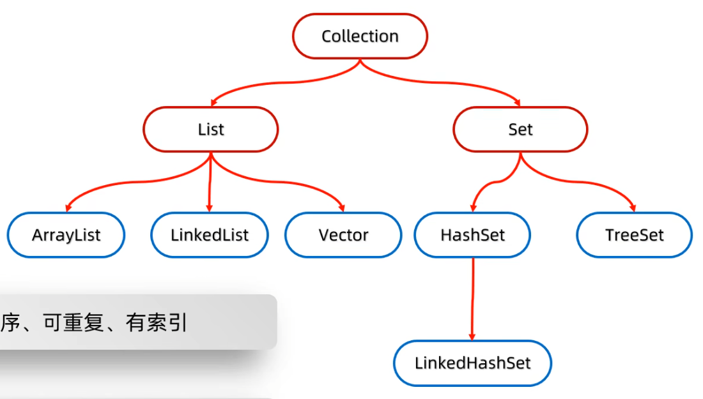

# Java 基础语法

- [Java 基础语法](#java-基础语法)
  - [入口函数](#入口函数)
  - [项目构建](#项目构建)
    - [Java 语言的构建工具有两种：Maven 和 Gradle](#java-语言的构建工具有两种maven-和-gradle)
    - [Project](#project)
    - [Package「项目结构」](#package项目结构)
  - [目录结构规范](#目录结构规范)
  - [高级语法相关 类库 |](#高级语法相关-类库-)
  - [Class](#class)
    - [语法](#语法)
  - [1. 变量](#1-变量)
  - [2. 数据类型 | Model](#2-数据类型--model)
  - [3. 运算符](#3-运算符)
  - [4. 控制语句](#4-控制语句)
  - [5. 数组](#5-数组)
  - [6. 类与对象](#6-类与对象)
    - [内部类](#内部类)
    - [匿名内部类「非常重要」](#匿名内部类非常重要)
    - [方法可变参数](#方法可变参数)
  - [7. 接口与抽象类](#7-接口与抽象类)
    - [接口的应用](#接口的应用)
  - [8. 多态](#8-多态)
  - [常量与静态 『`Final`』 \& 『`Static`』](#常量与静态-final--static)
  - [8. 集合体系\[结构\](./data Structure.md)](#8-集合体系结构data-structuremd)
  - [9. 泛型 『`Generic`』](#9-泛型-generic)
  - [Stream 流](#stream-流)
    - [总结](#总结)
  - [方法引用](#方法引用)
  - [8. 异常处理](#8-异常处理)
  - [9. 多线程](#9-多线程)
  - [10. 反射](#10-反射)
  - [11. 注解](#11-注解)
  - [12. 泛型](#12-泛型)
  - [13. 枚举](#13-枚举)
  - [14. 输入/输出](#14-输入输出)
  - [15. 语法糖](#15-语法糖)
  - [16. 包](#16-包)
  - [17. 反编译](#17-反编译)
  - [18. 编译](#18-编译)
  - [19. 调试](#19-调试)
  - [20. 单元测试](#20-单元测试)
  - [21. 代码风格](#21-代码风格)
  - [22. 注释](#22-注释)
  - [23. 编码规范](#23-编码规范)
  - [24. 版本控制](#24-版本控制)
  - [25. 设计模式](#25-设计模式)
  - [26. 数据库](#26-数据库)
  - [27. 设计原则](#27-设计原则)
  - [28. 设计模式](#28-设计模式)

## 入口函数

> [!TIP]
> 入口函数是 Java 程序的入口，所有的 Java 程序都必须有一个入口函数。
>
> 并且 java 格式文件名必须与类名相同，并且最外层必须是一个类，**类名必须与文件名相同**。强制`ESmodule`这样理解

Java 程序的入口函数一般是 `main` 方法，它是所有 Java 程序的入口。

```java
public class Main {
    public static void main(String[] args) {
        system.out.println("Hello, world!");
        // your code here
    }
}
```

> 使用 javac 命令编译 Java 源文件，并使用 java 命令运行 Java 程序。

## 项目构建

> [!TIP]
> 创建项目的基础，Java 编辑器请选择 Idea
>
> IDea 菜单栏>文件>项目结构>模块中勾选想要的项目预设

### Java 语言的构建工具有两种：Maven 和 Gradle

- Maven：Apache Maven 是 Java 项目管理工具，它可以自动化构建、依赖管理、项目信息管理等。
- Gradle：Gradle 是基于 Groovy 的项目自动化构建工具，它可以简化构建过程，提升构建效率。

### Project

> [!TIP]
> Idea 会自动打开上次的项目，可去菜单栏点击关闭项目，打开项目目录
>
> 管理你的项目或者添加项目，它自带一些模板快速构建项目录 插件可添加，也可以创建空目录自己创建项目。
>
> IDea 可以在注释首字母输入 **TIP** 再通过左测行位置点击即可切换 具有 UI 的注释
>
> 

### Package「项目结构」

> [!TIP]
> 包是 Java 语言的组织结构，它是 Java 项目的基本单元、通常存放于 src 目录下。
>
> 项目结构：
>
> IDea 中直接右键你所需要创建的目录下，新建>新建软件包，注意包的命名通过 `.` 分割 每一个 `.`
> 代表一个层级，它会不同层级生成不同的目录。三层就有三个文件夹
>
> 包中可以包含类、接口、枚举、注解、注释、配置文件等。在主程序使用时候，需要导入相应的包。
>
> 导入包可以通过 `import package + 包名;` 重名导入就需要 直接使用 包名.类名 调用 类方法。
>
> ---
>
> 包的作用：
>
> 1. 包可以避免命名冲突：不同包中的类可以有相同的名称，因此可以避免命名冲突。
> 2. 包可以组织代码：包可以将相关的代码放在一起，便于管理。
> 3. 包可以隐藏实现细节：包可以隐藏实现细节，使代码更加易读、易用。

包的命名规则：

1. 包名只能包含字母、数字、下划线（\_）、美元符号（$）
2. 包名不能以数字开头
3. 包名不能是关键字

## 目录结构规范

> [!TIP]
> Java 语言的目录结构，必须遵循规范，不使用会导致在 JVM 上无法找到类库。

Java 语言的目录结构：

```text
my-java-project/
├── src/
│   └── main/
│       └── java/
│           └── com/
│               └── example/
│                   ├── App.java
│                   └── utils/
│                       └── Utils.java
│   └── test/
│       └── java/
│           └── com/
│               └── example/
│                   └── AppTest.java
├── lib/
├── bin/
├── build/
├── docs/
└── pom.xml or build.gradle
```

1. main/: 主源代码
   1. java/: Java 源代码
      1. com/example/: 包目录，对应包名 `com.example` 命名通常是域名反写
         1. App.java: 主应用程序类
         2. utils/: 工具类包，对应包名 `com.example.utils`
            1. Utils.java: 工具类
2. test/: 测试代码
   1. java/: Java 测试代码
      1. com/example/: 测试类包目录，对应包名 `com.example`
         1. AppTest.java: 测试类
3. lib/: 存放外部库的目录。
4. bin/: 编译输出目录，存放编译后的 `.class` 文件。
5. build/: 构建输出目录。
6. docs/: 文档目录
7. pom.xml 或 build.gradle: 项目构建工具配置文件（分别用于 Maven 或 Gradle）。

## 高级语法相关 [类库](./Class.md) |

## Class

> [!TIP]
> 类是 Java 语言的基本单位，它包含成员变量、方法、构造器、访问控制符、继承、多态等。

类（Class）：模板，用来创建对象的蓝图。

类是 Java 语言的基本单位，它包含成员变量、方法、构造器、访问控制符、继承、多态等。

类可以包含以下元素：

- 成员变量：类中定义的变量，用于存储数据。
- 方法：类中定义的函数，用于实现功能。
- 构造器：类中用于创建对象的函数。
- 访问控制符：public、private、protected。
- 继承：一个类可以从另一个类继承所有其成员变量和方法。
- 多态：同一个方法可以作用于不同的对象，根据对象的实际类型调用不同的方法。
- 封装：将数据和方法包装在一起，隐藏内部实现细节。

### 语法

<details>
<summary>类语法</summary>

1. 构造器（Constructor）

   ```java
   public class Person {
       private String name;
       private int age;
       private String gender;

       public Person(String name, int age, String gender) {
           this.name = name;
           this.age = age;
           this.gender = gender;
       }
   }
   ```

2. 方法（Method）

   ```java
   public class Person {
       private String name;
       private int age;
       private String gender;

       public void sayHello() {
           System.out.println("Hello, my name is " + name + " and I am " + age + " years old.");
       }
   }
   ```

3. 成员变量（Field）

   ```java
   public class Person {
       private String name;
       private int age;
       private String gender;
   }
   ```

4. 访问控制符（Access Modifier）

   ```java
   public class Person {
       public String name;    // public 修饰的变量可以被任何地方访问
       private int age;       // private 修饰的变量只能在本类中访问
       protected String gender;   // protected 修饰的变量可以被本类和子类访问
   }
   ```

5. 继承（Inheritance）

   ```java
   public class Animal {
       public void eat() {
           System.out.println("Animal is eating.");
       }
   }

   public class Dog extends Animal {
       public void bark() {
           System.out.println("Dog is barking.");
       }
   }

   public class Cat extends Animal {
       public void meow() {
           System.out.println("Cat is meowing.");
       }
   }
   ```

6. 多态（Polymorphism）

   ```java
   public class Animal {
       public void eat() {
           System.out.println("Animal is eating.");
       }
   }

   public class Dog extends Animal {
       public void bark() {
           System.out.println("Dog is barking.");
       }
   }

   public class Cat extends Animal {
       public void meow() {
           System.out.println("Cat is meowing.");
       }
   }

   public class Main {
       public static void main(String[] args) {
           Animal animal = new Dog();
           animal.eat();
           ((Dog) animal).bark();

           Animal cat = new Cat();
           cat.eat();
           ((Cat) cat).meow();
       }
   }
   ```

</details>

## 1. 变量

<details>
<summary>变量语法</summary>

变量是程序中用于存储数据的占位符，它可以用来保存各种数据类型的值。

变量的命名规则：

1. 变量名只能包含字母、数字、下划线（\_）、美元符号（$）
2. 变量名不能以数字开头
3. 变量名不能是关键字

## 2. 数据类型 | [Model](./Model.md)

Java 语言支持以下数据类型：

- 整型：byte、short、int、long
- 浮点型：float、double
- 字符型：char
- 布尔型：boolean
- 字符串型：String

特殊类型

- 静态类型 `static` ：静态类型是存储在方法区中的，它在程序运行时创建，并在程序结束时销毁。
- 动态类型 `dynamic` <sup>默认</sup>：动态类型是存储在堆内存中的，它在类加载时创建，并在程序结束时销毁。
- 常量 `final`：常量是一种特殊的变量 拥有静态类型特性，但它的值定义后不能被修改。JS：`const`

## 3. 运算符

Java 语言支持以下运算符：

- 算术运算符：+、-、\*、/、%、++、--
- 赋值运算符：=、+=、-=、\*=、/=、%=
- 关系运算符：==、!=、>、<、>=、<=
- 逻辑运算符：&&、||、!
- 位运算符：&、|、^、~、<<、>>、>>>
- 条件运算符：?:

</details>

<details>
<summary>更多运算符</summary>

- Java 进行小数运算结果不是精确的，而是近似值任意出现偏差，尽量不要使用浮点型进行精确运算。

```java
// 三元运算符
int a = 10 > 5 ? 10 : 5;

// instanceof 运算符
if(obj instanceof String){
        // do something
        }

// 数组访问运算符
int[] arr = {1, 2, 3};
int num = arr[0];

// 字符串连接运算符
String str = "Hello" + "World";

// 字符串拼接运算符
String str = "Hello" + " " + "World";

// 字符串重复运算符
String str = "Hello" * 3;

```

</details>

## 4. 控制语句

<details>
<summary>控制语句语法</summary>

Java 语言支持以下控制语句：

1. if-else 语句

   ```java
   if (condition) {
       // do something
   } else {
       // do something else
   }
   ```

2. switch-case 语句

   ```java
   switch (expression) {
      case value1:
          // do something
          break;
      case value2:
          // do something else
          break;
      default:
          // default action
          break;
   }
   ```

3. for 循环

   ```java
   for (initialization; condition; iteration) {
       // do something
   }
   ```

4. for-each 循环

   ```java
   for (element : array) {
       // do something
   }
   ```

5. while 循环

   ```java
   while (condition) {
       // do something
   }
   ```

6. do-while 循环

   ```java
   do {
       // do something
   } while (condition);
   ```

7. break 语句

   ```java
   for (int i = 0; i < 10; i++) {
       if (i == 5) {
           break;
       }
       System.out.println(i);
   }
   ```

8. continue 语句

   ```java
   for (int i = 0; i < 10; i++) {
       if (i == 5) {
           continue;
       }
       System.out.println(i);
   }
   ```

9. return 语句

   ```java
   public int add(int a, int b) {
       return a + b;
   }
   ```

</details>

## 5. 数组

<details>
<summary>数组语法</summary>

Java 语言支持以下数组：

1. 静态数组

   > 直接打印多层数组是内存地址 **`Arrays.deepToString(arr)`**
   >
   > 访问修改指定位置就需要 **`arr[i][j]`**
   >
   > 下表`-1`就是设置空值，Java 逻辑处理无法直接使用 null;

   ```java
   int[] arr = new int[10];     // 声明一个长度为 10 的 int 数组
   int[] arr = new int[5-1];     // 声明一个长度为 5-1 = 4 的 int 数组
   ```

   ```java
   int[] arr = {10, 20, 30};    // 声明一个包含 3 个元素的 int 数组
   ```

   ```java
   String[] arr = {"Hello", "World"};    // 声明一个包含 2 个字符串的 String 数组
   ```

   ```java
   int[][] arr = new int[2][3];    // 声明一个二维数组，第一维长度为 2，第二维长度为 唯就是数组的层数
   // 不好理解你就 int[row][column] = {{1, 2, 3}, {4, 5, 6}}; 第一个括号是行数，第二个括号是列数
   [
    [1],[2],[3]
   ],
   [
    [4],[5],[6]
   ]
   ```

   ```java
   int[][] arr = {{1, 2, 3}, {4, 5, 6}};    // 声明一个 2 行 3 列的 int 数组
   ```

   ```java
   int[][][] arr = new int[2][3][4];    // 声明一个 2 行 3 列 4 层的 int 数组
   ```

   ```java
   int[] arr = new int[10];     // 声明一个长度为 10 的 int 数组
   for (int i = 0; i < arr.length; i++) {
       arr[i] = i * 2;           // 给数组的每个元素赋值
   }
   ```

2. 动态数组

   ```java
    import java.util.ArrayList;
    ArrayList<Integer> list = new ArrayList<Integer>();
    list.add(10);
    int[] arr = new int[list.size()];
    for (int i = 0; i < arr.length; i++) {
        arr[i] = list.get(i);
    }
    //不能在创建时候直接添加内容
   list.add(); // 向 ArrayList 中添加元素
   list.get(0); // 访问 ArrayList 中的元素
   list.remove(0); // 从 ArrayList 中删除元素
   list.size(); // 获取 ArrayList 中元素的个数
   list.isEmpty(); // 判断 ArrayList 是否为空
   list.clear(); // 清空 ArrayList
   list.contains(obj); // 判断 ArrayList 中是否包含某个元素
   list.set(0, obj); // 修改 ArrayList 中某个元素的值
   list.subList(0, 2); // 获取 ArrayList 的子列表
   list.toArray(); // 将 ArrayList 转换为数组
   list.toArray(new Integer[0]); // 将 ArrayList 转换为指定类型的数组
   list.iterator(); // 获取 ArrayList 的迭代器
   list.listIterator(); // 获取 ArrayList 的列表迭代器
   list.forEach(System.out::println); // 遍历 ArrayList 的元素
   list.forEach(item->{}) //箭头函数方式
   ```

   -二维动态数组

   ```java
    ArrayList<ArrayList<Integer>> list = new ArrayList<>();
    ArrayList<Integer> list1 = new ArrayList<>();
    list1.add(1);
    ArrayList<Integer> list2 = new ArrayList<>();
    list2.add(2);
    list.add(list1);
    list.add(list2);
    System.out.println(list);
   ```

</details>

## 6. 类与对象

- 类（Class）：模板，用来创建对象的蓝图。
- 对象（Object）：类的实例，根据类创建的实例称为对象。
- 成员变量（Field）：类中定义的变量，用于存储数据。
- 方法（Method）：类中定义的函数，用于实现功能。
- 构造器（Constructor）：类中用于创建对象的函数。
- 访问控制符（Access Modifier）：public、private、protected。
- 继承（Inheritance）：一个类可以从另一个类继承所有其成员变量和方法。
  - Java 所有类都继承 Object 类使其作为基类
  - Java 不能**多继承**，但是可以**多层继承**，变相解决继承问题。
  - Java 对继承做了优化，非 `static`、`final`、`private` 属性|方法 <br>
    均在虚方法中允许并**被继承**，继承了 `Getter` 方法，但静态属性**未继承**，`Getter`发现未继承属性，抛错！
  - **第二层**继承了**第一层**，**第三层**继承**第二层**，**第二层**中继承的**第一层**，所以**第三层**继承了**一二层**
  - Java 类中只能存在**一个**公开的类，所以继承的类必须**分离**文件出来 <br>
    类中写类无法调用 `super` 因 `this` 无法指向父类而是自己的堆值
  - 还需注意 继承类的 **堆** 中是拥有 父类的属性，`super` 是调用父类 **构造函数** <br>
    尽管没调用它也继承了 **父类的属性**，它实例化后就记录在了**方法区**中。
- 多态（Polymorphism）：同一个方法可以作用于不同的对象，根据对象的实际类型调用不同的方法。
- 封装（Encapsulation）：将数据和方法包装在一起，隐藏内部实现细节。

<details>
<summary>类与对象语法</summary>

> [!TIP]
> 注意！Java 语言是强类型语言，参数类型与返回值类型必须一致。
>
> 并且 Java 只允许一个文件中只有一个 public 类，并且这个类必须与文件名相同。还有 Java 不能多继承，只能单继承。
>
> 方法重载和方法重写的区别：方法重载是指在一个类中，有多个方法名相同，但是参数列表不同。方法重写是指子类重写父类的方法。<br>
> Java 语言不支持方法重载，只能通过方法重写来实现多态。
>
> 方法中使用 `this()` 方法来实现调用构造器。

1. 属性

   > [!CAUTION]
   > 请务必遵守「属性尽量不要用 public」的原则，因为 public 属性会被其他类访问，可能导致被修改数据，后续 debug 很难排查问题。就按照
   > pinia 状态管理思想。

   ```java
   public class Person {
       private String name;
       private int age;
       private String gender;
      // 属性不能像C# 一样 {get;set;}

      //idea可直接右键生成[alt+insert]构造器和get/set方法都能自动生成

       public Person(String name, int age, String gender) {
           //this. 是获取当前对象的引用地址，也是就是 在堆中的地址。默认拿去栈帧中的数据
           this.name = name;
           this.age = age;
           this.gender = gender;
       }
       //static 静态方法 不用实例化存在方法区
       public void sayHello() {
        /* public 公共方法 private 私有方法 protected 保护方法 */
           System.out.println("Hello, my name is " + name + " and I am " + age + " years old.");
       }
       //静态代码块
        static {
            String test;
        }
   }
   ```

2. 实例化对象

   ```java
   Person person = new Person("Alice", 25, "Female");
   ```

3. 调用方法

   ```java
   person.sayHello();
   ```

4. 方法重载

   ```java
   public class Person {
    private String name;
    private int age;
    private String gender;

    public Person(String name, int age, String gender) {
        this.name = name;
        this.age = age;
        this.gender = gender;
    }

    public void sayHello() {
        //调用构造方法
        this(name, age, gender)
        System.out.println("Hello, my name is " + name + " and I am " + age + " years old.");
    }
    // 方法重载
    public void sayHello(String name) {
        System.out.println("Hello, my name is " + name + " and I am " + age + " years old.");
    }
   }
   ```

5. 访问成员变量

   ```java
   System.out.println(person.name);
   ```

6. 内部类

   ```java
   //外部其他类
   public class Outer {
       private String name;

       public Outer(String name) {
           this.name = name;
           //内部类是类，所以需要实例化，其他语法跟类没区别。
           Inner inner = new Inner(name);
           inner.sayHello();
       }
       //内部类 | 类中再定于类
       //内部类用于，某个属性也有自己的子类属性，比如学生有专业 专业这个属性可能出现子属性，这时候就使用内部类
       public class Inner {
           private String name;

           public Inner(String name) {
               this.name = name;
           }

           public void sayHello() {
               System.out.println("Hello, my name is " + name + " and I am " + age + " years old.");
           }
       }
   }
   ```

7. 继承

   ```java
   public class Student extends Person {
       private String major;

       public Student(String name, int age, String gender, String major) {
           super(name, age, gender);
           this.major = major;
           //访问父类属性
           String name = super.name;
       }

       public void study() {
           System.out.println(name + " is studying in " + major + ".");
       }
   }
   ```

8. 多态

   ```java
   public class Animal {
       public void eat() {
           System.out.println("Animal is eating.");
       }
   }
    //Dog 和 Cat 继承 Animal
   public class Dog extends Animal {
       public void bark() {
           System.out.println("Dog is barking.");
       }
   }
    //Cat 继承 Animal
   public class Cat extends Animal {
       public void meow() {
           System.out.println("Cat is meowing.");
       }
   }
   //Main 类
   public class Main {
       public static void main(String[] args) {
           Animal animal = new Dog();
           animal.eat();
           ((Dog) animal).bark();

           Animal cat = new Cat();
           cat.eat();
           ((Cat) cat).meow();
       }
   }
   ```

</details>

<details>
<summary>内部类语法</summary>

### 内部类

> [!TIP]
> 内部类是一种嵌套类，它可以访问外部类的成员变量和方法，并且可以访问外部类的局部变量。
>
> 内部类是独立的一个类 文件 编译文件是 外部类$内部类 的形式。 它只是自动继承了外部类，写着方便。

基础语法

```java
public class Outer {
    String name;
    int age;

    protected class Inner {
        String name;
        int age;
    }

    public Inner getInner() {
        return new Inner();
    }
}

//链式编程，直接调用内部类
Outer.Inner inner = new Outer().new Inner();
//或者调用 Getter 利用的多态基类，绕过类型检测。
Object inner = new Outer().getInner();
// 方式二 普通方式
Outer out = new Outer();
out.

getInner()
```

内部内指针

```java
public class Outer {
    String name;
    int age = 1;

    protected class Inner {
        String name;
        int age = 2;

        public void show() {
            //this 是在类实例后 传递的。this 记录的是当前类的实例地址
            int age = 3;
            //就近原则，指向自己
            System.out.println(age);
            //指向内部类 this 是类自动传递给内部方法的，不写形参强制传递
            System.out.println(this.age + "我的this 指向自己和 Inner 类");
            //指向类 Java Outer 对象中同样也有 this 这个属性 | 继承了外部类，外部类下的 this 属性
            System.out.println(Outer.this.age + "我的 this 来自 Outer 类，Outer this 指向自己和 Object ");
        }
    }
}
```

静态内部类

```java
public class Outer {
    static String name = "hello";

    //静态类型 不用实例 类名+方法|属性 使用 存在方法区
    protected static class Inner {
        //方法区 只能访问 方法区的对象。静态属性
        public static void show() {
            //因为是在方法区，没有 this 指针 ，它是全局属性，不需要堆内存地址。直接访问即可
            System.out.println(Outer.name);
        }
    }
}

//调用
Outer.Inner.

show();
```

局部内部类

```java
public class Outer {
    String name;
    int age;

    public void show() {
        int age = 1;
        //局部内部类
        class Inner {
            String name;
            int age;

            //静态的方法
            public static void show() {
                System.out.println(age);
            }

            //非静态的方法
            public void show1() {
                System.out.println(age);
            }
        }
        //局部内部类 你用的静态就直接访问。
        Inner i = new Inner();
        Inner.show1();
        i.show1();
    }
}

//调用
Outer outer = new Outer();
outer.

show();
```

### 匿名内部类「非常重要」

> [!TIP]
> 匿名内部类是一种特殊的内部类，它没有名字，只能在方法内部使用。
>
> 匿名内部类可以访问外部类的成员变量和方法，并且可以访问外部类的局部变量。
>
> 匿名内部类可以实现 Runnable 接口，可以作为线程启动。

```java
//抽象类 | 接口 都可以
public abstract class Outer {
    abstract void show();
}

//匿名内部类，可以写在 类成员、局部 位置
Object Inter1 = new Outer() {
    @Override
    void show() {
        System.out.println("重写方法");
    }
}.show(); // 尾巴这里也可以直接调用

public static void method(Outer o) {
    o.show();
}

//将匿名内部类作为参数传递给方法，再直接调用方法，不需要再实例化。
method(Inter1)

//或者 参数中定义匿名类
method(new Outer() {
    @Override
    void show () {
        System.out.println("重写方法");
    }
});
```

Q：然后有什么用呢？

A：以前继承类需要再单独写一个类，在继承|实现接口重写方法，再去实例化调用。

A：现在我们写一个匿名类，并继承实现接口，这样一个子类，就不需要再单独写一个类了。

说简单点抽象类继承，有不同形态方法，原来我们继承需要分离文件，继承并实现再实例化类，才能调用方法。

现在我们直接在外部类 里面 写内部类 继承 重写 传递给方法 调用。省去了分离文件、实例化类、繁琐的步骤

</details>

### 方法可变参数

> [!TIP]
> 可变参数是参数数量不固定，由于方法参数数量相同才会调用对应的方法。
> 因此衍生出了可变参数，解决方法中参数不确定数量的时候使用，拟似 `arguments`

```java
public static void main(String[] args) {
   demo demp = new demo(1,2,3,4);
}

// ... 就是动态参数，返回的是数组。
public demo(int ...arg) {
    //!可变参数的方法 只能有一个可变参数 必须留做方法的最后一个参数。
    int sum = 0;

    for (int i : arg) {
        sum += i;
    }
    System.out.println(sum);
}
```

<details>
    <summary>常规方式</summary>

```java
import java.security.PublicKey;

public static void main(String[] args) {
    int[] arr = {1,2,3,4,5,6,7,8};
   System.out.println(getSum(arr));
}
    //不使用可变参数的方式，但不实用就是直接限制为数组。
   public static int getSum(int[] arr){
    int sum;

    for (int item : arr) {
         sum+=item;
    }
    return sum;
   }
```

</details>

## 7. 接口与抽象类

> [!TIP]
> 接口（Interface）：一种抽象的类型，它定义了某一类事物的行为，但是不提供具体的实现。
>
> 抽象类（Abstract Class）：一种类，它不能实例化，只能作为父类被继承，可以包含抽象方法和具体方法。
>
> `Super`关键字指向父类「内存地址」，`this`关键字指向当前类。

<details>
<summary>接口与抽象类语法</summary>

> [!CAUTION]
>
> Java 8 开始支持接口的默认方法和静态方法。 Java 不能多继承，只能单继承！接口尽量**分离文件出来**。
>
> Java 9 开始支持**模块化**和**注解**<sup>`告诉方法参数类型…`</sup>。

> [!TIP]
> Q：接口在什么时候使用？
>
> 将类所需的功能，分类画层次，最终结构通常是**二叉树**，统计同层级中重复的功能，将其设计成接口，然后实现接口。
>
> 比如学校老师，老师都需要会讲课、会做作业、会上课、会答疑，这四个功能可以设计成一个接口，然后让每个老师去实现这个接口。
>
> 学生也需要会做作业、会上课、会做测试，这三个功能可以设计成一个接口，然后让每个学生去实现这个接口。
>
> 这样设计能降低耦合度，提高代码复用性。并且以后发现了也需要这个功能，直接实现接口即可。
>
> Q：抽象类在什么时候使用？
>
> 父类中有一些方法或属性是不确定的，需要子类去实现，这时候就可以使用抽象类。
>
> 将类设计为多形态，将类可能存在的变化，父类统计画图，再将所有变化的形态都具有的特征，设计为抽象类。
>
> 比如学生，有男生、女生，有姓名，将这些特征单独设计一个抽象类，形态发现也有这个特征，就继承这个抽象类。
>
> Q：抽象类和接口的区别？
>
> 它与接口不同，接口是负责定义某种特征，抽象类是负责定义全部细节。
>
> 抽象类只能单继承，也就意味着它具备完全特征，学生必须有姓名……
>
> 接口可以多继承，也就意味着它是将某个特征独立开，某些学生会编程，那他会编程必须会使用电脑……

1. 接口

   ```java
   //将类 class 转换为 interface 接口 其他跟类语法一样
   //方法和属性可以不用实现，留空即可。
   public interface Animal {
      //属性 不写访问修饰符 默认 public static final
      int age;
     //方法 不写访问修饰符 默认 public abstract
     void eat();

     //static | default 方法 必须有方法体。静态方法由于 存放方法区，必须使用 接口 + 静态方法 调用。
      default void sleep() {
         //static JDK 8 开始支持
         System.out.println("default 方法 是由接口定义 并且不用实现 而且自动继承 类可直接调用.");

         run(); //调用私有方法
      }

       static void sayHello() {
         System.out.println("我是静态方法.");
      }
   }

    //private 方法 是为 default 方法提供的方法，将 default 方法中的重复代码抽离出来。
    //仅供自己使用，虚拟表不会出现。不会被实现类继承。静态方法 想调用 同样加上 static
    private void run() {
    //JDK 9 开始支持 没必要加 default 私有方法 不能被继承
        System.out.println("私有方法 默认 public 不能被继承 不能被重写 不能被调用。");
    }
   }

   //接口可以继承接口、继承了也必须实现接口的方法。
    public interface Flyable extends Animal {
       void fly();
    }
   ```

2. 实现接口

   ```java
   public class Dog implements Animal {
       int age;
       String name;

       public void eat() {
           System.out.println("Dog is eating.");
            sleep(); //调用接口继承方法
           Animal.sayHello(); //调用接口中的静态方法
       }
   }
   ```

3. 抽象类

   ```java
   public abstract class Person {
       private String name;
       private int age;
       private String gender;

       public Person(String name, int age, String gender) {
           this.name = name;
           this.age = age;
           this.gender = gender;
       }

       public abstract void sayHello();
   }
   ```

4. 继承抽象类

   - super() 方法调用父类的构造器，并初始化父类的成员变量。super 调用继承抽象类

   ```java
      public class Student extends Person {
         private String major;

         public Student(String name, int age, String gender, String major) {
             super(name, age, gender);
             this.major = major;
             //直接拿取父类属性
             System.out.println(super.name);
         }

         public void study() {
             System.out.println(name + " is studying in " + major + ".");
         }

         public void sayHello() {
             System.out.println("Hello, my name is " + name + " and I am " + age + " years old.");
         }
      }
   ```

</details>

### 接口的应用

> [!TIP]
> 接口的应用场景：
>
> 1. 解耦：将接口定义的功能，分离到不同的类中，实现解耦。
> 2. 依赖倒置：依赖接口，而不是依赖实现类，实现依赖倒置。
> 3. 适配器模式：适配器模式，将一个接口转换成另一个接口，实现适配器模式。
> 4. 多态：接口可以实现多态，实现多态。
> 5. 扩展：可以扩展接口，实现扩展。

<details>
<summary>接口的应用</summary>

- 解耦『基础』

  ```java
  //接口定义功能
  public interface Animal {
      void eat();
  }

  //实现类实现接口
  public class Dog implements Animal {
      public void eat() {
          System.out.println("Dog is eating.");
      }
  }

  public class Cat implements Animal {
      public void eat() {
          System.out.println("Cat is eating.");
      }
  }

  //调用方依赖接口，而不是实现类
  public class Main {
      public static void main(String[] args) {
          Animal animal = new Dog();
          animal.eat();
      }
  }
  ```

- 依赖倒置『基础』

  ```java
  //接口定义功能
  public interface Animal {
      void eat();
  }

  //实现类实现接口
  public class Dog implements Animal {
      public void eat() {
          System.out.println("Dog is eating.");
      }
  }

  public class Cat implements Animal {
      public void eat() {
          System.out.println("Cat is eating.");
      }
  }

  //调用方依赖接口，而不是实现类
  public class Main {
      public static void main(String[] args) {
          //依赖接口，而不是实现类
          Animal animal = new Dog();
          animal.eat();
      }
  }
  ```

  依赖倒置的好处：

  - 解耦：调用方只依赖接口，不依赖实现类，实现解耦。
  - 灵活：可以替换实现类，实现灵活。
  - 方便：调用方只需要知道接口，不需要知道实现类，方便调用。

- 适配器模式『中级』

> [!TIP]
> 适配器是将接口的所有方法实现，其他类需要使用对应接口时，直接继承该抽象类。
>
> 其他所有需使用这个接口的类，继承了这个抽象类，它实现了接口的方法=所有类都实现了接口的方法。

```java
//接口定义功能
public interface Animal {
    void eat();
    //假设有10个方法
}

//适配器类实现接口
public abstract class Adapter implements Animal {
    public void eat() {
        dog.eat();
    }
    // 其他方法 全部写了 留空也好
}

//继承适配器，使用方法覆写，实现适配器模式
public class Dog extends Adapter {
    public void eat() {
        System.out.println("Dog is eating.");
    }
}

//调用方依赖接口，而不是实现类
public class Main {
    public static void main(String[] args) {
        //Animal类型，实例化的是子类，类型检测通过
        Animal animal = new Dog();
        animal.eat();
    }
}
```

适配器模式的好处：

- 复用已有类：适配器模式可以复用已有类，实现复用。
- 增加功能：适配器模式可以增加功能，实现功能扩展。

- 多态『[高级](#8-多态)』

  ```java
  //接口定义功能
  public interface Animal {
      void eat();
  }

  //实现类实现接口
  public class Dog implements Animal {
      public void eat() {
          System.out.println("Dog is eating.");
      }
  }

  public class Cat implements Animal {
      public void eat() {
          System.out.println("Cat is eating.");
      }
  }

  //调用方依赖接口，而不是实现类
  public class Main {
      public static void main(String[] args) {
          //依赖接口，而不是实现类
          Animal animal = new Dog();
          animal.eat();
      }
  }
  ```

  多态的好处：

  - 代码重用：父类引用可以指向子类的对象，可以调用子类的方法。
  - 接口和抽象类：接口和抽象类可以定义方法，子类可以实现接口或继承抽象类，可以调用父类和子类的共同方法。
  - 灵活性：程序可以根据需要调用不同的对象，灵活地处理对象。

- 扩展『字意』

  ```java
  //接口定义功能
  public interface Animal {
      void eat();
  }

  //实现类实现接口
  public class Dog implements Animal {
      public void eat() {
          System.out.println("Dog is eating.");
      }
  }

  public class Cat implements Animal {
      public void eat() {
          System.out.println("Cat is eating.");
      }
  }

  //扩展接口
  public interface Flyable extends Animal {
      void fly();
  }

  //实现类实现接口
  public class Bird implements Flyable {
      public void eat() {
          System.out.println("Bird is eating.");
      }

      public void fly() {
          System.out.println("Bird is flying.");
      }
  }

  //调用方依赖接口，而不是实现类
  public class Main {
      public static void main(String[] args) {
          //依赖接口，而不是实现类
          Animal animal = new Dog();
          animal.eat();

          //依赖接口，而不是实现类
          Flyable flyable = new Bird();
          flyable.eat();
          flyable.fly();
      }
  }
  ```

  扩展的好处：

  - 解耦：扩展接口，实现解耦。
  - 灵活：可以扩展接口，实现灵活。
  - 方便：调用方只需要知道接口，不需要知道实现类，方便调用。

</details>

## 8. 多态

> [!TIP]
> 多态（Polymorphism）：同一个方法可以作用于不同的对象，根据对象的实际类型调用不同的方法。
>
> **多态**：对象的多种形态，即一个对象可以有多种形态，具有不同的功能。

- 向上转型（Upcasting）：将子类的引用赋给父类的引用。
- 向下转型（Downcasting）：将父类的引用赋给子类的引用。
- instanceof 运算符：判断对象是否属于某个类。
- 多态的好处：
  - 代码重用：父类引用可以指向子类的对象，可以调用子类的方法。
  - 接口和抽象类：接口和抽象类可以定义方法，子类可以实现接口或继承抽象类，可以调用父类和子类的共同方法。
  - 灵活性：程序可以根据需要调用不同的对象，灵活地处理对象。

<details>
<summary>多态语法</summary>

多态类型：

> [!CAUTION]
>
> `Object` 类是所有类的基类，所有类的父类。`person a = new student();`
>
> 看左边类型，如果有属性冲突，则采用左边类型，也就是基类中的写的值。方法也同理
>
> 说简单点就是，父类型，实例化子类，优先去找父类方法或者属性。找不到就直接报错！
>
> 因为类型是引用的父类，编译时候会去看父类方法，只有通过了检查才能运行。
>
> 运行的时候因为类继承了父类，他会将父类的所有方法都复制到子类实例中，所以子类实例可以调用父类的方法。
>
> `student s = new student();`
>
> 左边类型自己，看到有继承类，调用方法先看自己 methods，再看父类 methods，再看 Object methods。
>
> 其实也不是真正去实例了父类，在方法区加载的时候 | 编译，Java 记录了所有类能继承的方法 非 `static` 、`final` 、`private`
>
> 将其称之为 `虚方法表` ，在栈实例化类的时候，就将从父类 **虚方法表** 中的方法复制到子类实例中，没有实例化父类。

````java
public class person {
    String name;
    int age;

    public void sayHello() {
        System.out.println(STR."默认：\{name},\{age}");
    }
}

public class student extends person {
    @Override
    public void sayHello() {
        System.out.println(STR."学生：\{name},\{age}");
    }
}

public class admin {
    @Override
    public void sayHello() {
        System.out.println(STR."管理：\{name},\{age}");
    }
}

public class Main {
    public static void main(String[] args) {
        //看左边类型，如果有属性冲突，则采用左边类型，也就是基类中的写的值。方法也同理
        //说简单点就是，父类型，实例化子类，优先去找父类方法或者属性。找不到就直接报错！
        //因为类型是引用的父类，编译时候会去看父类方法，只有通过了检查才能运行。
        //运行的时候因为类继承了父类，他会将父类的所有方法都复制到子类实例中，所以子类实例可以调用父类的方法。
        person p = new person();
        p.name = "Alice";
        p.age = 25;
        sayHello(p);

        student s = new student();
        s.name = "Bob";
        s.age = 20;
        sayHello(s);

        admin a = new admin();
        a.name = "Tom";
        a.age = 30;
        sayHello(a);
    }

    //他们都是person类型，只要是被继承的类，都可以属于person类型。
    //父级的类型不一定是person，只需要它是基类即可。
    public static void sayHello(person p) {
        p.sayHello();
    }
}
```

转型语法：

        >[!TIP]
        >转型语法就是用于专门解决，父类引用指向子类对象，或者子类对象指向父类引用。类型检查无法调用方法，需要使用转型。
        >
        >向上转型：将子类的引用赋给父类的引用。
        >
        >向下转型：将父类的引用赋给子类的引用。


        ```java

//基类
public class Animal {
    public void eat() {
        System.out.println("Animal is eating.");
    }
}

public class Dog extends Animal {
    public void bark() {
        System.out.println("Dog is barking.");
    }
}

public class Cat extends Animal {
    public void meow() {
        System.out.println("Cat is meowing.");
    }
}

public class Main {
    public static void main(String[] args) {
        //向上转型 animal 引用指向子类对象
        Animal animal = new Dog();
        animal.eat();
        ((Dog) animal).bark();
        //向下转型 子类对象指向父类引用
        Animal cat = new Cat();
        cat.eat();
        ((Cat) cat).meow();

        //判断类型再转换
        if (animal instanceof Dog) {
            ((Dog) animal).bark();
            //括号内是父类，括号外是子类
            animal = (Animal) cat;
        } else if (animal instanceof Cat) {
            ((Cat) animal).meow();
        }
        //JDK11语法，判断对象是不是指定类型，是就直接转换。再使用命名接受转换后的对象
        //如果 a 变量是 Dog 就调用 bark 方法，如果是猫就调用 meow 方法
        if (animal instanceof Dog dog) {
            //在判断成功后，已经转换了，接受的转换类型变量去调用方法
            dog.bark();
        } else if (animal instanceof Cat cat) {
            cat.meow();
        }
    }
}
````

</details>

## 常量与静态 『`Final`』 & 『`Static`』

> [!TIP]
> Final：变量、方法、类不能被修改。命名记得带 下划线 `_`
>
> Static：静态变量、方法、类可以被修改。属于方法区『全局变量』，文件编译后就存在内存中。未实例前可调用。

- `final` 关键字修饰的变量 命名用`_`标注、方法、类不能被修改。变量、方法、类属于类。堆内存中。
- `static` 关键字修饰的变量、方法、类可以被修改。变量、方法、类属于类，属于全局变量，不能被修改。

  只会在编译时候执行一次，然后在内存中保留，可以被所有对象共享。

<details>
<summary>final & static 语法</summary>

1. Final 关键字修饰变量：

   ```java
   //Final 类

   final class FinalClass {
       public void sayHello() {
           System.out.println("Hello, world!");
           //无法被继承
       }
   }
   //Final 变量

   final int FINAL_VAR = 10; //常量用下划线命名 无法被修改

   //Final 方法

   final void finalMethod() {
       System.out.println("Final method.");
      //无法被重写
   }
   ```

2. Static 关键字修饰变量：

   ```java
   //Static 变量

   static int staticVar = 10;

   //Static 方法

   static void staticMethod() {
       System.out.println("Static method.");
   }
   ```

3. Static 关键字修饰类：

   ```java
   //Static 类

   static class StaticClass {
       public void sayHello() {
           System.out.println("Hello, world!");
       }
   }
   ```

</details>

## 8. 集合体系[结构](./data Structure.md)

红色为接口，蓝色为实现类



List 系列：有序、可重复、有索引

set 系列：无序、不重复、无索引

apis：

| 方法        | 功能           | 说明           |
| ----------- | -------------- | -------------- |
| --------    | Collection     | --------       |
| add         | 添加           | 字意           |
| remove      | 移除           | 字意           |
| contains    | 判断存在       | 字意           |
| size        | 获取长度       | 字意           |
| isEmpty     | 是否为空       | 字意           |
| --------    | iterator       | --------       |
| hasNext     | 是否有元素     | 当前指针位置   |
| next        | 获取当前元素   | 移动指针       |
| remove      | 删除元素       | 当前位置       |
| --------    | List           | --------       |
| add         | 添加元素       | 选参：索引位置 |
| set         | 修改元素       | 必参：索引位置 |
| remove      | 移除元素       | 必参：索引位置 |
| get         | 获取元素       | 必参：索引位置 |
| size        | 获取长度       | 方法           |
| --------    | ListIterator   | --------       |
| hasPrevious | 前方是否有元素 | 当前指针位置   |
| previous    | 获取当前元素   | 移动指针       |
| --------    | Arrays         | --------       |
| asList      | 参数转换数组   | 返回 arraylist |

<details>
<summary>集合体语法</summary>

1. 入手

   ```java
   import java.util.ArrayList;
   import java.util.Collections;
   public static void main(String[] args){
     Collection<String> cl = new ArrayList<String>();//我用的ArrayList，可选上图片蓝色实现类
       cl.add("test");//List系列不会返回false，set会进行检测约束。
       System.out.println(cl);
       cl.remove("test");//同样有返回状态。
       System.out.println(cl.contains("test"));//?查询是否存在,源码用查看实现类，底层用的 equals
       //! 引用地址需再引用类中重写 equals
       System.out.println(cl.size());//获取数组长度
       System.out.println(cl.isEmpty());//判断是否为空。判断的size
   }
   ```

2. 迭代器遍历

   > 迭代器指针无法复位，一个对象只能读取完整的一次。不能在遍历时添加元素。

   ```java
   public static void main(String[] args){
      //自行实例化集合
      Iterator<String> it = cl.iterator();
         while (it.hasNext()) {
             System.out.println(it.next());
             //迭代器遍历是时候，不能用ArrayList的删除，用迭代器的删除。
             it.remove();
         }
        //增强for，不用记住Idea可以提示转换
        for (String s : cl) {
            //增强for的元素，是第三方变量，不会影响原集合，修改操作无意义。
            System.out.println(s);
        }
    }
   ```

3. List 系列

   ```java
    import java.util.ArrayList;import java.util.List;public static void main(String[] args){
      List<String> list = new ArrayList<>();
      list.add("text",0);
      list.set(0,"set");
      list.remove(0);
      //get,size()
      //?如需遍历请使用迭代器,或者增强for ……
     }
   ```

   ListIterator : List 专用迭代器

   ```java
   public static void main(String[] args){
     List<String> cl = new ArrayList<>();
     cl.add("test");
     //继承自普通迭代器，拥有往前读取的方法。
     ListIterator<String> lit =cl.listIterator();
     //拥有特性，可以在遍历过程中添加元素。
     lit.hasPrevious();
     lit.previous();
   }
   ```

</details>

## 9. 泛型 『`Generic`』

> [!TIP]
> 泛型是 JDK5 新特性，用于解决参数类型、返回类型、变量类型不确定的问题。

- 泛型的好处：
  - 代码重用：父类引用可以指向子类的对象，可以调用子类的方法。
  - 接口和抽象类：接口和抽象类可以定义方法，子类可以实现接口或继承抽象类，可以调用父类和子类的共同方法。
  - 灵活性：程序可以根据需要调用不同的对象，灵活地处理对象。

<details>
<summary>泛型语法</summary>

泛型的用处：

```java
public static void main(String[] args) throws IOException {
        //没有泛型，数组可以接受，Object对象：基类，也就是任意数据类型。
        ArrayList list = new ArrayList();
        list.add(123);
        list.add("dad");
        //!弊端：类型不确定，由于多态特性，不能使用子类方法，强转可能会报错，integer无法转为string。
    }
```

使用泛型：

```java
public static void main(String[] args) throws IOException {
        //使用泛型指定类型，省去强转，编译器会检查类型。
        /* Java是伪泛型，只是在编译阶段进行类型检查，运行阶段仍然是Object类型。 */
        ArrayList<String> list = new ArrayList();
        list.add("dad");
    }
```

定义泛型类：

- E：元素类型，可以是任意类型。T：类型参数，可以是任意类型。
- K：键类型，可以是任意类型。V：值类型，可以是任意类型。
- N：数字类型，可以是任意类型。S：字符串类型，可以是任意类型。
- 可以是任意字符，上面是常用单词。

```java
public static class myList<E,K>{
    // e 形参名字
    public void add(E e){
     sout(e);
    }
    //返回值类型，同样可以使用泛型。
    public K get(){
      return (K) value ;
    }
  }
```

定义泛型方法：

```java
/* 如果只是一个方法需要用到泛型，就可以不用给整个类添加泛型。 */
public static <T> void add(ArrayList<T> arr,T...e){ /* ...新语法，可以传入多个参数，自动转为数组 */
     for(T t:e){
         arr.add(t);
     }
}
```

定义泛型接口：

```java
public interface MyInterface<T>{
    public void add(T t);
    public T get();
}
//实现接口，并指定类型：
public class Cls implements MyInterface<String>{
  ...
}
//实现接口，仍然使用泛型。
public class NewCls<E> implements MyInterface<E>{
   ...
}
```

泛型数据继承

```java
public void add(T t){
    sout(t);
}

public static void main(String[] args) {
    add("hello")
    add(123) //编译器会报错，类型不匹配，泛型会在首次使用时确定类型，后面使用类型必须与首次一致。

    //?但是如果你传入的是类，可以使用多态继承来实现，绕过类型检查。
    /* 比如你首次传入 Ye 类，后面传入 Zi 类，肯定是不行的，但是你可以让 Zi 类去继承 Ye 类，这样就能实现多态。 */
}

public static <E> void example(T t){
    sout(t);
    /* 上面说的多态在泛型方法中就可以省去了，方法每次调用都算作首次 */
}
```

泛型通配符

- ? extends T：可以接受任何 T 类型的子类,包括 T 类型本身。
  -? super T：可以接受任何 T 类型的父类,包括 T 类型本身。

```java
public static void method(ArrayList<? extends Number> list){
    //? 泛型通配符，可以接受任何 Number 类型的子类。
    //? 但是不能添加元素，只能读取。
    for(Number n:list){
        sout(n);
    }
}
```

</details>

## Stream 流

> [!TIP]
> Stream 是 Java8 引入的新特性，用于处理集合数据。
> 将集合数据处理为流，可以进行过滤、排序、映射等操作。

- Stream 是一个数据流，可以对集合数据进行操作，类似于 SQL 语句。
- Stream 操作可以顺序执行，也可以并行执行。
- Stream 操作可以是中间操作，也可以是终止操作。
- Stream 操作可以连接多个操作，形成一个流水线。
- [集合操场](./AboutAPI.md#strem-流-api)

<details>
<summary>Stream 语法</summary>

```java
import java.util.stream.Stream;

public class Main {
    public static void main(String[] args) {
        //创建集合
        List<String> list = Arrays.asList("hello", "world", "java");
        //创建流
        Stream<String> stream = list.stream();
        //中间操作
        stream = stream.filter(s -> s.length() > 3);
        //终止操作
        stream.forEach(System.out::println);
    }
}
```

</details>

### 总结

1. `Stream` 流的作用
   结合了 Lambda 表达式，简化集合、数组的操作
2. `Stream` 的使用步骤
   获取 `stream` 流对象
   使用中间方法处理数据
   使用终结方法处理数据
3. 如何获取 `stream` 流对象
   单列集合：`Collection` 中的默认方法 `stream`
   双列集合：不能直接获取
   数组：`Arrays` 工具类型中的静态方法 stream
   一堆零散的数据：`Stream` 接口中的静态方法 `of`
4. 常见方法
   中间方法：filter,limit,skip,distinct,concat,map
   终结方法：forEach,count, collect

## 方法引用

> [!TIP]
> 方法引用是 Java8 引入的新特性，用于简化代码。
> 允许直接引用已有的方法或构造方法，无需显式的创建对象。

- 方法引用可以引用已有的方法或构造方法，无需显式的创建对象。
- 方法引用可以传递给其他方法，作为参数传递，或者作为返回值。
- 方法引用可以作为 lambda 表达式的替代。

1. 语法：

   ```java
   //类名::方法名
   ClassName::methodName
   //对象::方法名
   object::methodName
   //类名::new
   ClassName::new
   //表达式::方法名
   expression::methodName
   ```

2. 实例：

   ```java
    public static void main(String[] args) {
        List<Integer> list = Arrays.asList(4,2,5,9,6,5,6,77,13,3);
        //使用方法引用 替代 匿名内部类 可以多次使用
        list.sort(App::sort);/* ::方法引用的语法 */

        System.out.println(list);
    }

    public static int sort(int o1,int o2) {
        return o2-o1;
    }
   ```

3. 注意事项：

   1. 引用处需要是函数式接口
   2. 被引用的方法需要已经存在
   3. 被引用方法的形参和返回值需要跟抽象方法的形参和返回值保持一致
   4. 被引用方法的功能需要满足当前的要求

## 8. 异常处理

## 9. 多线程

## 10. 反射

## 11. 注解

## 12. 泛型

## 13. 枚举

## 14. 输入/输出

## 15. 语法糖

## 16. 包

## 17. 反编译

## 18. 编译

## 19. 调试

## 20. 单元测试

## 21. 代码风格

## 22. 注释

## 23. 编码规范

## 24. 版本控制

## 25. 设计模式

## 26. 数据库

## 27. 设计原则

## 28. 设计模式
