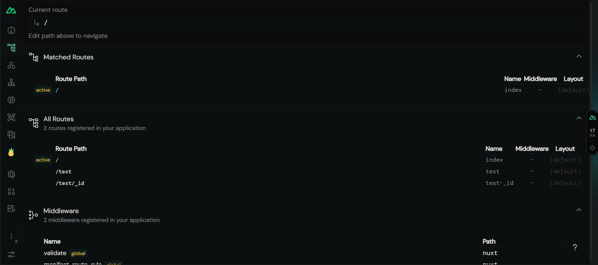
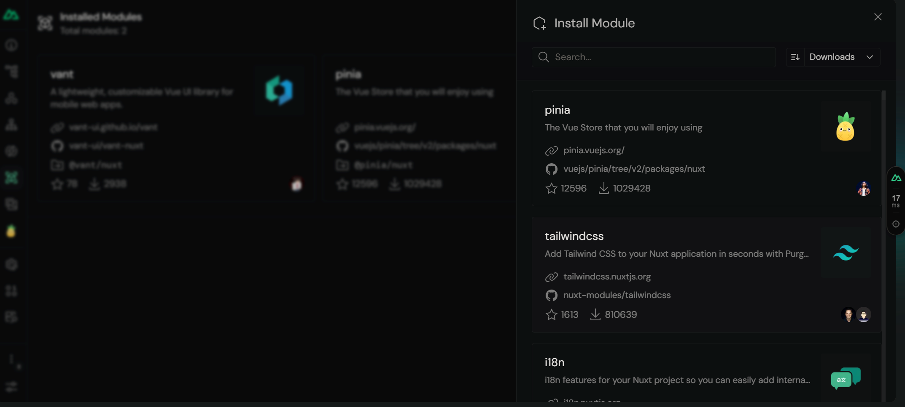
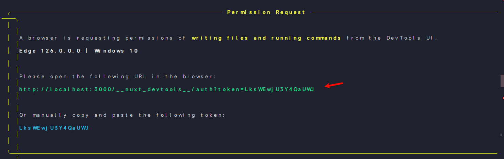

# Nust 服务器端配置 [官网](https://nuxt.com/docs/api/configuration/nuxt-config)

## 固定参数 `nuxt.config.ts`

```javascript
export default defineNuxtConfig({
  //调试工具
  devtools: { enabled: true },
  //服务器端渲染模式
  ssr: true,
});
```

## 调试工具

查看所有 router


安装拓展



权限管理


## 预渲染 [文档](https://nuxt.com/docs/getting-started/prerendering)

```javascript
//nuxt.config.ts
export default defineNuxtConfig({
  nitro: {
    prerender: {
      //提前渲染 router 指定对象
      routes: ["/user/1", "/user/2"],
      //无视dynamic下所有组件
      ignore: ["/dynamic"],
    },
    //指定预渲染数据
    prerender 预渲染: {
      //控制开关
      crawlLinks: true,
      routes: ["/sitemap.xml", "/robots.txt"],
    },
  },
});
```

## 页面过度[文档](https://nuxt.com.cn/docs/getting-started/transitions#disable-transitions)

```typescript
app: {
    // name: 调用名 mode：形式
    pageTransition: { name: 'page', mode: 'out-in' },
    //全局禁用
    pageTransition: false,
    layoutTransition: false
  },

//独立过度动画，记得声明css
/* app.vue */
definePageMeta({
  pageTransition: {
    name: 'slide-right',
    mode: 'out-in'
  },
})
```

> 配置动画，可通过主组件声明，或者全局 css 声明效果，配置文件添加全局 css 文件

```css
.page-enter-active,
.page-leave-active {
  transition: all 0.4s;
}
.page-enter-from,
.page-leave-to {
  opacity: 0;
  filter: blur(1rem);
}
```

全局 css 实现方式

```typescript
module.exports = {
  css: ["assets/main.css"],
};
```
