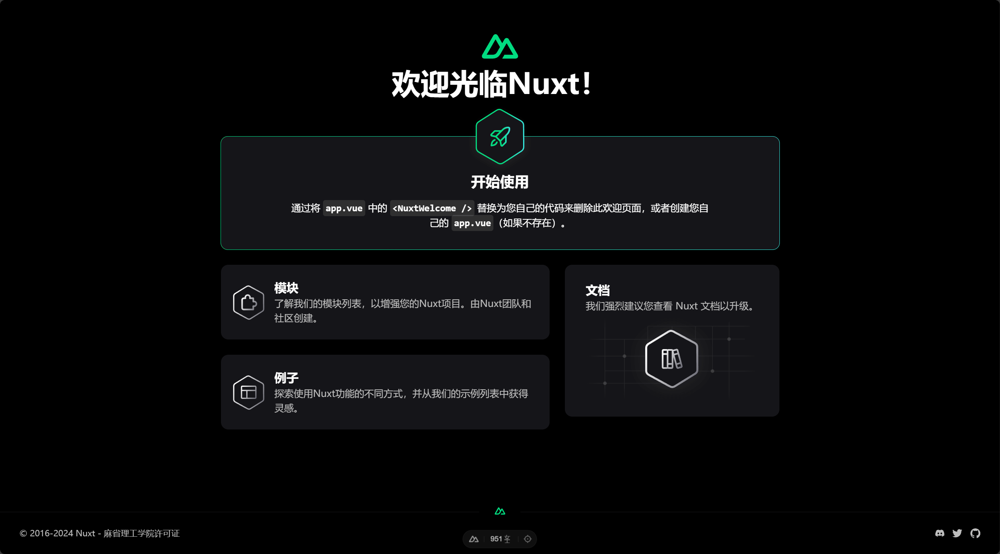

# 配置环境「[官网](https://nuxt.com/docs/getting-started/installation)」 「[中国](https://www.nuxtjs.cn/guide/installation)」

1. 安装`node.js` 「[Node](https://nodejs.org/zh-cn)」更新node `npm install -g npx`
2. 脚手架 `npx create-nuxt-app name`
3. 无法执行使用`Set-ExecutionPolicy -Scope CurrentUser -ExecutionPolicy RemoteSigned -Force`
4. 出现安装选择 `上下左右 回车` 控制 无法连接自行多次尝试
5. 初始化项目 `npm run dev`
