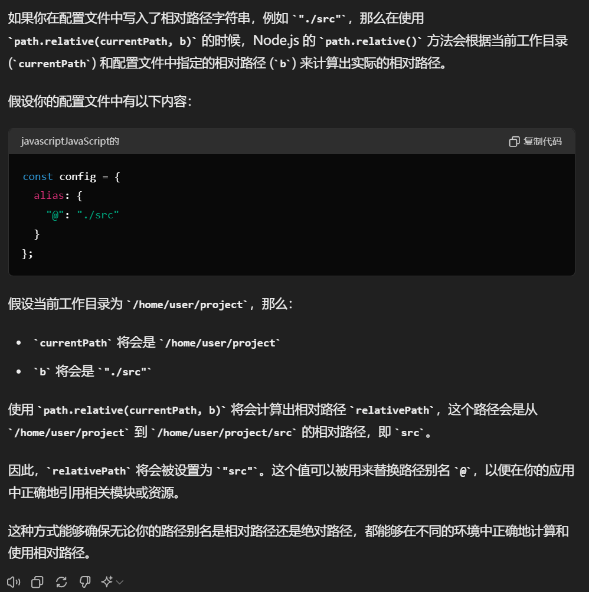

# 本文档用于快速构建一个 Node 服务器

## 准备工作

- 安装 Node.js
- 安装 npm
- 安装 Express

## 创建项目

```bash
mkdir quickCreate
cd quickCreate
npm init -y
```

## 安装依赖

```bash
npm install express
npm install koa
npm install path
```

## 创建服务器 Index.js

> [!IMPORTANT]
> 注：服务端路径拼接请一定要使用 `path` 模块，如果使用终端的相对路径 `process.cwd()`，它是会基于终端运行目录来拼接路径，如果终端使用的不是项目根路径，就会导致路径错误。 `path` 的路径是基于运行当前文件 `main.js` 的路径来拼接的。不同系统的`/` 和 `\`也能处理，并且是先获取绝对路径，再使用 **相对路径** 拼接的。 `__dirname` 是 Node 内置方法

```javascript
//开启服务器端口
const Koa = require("koa");
//处理服务器请求
const fs = require("fs").promises;
//获取路径
const path = require("path");

const app = new Koa();

app.listen(5177, () => {
  console.log("端口开启成功");
});

app.use(async (ctx) => {
  // console.log("visit:", ctx.request, ctx.response);
  if (ctx.request.url === "/" || ctx.request.url === "") {
    //拼接html文件路径,并读取文件内容,返回给浏览器
    let lj = path.resolve(__dirname, "./index.html");
    let data = await fs.readFile(lj, "utf8");
    ctx.response.body = data;
    //设置返回内容格式,使浏览器解析
    ctx.response.headers["content-type"] = "text/html; charset=utf-8";
  } else if (ctx.request.url.endsWith(".js")) {
    //返回静态JS文件 path绝对路径 + 请求路径 路径拼接 传入的路径必须是绝对路径 必须有 ./ 相对路径
    let result = path.resolve(__dirname + ctx.request.url);

    let data = await fs.readFile(result, "utf8");
    ctx.response.body = data;
    //配置返回的文件格式 Js 其他格式根据实际情况配置
    ctx.response.headers["content-type"] = "text/javascript; charset=utf-8";
  }
});
```

> [!TIP]
> 浏览器只支持 HTML 类型请求格式解析,HTML 地址栏更新会重新请求并且刷新页面只有 JS 文件的导入和引入不会刷新页面,浏览器直支持执行 JS 代码. Vite 框架是将 Vue 后缀文件编译成 JS 文件,所以浏览器会直接执行 JS 文件. 利用 JS 去修改 HTML 内容 , Vite 强大之处就在于 将文件重新构建,将编译好的组件功能渲染到 HTML 页面上.并且还能添加对应的 JS 事件监听.

## 运行服务器

```bash
node index.js
```

## 浏览器访问

```base
http://localhost:5711/
```

后面均为原理，覆写插件代码

## 实现 Vite 中的 alias 路径别名

配置路径文件

```javascript
const path = require("path");
//必须用module.exports导出 因为是Node环境的配置
module.exports = {
  resolve: {
    alias: {
      "@": path.resolve(__dirname, "./src"),
      "/": path.resolve(__dirname, "./src"),
    },
  },
};
```

实现 JS 请求的别名路径替换 main.js

```javascript
//开启服务器端口
const Koa = require("koa");
//处理服务器请求
const fs = require("fs").promises;
//获取路径
const path = require("path");
//实例化端口配置
const app = new Koa();
//挂载到5177端口
app.listen(5177, () => {
  console.log("端口开启成功");
});

//导入别名替换工具
const tools = require("./alias");
//导入配置
const config = require("./config.js");

//获取路径别名配置
fig = config.resolve.alias;

app.use(async (ctx) => {
  if (ctx.request.url === "/" || ctx.request.url === "") {
    let lj = path.resolve(__dirname, "./index.html");
    let data = await fs.readFile(lj, "utf8");
    ctx.response.body = data;
    ctx.response.headers["content-type"] = "text/html; charset=utf-8";
  } else if (ctx.request.url.endsWith(".js")) {
    let result = path.resolve(__dirname + ctx.request.url);

    //使用别名替换工具 传入配置和请求路径 得到真实路径
    const realPath = tools(fig, result);

    //读取路径对应的文件内容 并且返回给浏览器
    let data = await fs.readFile(lj, "utf8");
    ctx.response.body = data;
    ctx.response.headers["content-type"] = "text/html; charset=utf-8";
  }
});
```

> [!IMPORTANT]
> 最重要的别名替换工具，解构配置文件再将路径根据配置进行替换，这样就能实现路径别名的功能。

```javascript
// 这种方式切割的路径，有很大的问题只有用户配置的路径只有绝对路径后面缺少的部分才能被替换，如果用户配置的是相对路径，那么就会导致路径错误。
module.exports = function (fig, res) {
  const finalQuery = "";
  //将传入的对象中每一条属性 解构为list对象 并且将其中的属性值 同样以list方式转换 ES6语法
  const entity = Object.entries(fig);
  console.log(entity);
  entity.forEach((eny) => {
    //便利所有属性,并且拿到其中的 键与值
    const [a, b] = eny;
    console.log("建:" + a, "值:" + b);
    //替换路径别名为对应的值
    // finalQuery = res.replace(a, b);
    finalQuery = finalQuery.replace(new RegExp(a, "g"), b); // 使用正则表达式进行全局替换 防止后续别名替换前面
    //将替换后的路径赋值给res 防止下次循环之前别名替换失效
    console.log("最终路径:" + finalQuery);
    //循环一直替换直到没有别名，之前的别名替换已经完成
  });
  return entity;
};
```

> [!IMPORTANT]
> 最终版本，无论是绝对路径还是相对路径都能正确的替换别名路径。

```javascript
//测试配置，或者传入path.resolve(__dirname, "./src") 绝对路径测试
module.exports = {
  resolve: {
    alias: {
      "@": "./src",
      "/": "./src",
    },
  },
};

const path = require("path");

module.exports = function (fig, res) {
  let finalQuery = res;
  // 将传入的对象中每一条属性解构为列表对象，并将其中的属性值同样以列表方式转换
  const entity = Object.entries(fig);
  console.log(entity);
  entity.forEach((eny) => {
    // 遍历所有属性，并且拿到其中的键与值
    const [a, b] = eny;
    console.log("键:" + a, "值:" + b);
    // 获取当前工作目录路径
    const currentPath = path.resolve("./");
    // 计算相对路径
    const relativePath = path.relative(currentPath, b);
    console.log("相对路径:" + relativePath);
    // 替换路径别名为对应的值
    // 这里可使用正则表达式进行全局替换，测试下来也可以不用
    // finalQuery = finalQuery.replace(new RegExp(a.replace(/[-/\\^$*+?.()|[\]{}]/g, "\\$&"), "g"),relativePath,);
    finalQuery = finalQuery.replace(a, relativePath);
    console.log("最终路径:" + finalQuery);
  });
  return finalQuery;
};
```

## 实现逻辑

```al
path.resolve(): 这个方法会将传入的路径参数解析为绝对路径。具体来说：

如果传入的路径是绝对路径（比如 /home/user），path.resolve() 将直接返回该路径。
如果传入的路径是相对路径（比如 ./index.js），path.resolve() 将基于当前工作目录来解析并返回绝对路径。
在代码中，我使用 path.resolve("./") 获取当前工作目录的绝对路径 currentPath，这样无论运行脚本时所在的位置如何，都能得到正确的当前路径。

path.relative(): 这个方法计算从一个路径到另一个路径的相对路径。具体来说：

如果两个路径有共同的根路径，则返回从第一个路径到第二个路径的相对路径。
如果两个路径没有共享的根路径，则返回第二个路径本身（绝对路径）。

在代码中，我使用 path.relative(currentPath, b) 计算路径 b 相对于当前工作目录的相对路径 relativePath。这样无论 b 是绝对路径还是相对路径，都能得到正确的相对路径。

如果relativePath是以./ 开头 或者 只有字符串，则说明 b 是相对路径，否则说明 b 是绝对路径。当你添加了/src 它就处理成 D:\src 了
```


