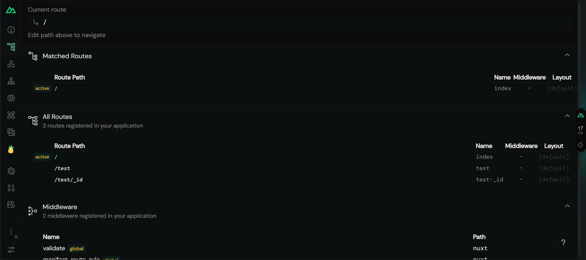
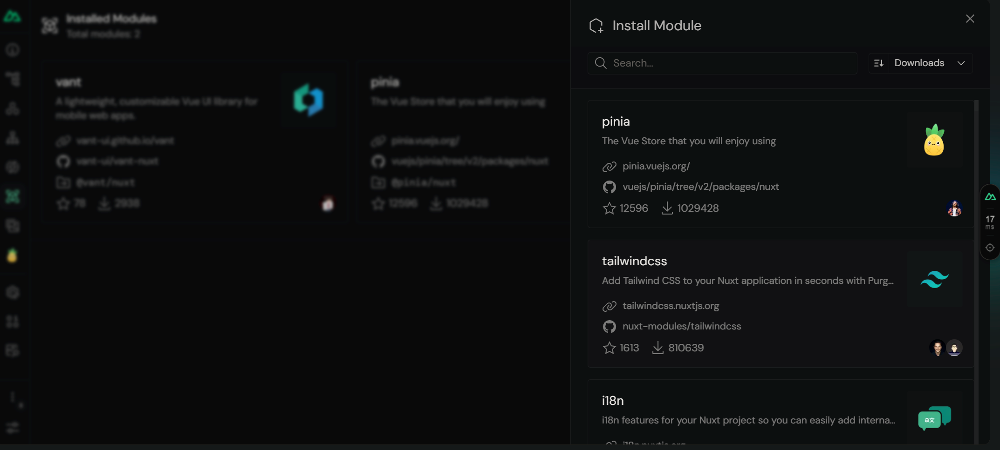
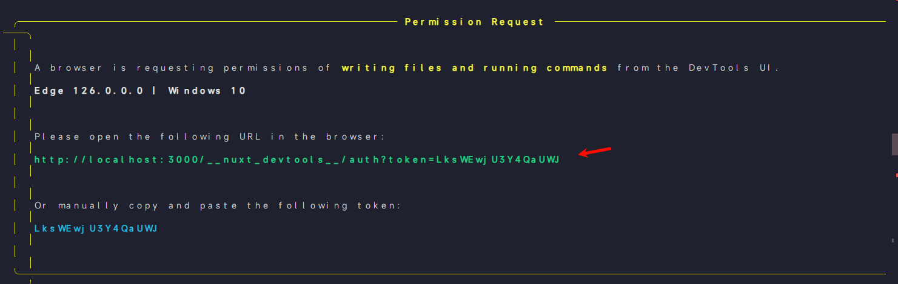

# Nuxt 服务器端配置 [官网](https://nuxt.com/docs/api/configuration/nuxt-config)

## 固定参数 `nuxt.config.ts` 编辑器可获得语法提示 [Vite](../Vite/config.md)

```javascript
import { defineNuxtConfig } from "nuxt3";

export default defineNuxtConfig({
  //调试工具
  devtools: { enabled: true },
  //服务器端渲染模式
  ssr: true,
});
```

## 调试工具

查看所有 router


安装拓展



权限管理


## 预渲染 [文档](https://nuxt.com/docs/getting-started/prerendering)

```javascript
//nuxt.config.ts
export default defineNuxtConfig({
  nitro: {
    prerender: {
      //提前渲染 router 指定对象
      routes: ["/user/1", "/user/2"],
      //无视dynamic下所有组件
      ignore: ["/dynamic"],
    },
    //指定预渲染数据
    prerender 预渲染: {
      //控制开关
      crawlLinks: true,
      routes: ["/sitemap.xml", "/robots.txt"],
    },
  },
});
```

## env 环境变量 [文档](https://www.nuxtjs.cn/api/configuration-env)

> [!NOTE]
> env 文件会根据环境变量自动加载，开发环境会加载 `.env.development`，生产环境会加载 `.env.production`。 [了解](../Vite/config.md#dotenv-配置)

```javascript
//nuxt.config.ts
export default defineNuxtConfig({
  env: {
    baseUrl: "https://example.com",
    apiUrl: "https://api.example.com",
    //需要webpack 或者 Vite 编译时，需要指定环境变量 导入env文件
    envFile: "process.env.ENV_name",
  },
});
```

## head | meta [文档](https://www.nuxtjs.cn/api/configuration-head)

> [!TIP]
> 当组件中没有使用 useHead() 或者 useSeoMeta() 方法时 定义 meta Nuxt 默认会生成配置文件中的默认 meta 。

```javascript
export default {
  meta: {
    title: "My App",
    description: "My App description",
    lang: "en",
  },
};
```

## css [文档](https://www.nuxtjs.cn/api/configuration-css)

> [!TIP]
> 配置文件中添加全局 css 文件，会自动应用到所有页面。 路径可以使用路径别名。可用于全局应用 element-ui 等样式库。

```javascript
export default {
  css: ["assets/main.css"],
};
```

## plugins [文档](https://www.nuxtjs.cn/api/configuration-plugins)

> [!TIP]
> 配置文件中添加插件，会 **自动加载** 到 Nuxt 应用中。 当被访问时会自动执行插件，用于引入 element-ui 等插件。

```javascript
export default {
  plugins: ["~/plugins/my-plugin.ts"],
};
```

## modules [文档](https://www.nuxtjs.cn/api/configuration-modules)

> [!TIP]
> 配置文件添加模块，页面可通过 $name 来调用模块中的方法。省去了 Import 多次导入模块的麻烦。

```javascript
export default {
  //导入的模块 是根据 package name
  modules: ["@nuxtjs/axios", "@nuxtjs/pwa"],
};
```

## loading [文档](https://www.nuxtjs.cn/api/configuration-loading)

> [!TIP]
> 开启页面加载的时候 头顶显示一个 loading 效果。 [定义动画](#页面过度-文档)

```javascript
export default {
  loading: {
    color: "#fff",
    height: "3px",
    duration: 5000,
  },
  loading: false,
};
```

## 路由

> [!TIP]
> 配置文件中添加路由，会自动生成对应的路由文件。

```javascript
export default {
  router: {
    base: "/app",
    routes: [
      {
        path: "/",
        component: "pages/index.vue",
      },
      {
        path: "/about",
        component: "pages/about.vue",
      },
    ],
  },
};
```

## 页面过度 [文档](https://nuxt.com.cn/docs/getting-started/transitions#disable-transitions)

```typescript
app: {
    // name: 调用名 mode：形式
    pageTransition: { name: 'page', mode: 'out-in' },
    //全局禁用
    pageTransition: false,
    layoutTransition: false
  },

//独立过度动画，记得声明css
/* app.vue */
definePageMeta({
  pageTransition: {
    name: 'slide-right',
    mode: 'out-in'
  },
})
```

> 配置动画，可通过主组件声明，或者全局 css 声明效果，配置文件添加全局 css 文件

```css
.page-enter-active,
.page-leave-active {
  transition: all 0.4s;
}
.page-enter-from,
.page-leave-to {
  opacity: 0;
  filter: blur(1rem);
}
```

全局 css 实现方式

```typescript
module.exports = {
  css: ["assets/main.css"],
};
```
