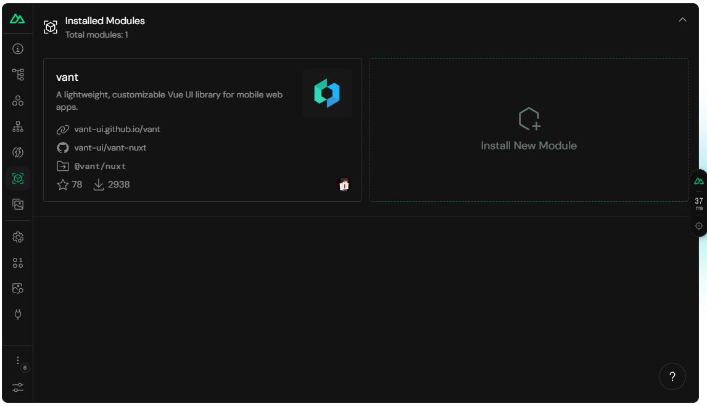

# 组合式函数 「[文档](https://nuxt.com/docs/getting-started/)」 「[ui](https://vant-ui.github.io/vant/?utm_source=nuxt.com&utm_medium=aside-module&utm_campaign=nuxt.com#/zh-CN/home)」

> [!TIP] > `nuxt` 实用方法

## seo&meta [文档](https://nuxt.com/docs/getting-started/seo-meta)

```typescript
//方法一
useHead({
  // 自定义组件标题
  title: "My App",
  //创建一个meta标签，帮助搜索引擎赛选
  meta: [{ name: "description", content: "My amazing site." }],
  // 引入自定义样式
  bodyAttrs: {
    class: "test",
  },
  //添加事件
  script: [{ innerHTML: "console.log('Hello world')" }],
});
//方法二
useSeoMeta({
  // 键值对方式添加meta数据
  title: "My Amazing Site",
  //og 前缀为 property 属性
  ogTitle: "My Amazing Site",
  description: "This is my amazing site, let me tell you all about it.",
  ogDescription: "This is my amazing site, let me tell you all about it.",
  ogImage: "https://example.com/image.png",
  // 普通命名 为 name属性 值均为 content
  twitterCard: "summary_large_image",
  //网站关键字
  keywords: "cloud client,video,photo",
});
//方法三 直接写死
$`
<template>
  <Head>
    <Meta name="description" :content="description" />
  </Head>
</template>
`;
```

## 组件库 [文档](https://nuxt.com/modules/vant)



> nuxt 前端框架推荐 参考调试工具

```bash
npm i vant @vant/nuxt -D
```

```javascript
//nuxt.config.ts
export default defineNuxtConfig({
  modules: ["@vant/nuxt"],
  //组件式引入，都ssr了直接全用了吧
  vant: {
    /** Options */
  },
});
```

## 预渲染 [文档](https://nuxt.com/docs/getting-started/prerendering)

```javascript
//nuxt.config.ts
export default defineNuxtConfig({
  nitro: {
    prerender: {
      //提前渲染 router 指定对象
      routes: ["/user/1", "/user/2"],
      //无视dynamic下所有组件
      ignore: ["/dynamic"],
    },
    //还能指定预渲染数据
    prerender 预渲染: {
      //控制开关
      crawlLinks: true,
      routes: ["/sitemap.xml", "/robots.txt"],
    },
  },
});
```

> 组件中控制

```html
<script setup>
  // Or set at the page level
  defineRouteRules({
    prerender: true,
  });
  // 控制其他路由的预渲染
  /* export default defineNuxtConfig({
  routeRules: {
    "/": { prerender: true },
  },
});*/

  //被实例化后控制其他预渲染
  prerenderRoutes(["/some/other/url"]);
</script>
```
