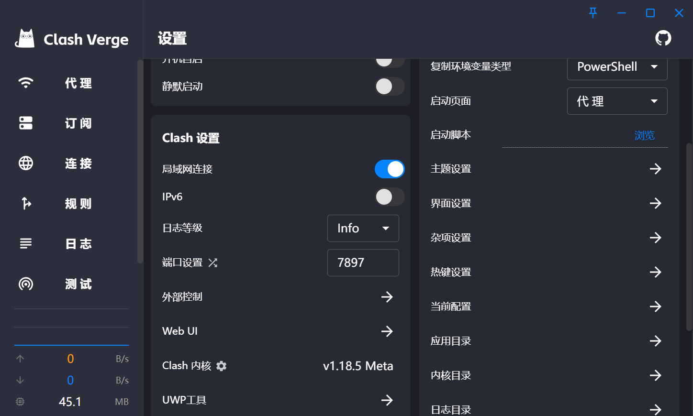
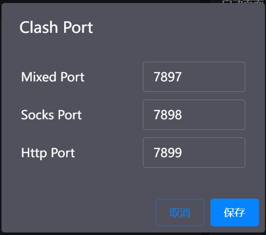

# git [详见](https://blog.csdn.net/qq_29493173/article/details/113094143)
1. VSC 中登录github
1. 点击源代码仓库
1. 终端中输入
```
$ git config --global user.name  "name"//自定义用户名
$ git config --global user.email "youxiang@qq.com"//用户邮箱
```
1. 其他使用插件来使用git命令 如连接不上github 终端中输入
```
<!-- 此处为禁用代理 -->
git config --global --unset https.proxy
```
  
## 大招使用clash代理[文档](https://www.cnblogs.com/cscshi/p/15705045.html)
<!-- 调用clash代理 -->
1. 开启端口链接
  
2. 点击端口控制查看
  
3. git配置代理
```bash
git config --global http.proxy http://127.0.0.1:7899
```


# 实用功能

## 1. 生成随机数

```Javascript
function randomNum(min, max) {
  return Math.floor(Math.random() * (max - min + 1) + min);
}
```

## 2. 生成随机颜色

```Javascript
function randomColor() {
  const r = randomNum(0, 255);
  const g = randomNum(0, 255);
  const b = randomNum(0, 255);
  return `rgb(${r},${g},${b})`;
}
```

## 3. 生成随机验证码

```Javascript
function randomCode() {
  let code = "";
  for (let i = 0; i < 4; i++) {
    const num = randomNum(0, 9);
    code += num;
  }
  return code;
}
```

## 4. 生成随机字母

```Javascript
function randomLetter() {
  const letter = "abcdefghijklmnopqrstuvwxyzABCDEFGHIJKLMNOPQRSTUVWXYZ";
  const index = randomNum(0, letter.length - 1);
  return letter[index];
}
```

## 5. 生成随机字母数字

```Javascript
function randomLetterNum() {
  const str = "0123456789abcdefghijklmnopqrstuvwxyzABCDEFGHIJKLMNOPQRSTUVWXYZ";
  const index = randomNum(0, str.length - 1);
  return str[index];
}
```

## 6. 生成随机16进制颜色

```Javascript
function randomHexColor() {
  let color = "#";
  for (let i = 0; i < 6; i++) {
    const num = randomNum(0, 15);
    if (num < 10) {
      color += num;
    } else {
      switch (num) {
        case 10:
          color += "a";
          break;
        case 11:
          color += "b";
          break;
        case 12:
          color += "c";
          break;
        case 13:
          color += "d";
          break;
        case 14:
          color += "e";
          break;
        case 15:
          color += "f";
          break;
      }
    }
  }
  return color;
}
```

## 7. 生成随机16进制颜色(简化)

```Javascript
function randomHexColor() {
  let color = "#";
  for (let i = 0; i < 6; i++) {
    const num = randomNum(0, 15);
    if (num < 10) {
      color += num;
    } else {
      color += num.toString(16);
    }
  }
  return color;
}
```

## 动态TItle

```Javascript
  // 设置默认的网页标题
  var defaultTitle = "我的测试网页";

  // 设置切换标签页时的网页标题
  var hiddenTitle = "记得回来看看我";
  var visibleTitle = "好耶你回来了";

  // 监听visibilitychange事件
  document.addEventListener("visibilitychange", function () {
    // 判断当前页面是否可见
    if (document.hidden) {
      // 如果不可见，修改网页标题为hiddenTitle
      document.title = hiddenTitle;
    } else {
      // 如果可见，修改网页标题为visibleTitle
      document.title = visibleTitle;
      // 一段时间后，恢复网页标题为defaultTitle
      setTimeout(function () {
        document.title = defaultTitle;
      }, 2000);
    }
  });
```

## 地址栏动画 [了解更多](https://matthewrayfield.com/articles/animating-urls-with-javascript-and-emojis)

[](https://matthewrayfield.com/articles/animating-urls-with-javascript-and-emojis)

[](https://matthewrayfield.com/articles/animating-urls-with-javascript-and-emojis)

[](https://matthewrayfield.com/articles/animating-urls-with-javascript-and-emojis)

[](https://matthewrayfield.com/articles/animating-urls-with-javascript-and-emojis)

```JavaScript
/* 地址栏显示视频播放进度 */
var video;
    function formatTime(seconds) {
        var minutes = Math.floor(seconds/60),
            seconds = Math.floor(seconds - (minutes*60));

        return ('0'+minutes).substr(-2) + ':' + ('0'+seconds).substr(-2);
    }

    function renderProgressBar() {
        var s = '',
            l = 15,
            p = Math.floor(video.currentTime / video.duration * (l-1)),
            i;

        for (i = 0; i < l; i ++) {
            if (i == p) s +='◯';
            else if (i < p) s += '─';
            else s += '┄';
        }

        location.hash = '╭'+s+'╮'+formatTime(video.currentTime)+'╱'+formatTime(video.duration);
    }

    video = document.getElementById('video');
    video.addEventListener('timeupdate', renderProgressBar);
/* 其余去网站复制 */
```

## 函数获取当前时间

```Javascript
function getTime() {
  const date = new Date();
  const year = date.getFullYear();
  const month = date.getMonth() + 1;
  const day = date.getDate();
  const hour = date.getHours();
  const minute = date.getMinutes();
  const second = date.getSeconds();
  return `${year}-${month}-${day} ${hour}:${minute}:${second}`;
}
```